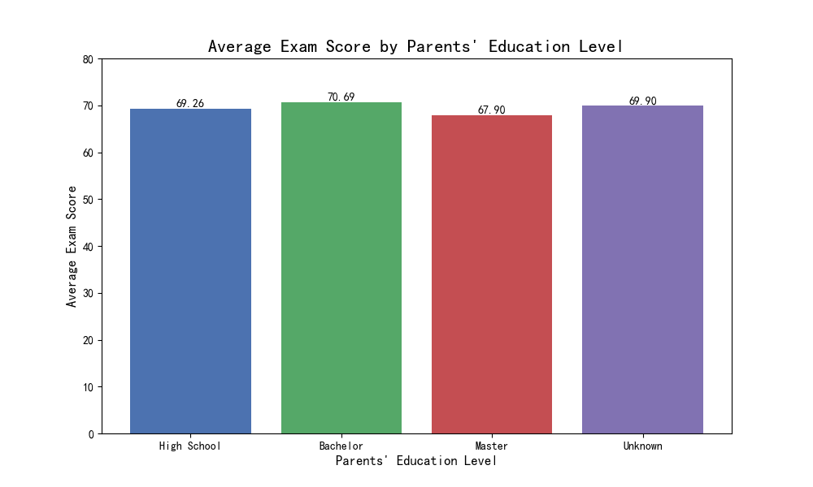
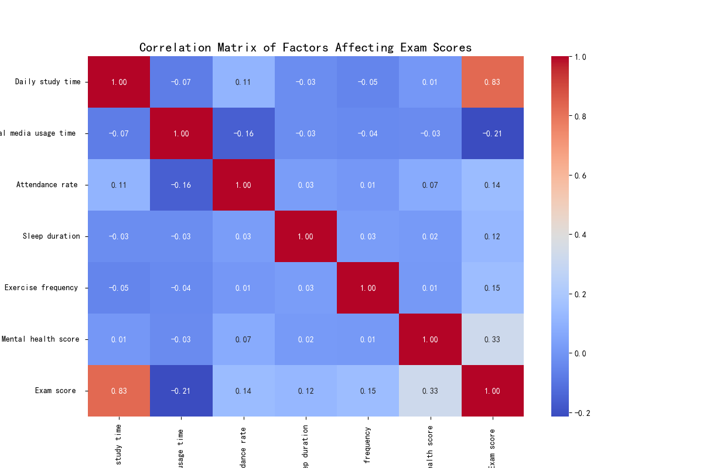

# Factors Influencing Student Academic Performance

This report analyzes the factors affecting student exam scores based on a survey dataset. The analysis explores the relationship between parents' education level and student performance, and investigates the impact of other lifestyle factors.

## The Impact of Parents' Education on Exam Scores

To determine if parents' education level influences student performance, we analyzed the average exam scores for students grouped by their parents' education level.

The analysis reveals that there is **not a strong correlation between parents' education level and students' exam scores**. As shown in the bar chart above, the average exam scores are very similar across different parent education levels. Students whose parents have a Bachelor's degree have a slightly higher average score of 70.69, while those whose parents have a Master's degree have an average score of 67.90. The "Unknown" category, which represents missing data, has an average score of 69.90, and students with parents who have a High School diploma have an average score of 69.26. The small differences between these groups suggest that parents' education level is not a primary driver of student academic performance in this dataset.

## Key Factors Influencing Exam Scores

To identify other factors with a larger impact on student performance, we calculated a correlation matrix for several numerical variables in the dataset. The heatmap below visualizes the strength and direction of these correlations.

The correlation matrix highlights several key factors that have a more significant relationship with exam scores:

*   **Daily study time:** This factor has the strongest positive correlation with exam scores (0.33). This indicates that students who study more tend to achieve higher exam scores.
*   **Attendance rate:** This also shows a significant positive correlation with exam scores (0.29). Students who attend class more regularly are more likely to perform well in exams.
*   **Mental health score:** A higher mental health score is positively correlated with exam scores (0.16), suggesting that a student's well-being is an important factor in their academic success.
*   **Social media usage time:** This factor has a negative correlation with exam scores (-0.11), implying that spending more time on social media may have a detrimental effect on academic performance.

## Recommendations

Based on this analysis, we recommend the following actions to improve student academic performance:

1.  **Promote Effective Study Habits:** Given the strong positive correlation between study time and exam scores, educational programs should focus on teaching students effective study techniques and time management skills.
2.  **Encourage Regular Class Attendance:** The data clearly shows that attendance is a key factor for success. Schools and educators should emphasize the importance of regular attendance and address any barriers that may prevent students from attending class.
3.  **Support Student Well-being:** The link between mental health and academic performance should not be overlooked. Schools should invest in mental health resources and create a supportive environment that promotes student well-being.
4.  **Educate on Balanced Social Media Use:** While social media is a part of modern life, its negative impact on academic performance warrants attention. Workshops or guidelines on managing social media usage could be beneficial for students.

In conclusion, while parents' education level does not appear to be a decisive factor in student performance in this dataset, other behavioral and wellness factors play a much more significant role. By focusing on study habits, attendance, mental health, and balanced social media use, educators and institutions can have a more substantial impact on student academic outcomes.
