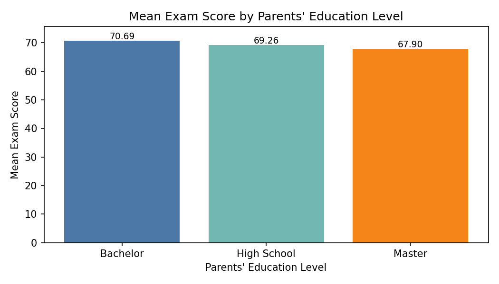
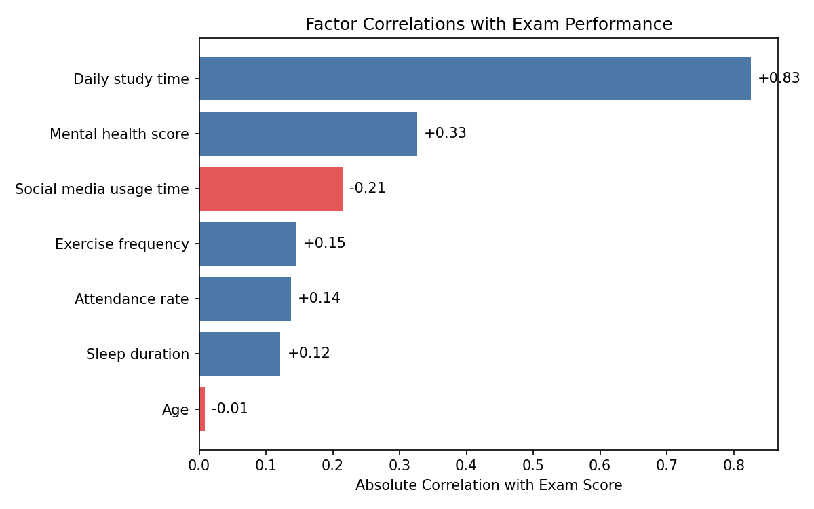

Report: What drives students’ academic performance—and does parental education matter?

Executive summary
- The belief that “higher parental education → better student performance” is not supported by this survey. Bachelor-level parents’ children score the highest (70.69), but Master-level parents’ children score lower (67.90) than both Bachelor and High School (69.26). Differences are modest (~2.8 points across categories).
- The largest impacts come from student behaviors and well-being: daily study time (corr +0.83; +34.53 points from bottom to top quartile), mental health score (corr +0.33; +13.38 points), and social media usage (corr −0.21; −7.86 points). Attendance, sleep, and exercise show smaller yet positive effects.
- Action should prioritize study habits, mental health support, and reducing social media usage, alongside attendance and sleep hygiene. Parental education should not be used as a predictive or eligibility criterion.

Data & method
- Data source: SQLite database dacomp-en-011.sqlite, table sheet1 (n=1,000 students). Key fields include Exam score, Parents' education level, Daily study time, Social media usage time, Attendance rate, Sleep duration, Exercise frequency, Mental health score, Diet quality, Internet quality, Gender, Part-time job, Extracurricular activity participation.
- SQL steps: counted rows and computed mean Exam score by Parents' education level; Python steps: calculated correlations for numeric factors, quartile effect sizes, and categorical max–min differences; generated visualizations.

Visualization 1: Mean exam score by parents’ education level

- Observation: Children of Bachelor-educated parents have the highest mean Exam score at 70.69 (n=355). High School is 69.26 (n=391), and Master is 67.90 (n=165).
- Why it matters: The pattern is not monotonic—Master < High School < Bachelor—contradicting the notion that higher parental education consistently improves outcomes.
- Supported by: SQL and Python aggregation of sheet1: Parents' education level vs. Exam score means.

Visualization 2: Which factors matter most? Correlation magnitudes

- Observation: Daily study time correlates most strongly with Exam score (corr +0.825), followed by Mental health score (+0.326). Social media usage shows a negative correlation (−0.214). Attendance (+0.138), Sleep (+0.122), Exercise (+0.146) are smaller but positive; Age is negligible (−0.009).
- Why it matters: Study behavior and well-being are the dominant drivers; interventions targeting these levers can yield substantial gains.
- Supported by: Python correlation analysis on numeric fields in sheet1.

Quantified impacts (top vs. bottom quartiles of each factor)
- Daily study time: +34.53 points (low mean 52.28 vs. high mean 86.81)
- Mental health score: +13.38 points (63.37 vs. 76.76)
- Social media usage time: −7.86 points (high usage 65.55 vs. low usage 73.41)
- Exercise frequency: +6.93 points (66.54 vs. 73.47)
- Attendance rate: +4.95 points (67.10 vs. 72.05)
- Sleep duration: +4.51 points (67.15 vs. 71.67)
- Age: −0.39 points (70.62 vs. 70.23)

Categorical factors (max–min mean Exam differences)
- Parents' education level: 70.69 (Bachelor) vs. 67.90 (Master), diff 2.79
- Diet quality: 70.43 (Fair) vs. 68.13 (Poor), diff 2.30
- Internet quality: 70.64 (Average) vs. 68.65 (Good), diff 1.99
- Gender: 70.65 (Other) vs. 69.37 (Male), diff 1.28
- Part-time job: 69.76 (No) vs. 69.03 (Yes), diff 0.73
- Extracurricular activity participation: 69.69 (No) vs. 69.42 (Yes), diff 0.27

Answering the main question: Does higher parental education lead to better performance?
- Observation: Not consistently. Bachelor: 70.69; High School: 69.26; Master: 67.90. There is no monotonic increase with higher education.
- Root cause: Student-level behaviors (study time, social media) and well-being (mental health, sleep, attendance) exhibit much stronger relationships with performance than parents’ education level.
- Business impact / Recommendation: Do not rely on parental education as a primary determinant. Redirect resources toward student study habits, wellness programs, and digital hygiene.

Key insights with causal reasoning and impact
1) Daily study time is the dominant driver.
- Observation: corr +0.825; +34.53-point lift from bottom to top quartile.
- Root cause: More deliberate practice improves knowledge retention and exam readiness.
- Impact/Recommendation: Implement structured study plans and monitored study hours; aim to move students from the bottom quartile to at least the median—expect double-digit score gains.

2) Mental health meaningfully affects scores.
- Observation: corr +0.326; +13.38-point lift.
- Root cause: Better mental health enhances focus, motivation, and test anxiety management.
- Impact/Recommendation: Offer counseling, peer support groups, and stress-reduction workshops; screen and provide early interventions.

3) Social media usage is a significant negative.
- Observation: corr −0.214; −7.86-point gap across quartiles.
- Root cause: Time displacement and fragmented attention reduce effective study time and sleep quality.
- Impact/Recommendation: Provide digital hygiene education, app-use nudges, and time-limiting strategies; encourage device-free study blocks.

4) Attendance, sleep, and exercise are supportive levers.
- Observation: Attendance (+0.138; +4.95 points), Sleep (+0.122; +4.51 points), Exercise (+0.146; +6.93 points).
- Root cause: Consistency, rest, and physical health reinforce learning and cognition.
- Impact/Recommendation: Tighten attendance policies and early alert systems; promote sleep hygiene and moderate exercise routines.

5) Categorical context: Diet and internet quality
- Observation: Diet quality shows a ~2.30-point spread; Internet quality ~1.99-point spread.
- Root cause: Nutrition and connectivity may affect concentration and access to resources.
- Impact/Recommendation: Ensure access to healthy meals and reliable campus internet; provide offline study materials where needed.

What to do next
- Prioritize programs that increase daily study time (e.g., guided study halls, tutoring, time-blocking coaching).
- Expand mental health resources and regular well-being checks.
- Roll out digital hygiene education to cut social media overuse.
- Reinforce attendance, sleep, and exercise habits via policy and incentives.

Supporting code executed (Python plotting)
- The analysis and plots were generated by the Python script analysis.py, which:
  - Loaded sheet1 from dacomp-en-011.sqlite.
  - Produced parent_education_exam.png and factor_correlations.png.
  - Computed correlations, quartile impacts, and categorical differences.
