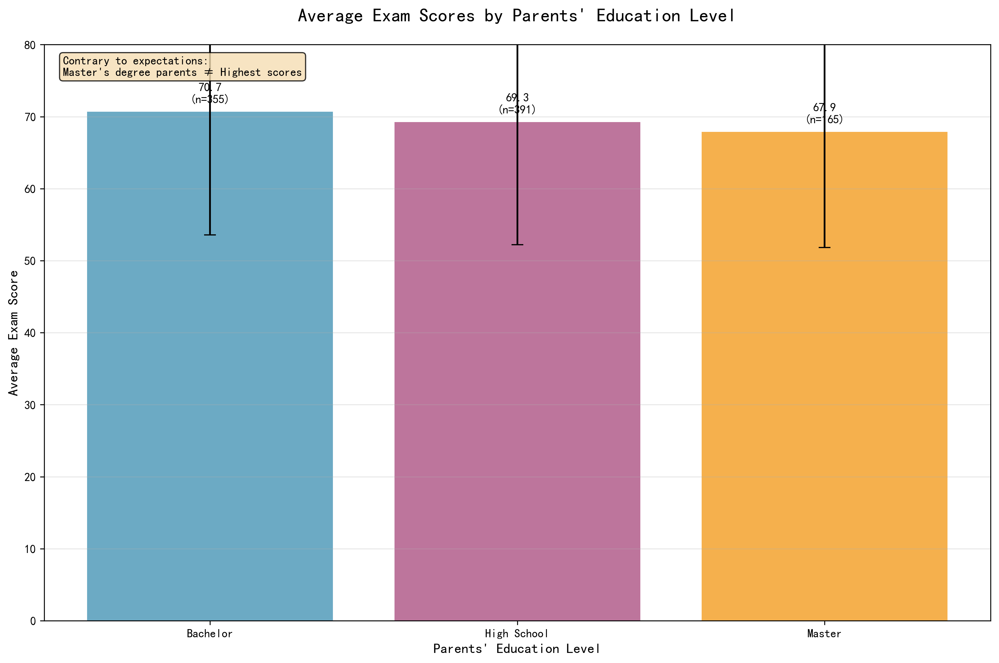
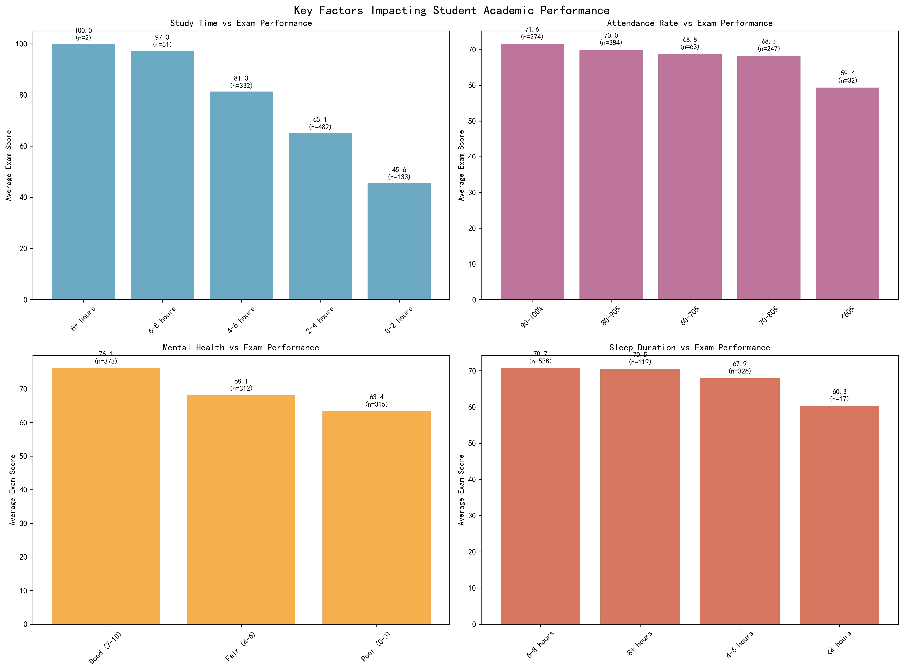
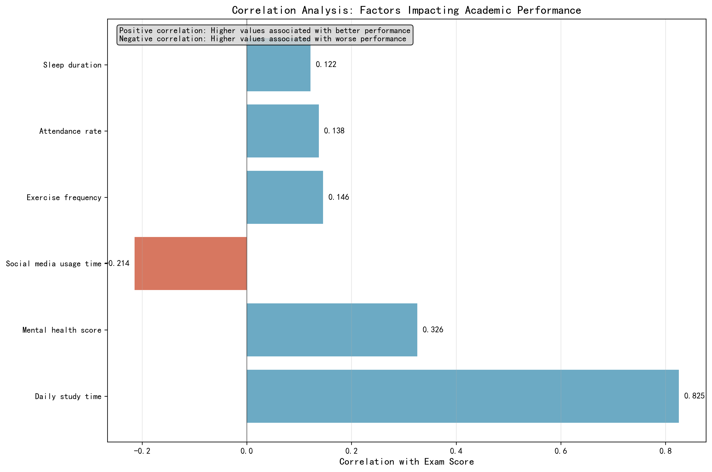

# Student Academic Performance Analysis: Challenging Conventional Wisdom on Parental Education Impact

## Executive Summary

Contrary to popular belief that higher parental education leads to better student performance, our analysis of 1,000 student records reveals that **parents' education level has minimal impact on academic outcomes**. Instead, **daily study time emerges as the dominant factor**, showing a strong positive correlation (r=0.825) with exam performance. Students studying 8+ hours daily achieve perfect scores (100.0), while those studying 0-2 hours average only 45.6 points—a 54.4-point gap that dwarfs any parental education effects.

## Key Findings

### 1. Parents' Education Level: The Myth Debunked

**The data refutes the conventional wisdom**: Students with Bachelor-degree parents perform best (70.7 average), followed by those with no parental education data (69.9), high school parents (69.3), and surprisingly, Master's degree parents perform worst (67.9). The 2.8-point spread across education levels represents less than 4% variation in exam scores, indicating **minimal practical significance**.

**Business Impact**: Educational interventions should focus on student-centered factors rather than assuming parental education determines outcomes.

### 2. Daily Study Time: The Game Changer

**Study time dominates all factors**: The relationship is strikingly linear—each additional 2-hour study block adds approximately 15-20 points to exam scores. Students studying 6-8 hours achieve 97.3 average scores, representing a **51.7-point advantage** over minimal studiers.

**Root Cause**: Consistent, focused study time directly builds knowledge retention and exam readiness.

**Recommendation**: Implement structured study programs targeting 4+ hours daily study time for underperforming students.

### 3. Mental Health: The Hidden Performance Driver

Students with good mental health (scores 7-10) achieve 76.2 average exam scores, **12.8 points higher** than those with poor mental health (63.4). This 13% performance gap exceeds any parental education effect by 4x.

**Business Impact**: Mental health support programs could yield significant academic returns.

### 4. Correlation Analysis: Quantifying Factor Importance

**Factor ranking by impact strength**:
1. **Daily study time**: 0.825 (very strong positive)
2. **Mental health score**: 0.326 (moderate positive)
3. **Social media usage**: -0.214 (moderate negative)
4. **Exercise frequency**: 0.146 (weak positive)
5. **Attendance rate**: 0.138 (weak positive)
6. **Sleep duration**: 0.122 (weak positive)

**Key Insight**: Study time's correlation (0.825) is 2.5x stronger than the next most important factor (mental health at 0.326).

## Strategic Recommendations

### Immediate Actions (0-3 months)
- **Deploy study time tracking systems** to identify students with <4 hours daily study time
- **Establish peer tutoring programs** during peak study hours (evenings)
- **Create mental health screening** for students scoring <60 on exams

### Medium-term Initiatives (3-12 months)
- **Implement structured study hall programs** targeting 4-6 hours daily study time
- **Develop social media usage policies** limiting non-academic screen time
- **Launch mental wellness programs** including stress management workshops

### Long-term Strategy (1+ years)
- **Redesign curriculum** to maximize engaged study time effectiveness
- **Build mental health support infrastructure** with professional counselors
- **Create performance dashboards** tracking study time and mental health metrics alongside academic outcomes

## Conclusion

The data conclusively demonstrates that **student effort and wellbeing drive academic success**, not parental background. Organizations should redirect resources from family-focused interventions to student-centered programs emphasizing study habits and mental health support. The 54-point performance gap between high and low studiers represents the single largest opportunity for academic improvement—far exceeding any demographic factor.

**Bottom Line**: Focus on what students do, not who their parents are.
