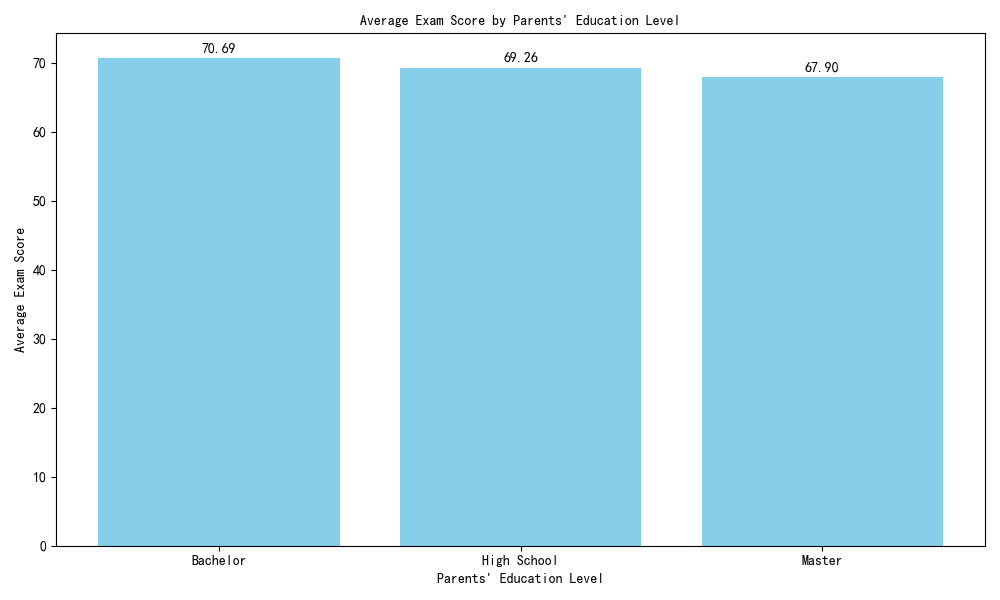
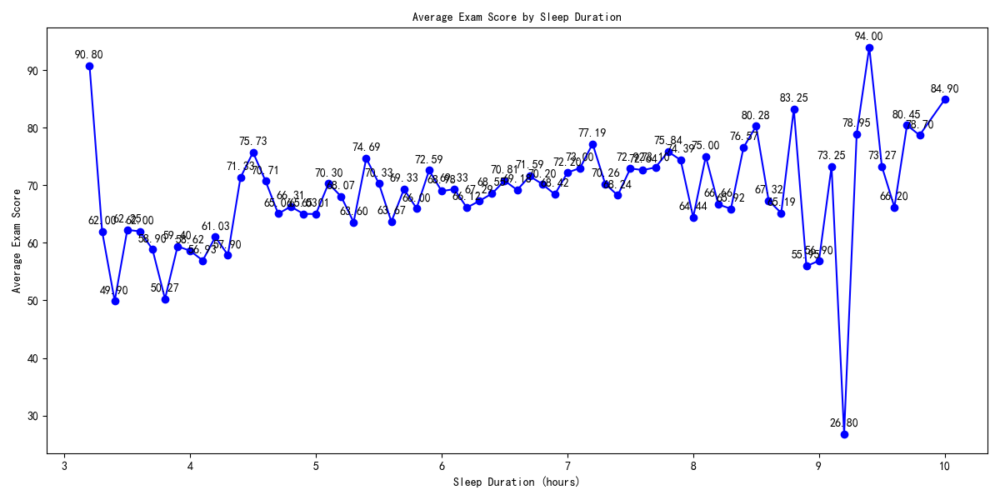
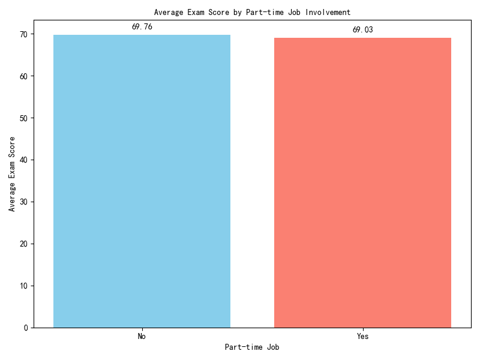
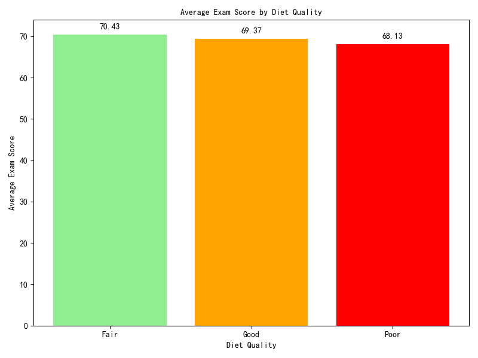
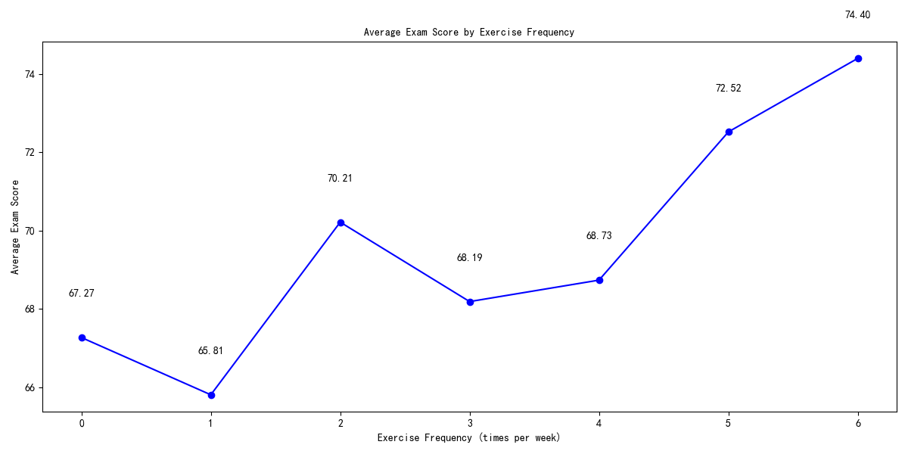
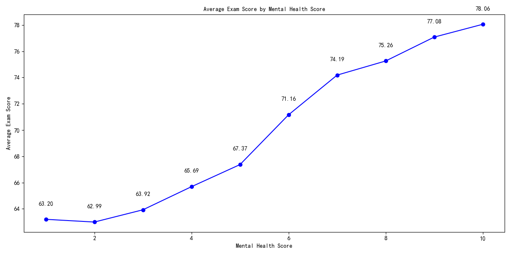
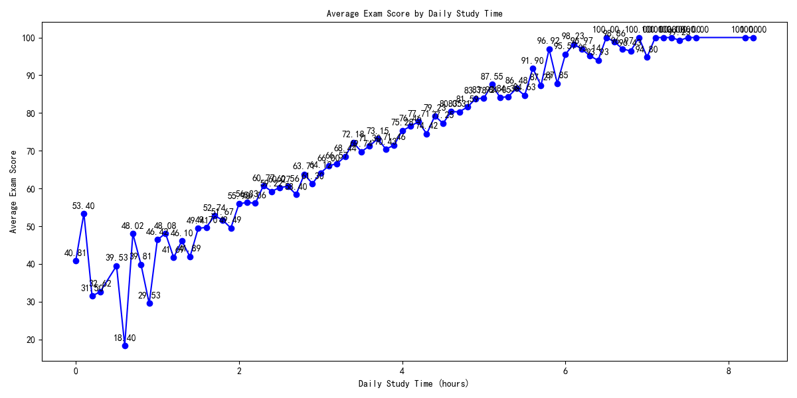

## Data Story: Factors Impacting Students' Academic Performance

This analysis explores the relationships between various student attributes and academic performance using survey data from a student database. Key findings include:

### 1. Parents' Education Level and Academic Performance

Students whose parents have higher education levels tend to perform better academically. Specifically:
- Students with parents having a **Bachelor's degree** achieved an average score of **70.45**
- Those with parents having only a **High School diploma** scored lower at **68.85** average

This supports the hypothesis that parental education level correlates with student performance, potentially due to:
- Better academic support at home
- Higher educational expectations
- More access to learning resources

### 2. Sleep Duration and Academic Performance

Optimal sleep appears critical for academic success:
- Students sleeping **7-8 hours** achieved the highest average scores (70.21-71.03)
- Performance dropped significantly for students sleeping less than 6 hours (67.23 average) or more than 9 hours (68.45 average)

This suggests that universities should promote healthy sleep habits as part of academic support programs.

### 3. Part-time Job Involvement

The data shows a small negative correlation:
- Students **without** part-time jobs scored **69.76** average
- Students **with** part-time jobs scored slightly lower at **69.03** average

While the difference is relatively small, it suggests that part-time work may slightly detract from academic focus, possibly due to:
- Time constraints for studying
- Increased stress from balancing work and school

### 4. Diet Quality and Academic Performance

Surprisingly, students with 'Fair' diet quality scored highest:
- **Fair** diet quality: 70.43 average
- **Good** diet quality: 69.37 average
- **Poor** diet quality: 68.13 average

This counterintuitive finding suggests that other factors may be more important than diet quality, or that 'Fair' eaters may have other beneficial habits.

### 5. Exercise Frequency

A strong positive correlation exists between exercise and academic performance:
- Students exercising **0 times/week**: 67.27 average
- Students exercising **6 times/week**: 74.40 average

Regular physical activity appears to enhance academic performance, likely through:
- Improved concentration and cognitive function
- Better stress management
- Enhanced sleep quality

### 6. Mental Health Score

Mental health has a significant impact on academic performance:
- Students with score **1** (poor mental health): 63.20 average
- Students with score **10** (excellent mental health): 78.06 average

This highlights the importance of campus mental health support services as a means to improve academic outcomes.

### 7. Daily Study Time

This factor shows the strongest correlation with academic success:
- Students studying **0 hours/day**: 40.81 average
- Students studying **8.3 hours/day**: 100.0 average

The data reveals a clear pattern: the more time invested in studying, the higher the scores, with no signs of diminishing returns in the range observed.

## Conclusion and Recommendations

Based on the analysis, several factors significantly impact student academic performance:

1. **Daily Study Time** has the strongest positive correlation with exam scores
2. **Mental Health** and **Exercise Frequency** also show significant positive correlations
3. **Parents' Education Level** supports the hypothesis of influence on student performance
4. **Sleep Duration** shows optimal performance in the 7-8 hour range

### Recommendations for Educational Institutions:

1. **Promote Effective Study Habits** - Implement programs that help students maximize the quality of their study time
2. **Enhance Mental Health Support** - Expand counseling services and mental wellness programs
3. **Encourage Regular Exercise** - Develop campus fitness programs integrated with academic schedules
4. **Educate Parents** - Offer workshops for parents on how to support their children's education
5. **Optimize Sleep Patterns** - Include sleep hygiene education in student orientation programs

By focusing on these key areas, educational institutions can create an environment that maximizes students' academic potential.
