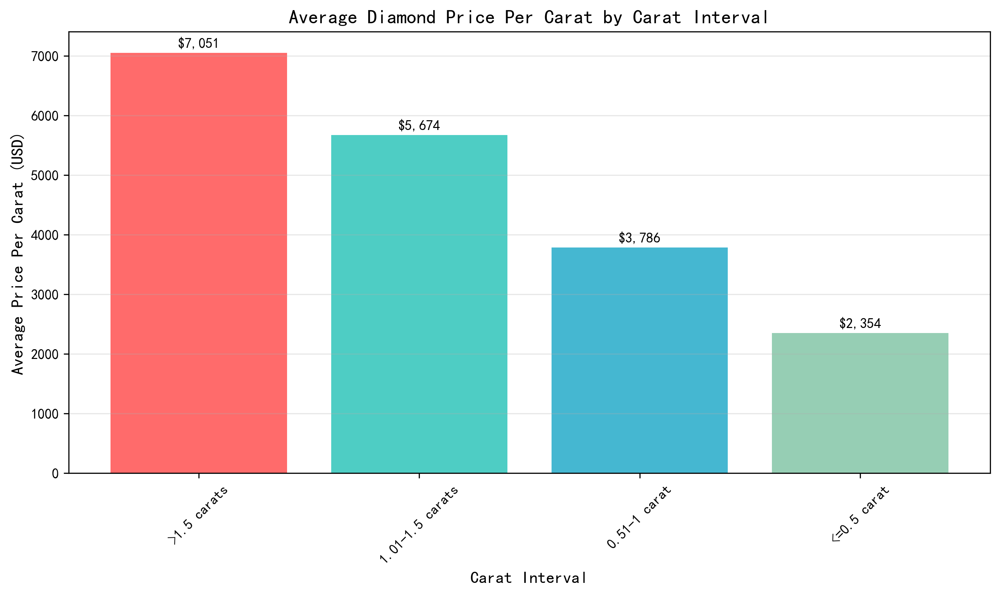
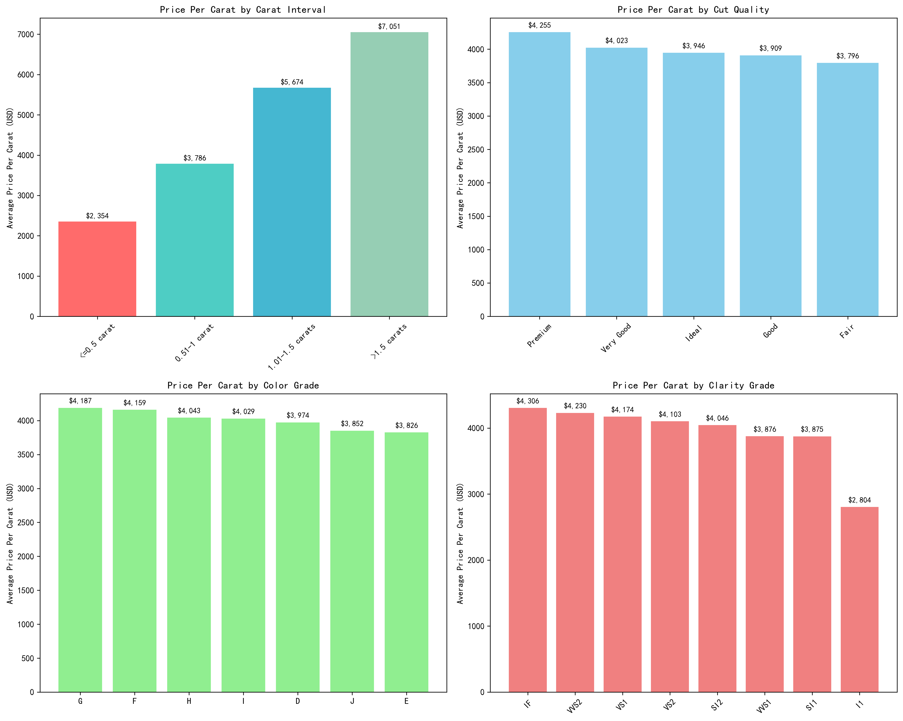
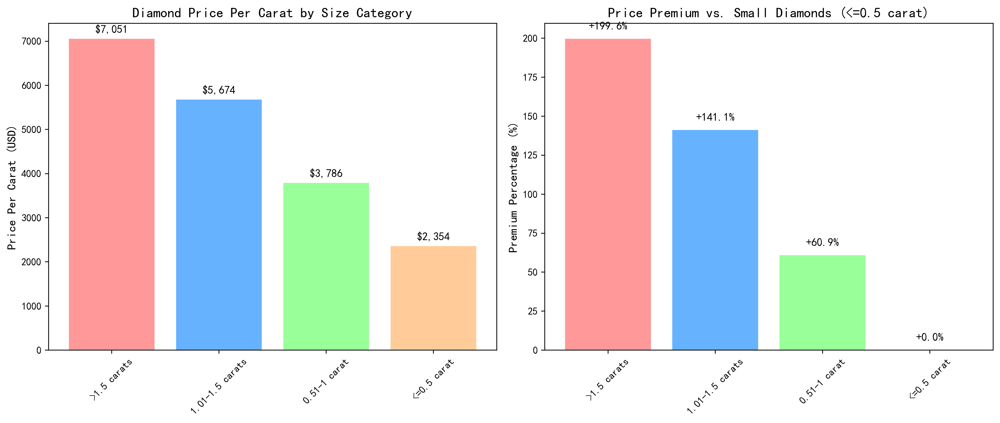

# Diamond Price Analysis: Key Insights and Business Implications

## Executive Summary

This analysis of 53,595 diamond records reveals significant price trends and market dynamics. The most striking finding is that **larger diamonds command exponentially higher prices per carat**, with diamonds over 1.5 carats achieving a remarkable 200% premium compared to smaller stones.

## Key Findings

### 1. Carat Size Drives Exponential Price Growth

Diamond prices per carat increase dramatically with size:
- **≤0.5 carat**: $2,354 per carat (baseline)
- **0.51-1 carat**: $3,786 per carat (+61% premium)
- **1.01-1.5 carats**: $5,674 per carat (+141% premium)
- **>1.5 carats**: $7,051 per carat (+200% premium)

This demonstrates that **larger diamonds are not just linearly more valuable but command exponential price premiums**, making them highly profitable inventory for jewelers.

### 2. Quality Factors Show Complex Pricing Patterns

**Cut Quality Impact**: Premium cut diamonds lead at $4,255 per carat, followed by Very Good ($4,023) and Ideal ($3,945). This counterintuitive result suggests market preferences may favor brilliance over perfect proportions.

**Color Grade Anomaly**: G-color diamonds surprisingly command the highest price per carat at $4,187, while D-color (the highest grade) ranks 5th at $3,974. This indicates consumer preference for near-colorless stones that offer better value.

**Clarity Hierarchy**: IF (Internally Flawless) diamonds lead at $4,306 per carat, followed by VVS2 ($4,230) and VS1 ($4,174), confirming that flawless clarity commands premium pricing as expected.

### 3. Size-Quality Interaction Reveals Strategic Opportunities

**Large, High-Quality Diamonds Command Supreme Premiums**: For diamonds >1.5 carats, Ideal cut achieves $7,411 per carat - the highest combination in the dataset. This represents a **215% premium** over small diamonds of the same quality.

**Market Segmentation Opportunity**: The data reveals distinct customer segments:
- **Value Seekers**: Small diamonds (≤0.5 carat) with good cut quality
- **Premium Buyers**: Medium diamonds (0.51-1.5 carats) with excellent color/clarity
- **Luxury Collectors**: Large diamonds (>1.5 carats) with ideal characteristics

## Business Recommendations

1. **Inventory Strategy**: Prioritize acquisition of diamonds >1 carat, as they offer 61-200% higher margins per carat
2. **Pricing Optimization**: Implement tiered pricing that reflects the exponential premium of larger stones
3. **Marketing Focus**: Highlight G-color diamonds as they offer the best price-to-quality ratio in the market
4. **Customer Segmentation**: Develop targeted collections for different buyer profiles based on carat-size preferences
5. **Supplier Negotiation**: Leverage the premium effect of larger diamonds in procurement discussions

## Conclusion

The diamond market demonstrates sophisticated pricing dynamics where size creates exponential value. While traditional quality factors (cut, color, clarity) remain important, **carat weight emerges as the dominant driver of price premiums**. Jewelers can maximize profitability by strategically focusing on larger diamonds and understanding the complex interactions between size and quality characteristics.

*Data Source: Analysis of 53,595 diamond records from comprehensive market database*
