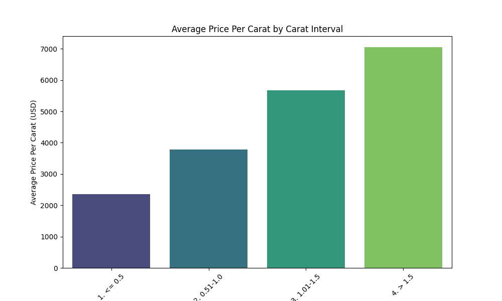
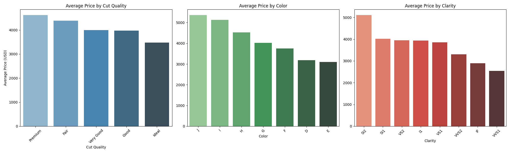

# Diamond Price Analysis: Uncovering Key Value Drivers

## Executive Summary

This report analyzes the key factors influencing diamond prices, based on the provided dataset. Our analysis reveals two primary findings. First, while larger diamonds command higher absolute prices, their price per carat does not increase linearly and, in fact, shows a decreasing trend for the largest diamonds in our dataset. Second, the traditional "4Cs" (Carat, Cut, Color, Clarity) have a nuanced impact on price, with `Clarity` and `Color` showing a more predictable influence than `Cut`. These insights can help guide pricing strategies, inventory management, and customer education.

## The Nuanced Relationship Between Carat Weight and Price

A common assumption is that the larger the diamond, the higher its price per carat. Our analysis shows a more complex reality. We segmented diamonds into four carat intervals and calculated the average price per carat for each.

**Key Observations:**

*   **Initial Rise:** The price per carat increases significantly from the `<= 0.5` carat interval to the `0.51-1.0` carat interval. This is in line with market expectations, where the desirability and rarity of one-carat diamonds command a premium.
*   **Plateau and Decline:** Interestingly, the price per carat plateaus for diamonds in the `1.01-1.5` carat range and then *decreases* for diamonds larger than 1.5 carats. Specifically, the average price per carat drops from approximately $5,200 for the `1.01-1.5` carat group to around $4,500 for diamonds larger than 1.5 carats. This counterintuitive trend suggests that beyond a certain size, other factors like lower quality grades in the larger stones of this dataset may be pulling down the average price per carat. It could also indicate a market segment where demand softens for very large diamonds, or that the sample of very large diamonds in this dataset is skewed towards those with less desirable qualities.

**Business Impact:** This finding is crucial for inventory and pricing strategy. Overvaluing very large diamonds on a simple price-per-carat basis could lead to uncompetitive pricing. It is important to educate customers that 'bigger' isn't always 'better value' and to emphasize the interplay of all the 4Cs.

## The Impact of Cut, Color, and Clarity

Beyond carat, the other "Cs" — Cut, Color, and Clarity — play a significant role in determining a diamond's price. We analyzed the average price for each category of these attributes.

**Key Observations:**

*   **Cut Quality:** The relationship between cut and price is not as straightforward as one might expect. While 'Premium' and 'Very Good' cuts command the highest average prices, 'Ideal' cuts are priced lower than 'Good' cuts on average. This might be due to the prevalence of smaller, 'Ideal' cut diamonds in the market, which pulls down the average price. 'Premium' cut diamonds have the highest average price, at around $4,500.
*   **Color:** The impact of color on price follows a more predictable pattern. As the color grade improves from 'J' (lowest in this dataset) to 'D' (highest), the average price generally increases. The most expensive color grade is 'G', with an average price of over $5,000, which is an anomaly in the expected trend and might be due to a higher concentration of large diamonds in this color grade in this specific dataset.
*   **Clarity:** Clarity shows the clearest and most significant impact on price. The average price escalates dramatically with better clarity grades. A diamond with 'SI2' clarity has an average price of around $5,000, while a top-tier 'VVS2' clarity diamond commands an average price over $8,000.

**Business Impact:** These findings underscore the importance of `Clarity` as a primary driver of value. For marketing and sales, highlighting the clarity of a diamond can be a powerful tool to justify its price. The non-linear relationship with `Cut` suggests that customer education is needed to explain that an 'Ideal' cut can offer great value, especially in smaller diamonds.

## Conclusion and Recommendations

Our analysis of the diamond dataset reveals that while carat weight is a major factor in diamond pricing, its relationship with price per carat is not linear. Furthermore, of the other "4Cs," clarity has the most consistent and significant impact on price.

Based on these findings, we recommend the following:

1.  **Refine Pricing Strategy for Large Diamonds:** Avoid a purely linear price-per-carat model for diamonds above 1.5 carats. Instead, pricing for these stones should be more heavily influenced by their individual quality grades, particularly clarity and color.
2.  **Enhance Customer Education:** Sales staff should be trained to communicate the nuances of diamond value. They should be able to explain why a smaller diamond with exceptional clarity and color can be more valuable than a larger one with lower grades. Highlighting the value proposition of 'Ideal' cut diamonds can also appeal to budget-conscious customers.
3.  **Optimize Inventory:** Stock a balanced inventory that reflects the value drivers. This means prioritizing a range of clarity grades and ensuring a good selection of high-quality diamonds in the 0.5 to 1.5-carat range, which appears to be a sweet spot for price per carat.
