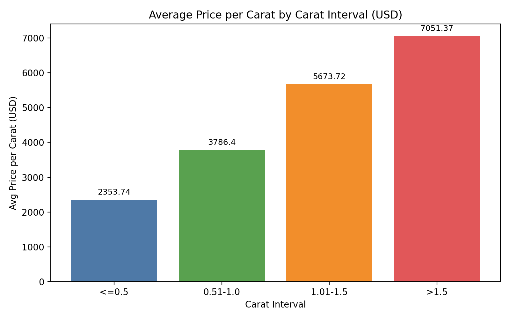

Diamond Pricing Analysis: How Price per Carat Varies by Size and Other Factors

Executive Summary
- Price per carat rises sharply with carat size, from 2,353.74 USD for <=0.5 carat to 7,051.37 USD for >1.5 carats, confirming non-linear pricing due to scarcity and demand.
- Quality attributes matter: Premium cut and IF clarity carry higher price-per-carat, while color shows a nuanced pattern where G/F outperform D on average in this dataset.
- Carat (0.915 correlation with price) and physical dimensions (X: 0.878, Y: 0.858, Z: 0.855) are the dominant drivers; depth and table percentages have minimal direct impact on price.

Dataset & Method
- Data source: SQLite table sheet1 (n=53,595) with fields Carat (diamond weight), Cut (quality), Color, Clarity, Depth percentage, Table percentage, X-axis length (mm), Y-axis width (mm), Z-axis depth (mm), Price (USD).
- SQL: Grouped by carat intervals and by Cut, Color, Clarity to compute counts and average price-per-carat; Python: created a bar chart and computed Pearson correlations across numeric features.

Trend: Price per Carat by Carat Interval
- Observation: Average price per carat rises by interval:
  • <=0.5 carat: 2,353.74 USD (n=18,793; min 1,051.16; max 12,580.65)
  • 0.51–1.0 carat: 3,786.40 USD (n=17,431; min 1,312.50; max 18,341.77)
  • 1.01–1.5 carats: 5,673.72 USD (n=11,985; min 1,225.24; max 23,941.67)
  • >1.5 carats: 7,051.37 USD (n=5,386; min 2,170.67; max 21,880.58)
- Visualization: 
- Why it matters: Larger stones command higher price-per-carat; pricing and acquisition strategies should account for this non-linearity to capture margin.
- Evidence: SQL binning of [Carat (diamond weight)] and avg([Price (USD)]/Carat); Python grouped bar chart from computed bins.

Quality Effects: Cut, Color, Clarity
- Cut (quality):
  • Premium: 4,254.99 USD avg PPC (n=13,687)
  • Very Good: 4,023.12 USD (n=12,055)
  • Ideal: 3,945.51 USD (n=21,410)
  • Good: 3,908.63 USD (n=4,845)
  • Fair: 3,795.55 USD (n=1,598
