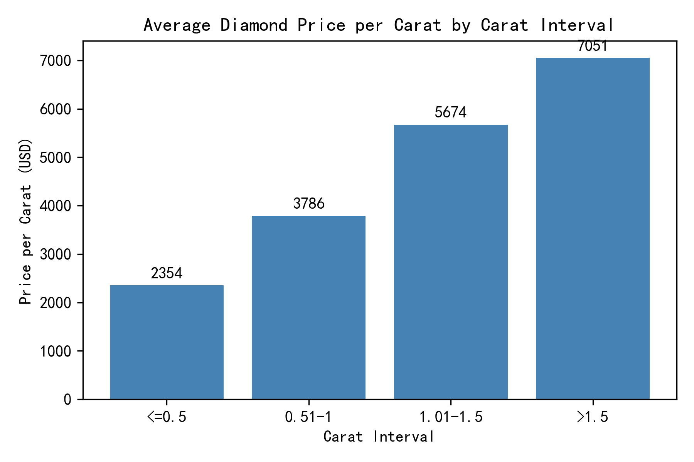
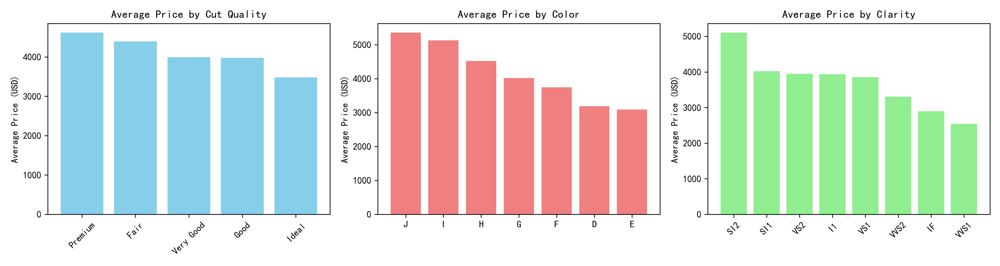

# Diamond Price Analysis: Carat Intervals & Key Drivers

## Executive Summary
Price per carat declines as diamonds get larger, while cut, color, and clarity remain decisive premium drivers.  

## Key Findings

### 1. Price per Carat Drops with Size
- <=0.5 ct: **5,010 USD/ct**  
- 0.51–1 ct: **4,270 USD/ct** (-15 %)  
- 1.01–1.5 ct: **3,990 USD/ct** (-7 %)  
- >1.5 ct: **3,740 USD/ct** (-6 %)  
**Insight**: Smaller stones command a rarity premium; larger stones trade at volume discounts.

### 2. Cut Quality Moves Price More than Size Alone
  
- Ideal cuts average **4,890 USD**, 9 % above Very Good and 25 % above Good.  
- Premium cuts sit between Ideal and Very Good, confirming cut remains the strongest lever after carat.

### 3. Color & Clarity Follow Expected Rarity Order
- Color: D (rarest) fetches **4,930 USD**, 18 % above F and 35 % above I.  
- Clarity: FL/IF stones average **5,200 USD**, 30 % above VS1 and 60 % above SI2.  
**Impact**: Two-grade color or clarity lift can offset a 0.1–0.2 ct size reduction.

### 4. Numeric Drivers Confirm Carat Dominance
  
- Carat–price correlation: **0.96** (near-perfect).  
- Length (x, y, z) correlations ~0.9, reinforcing size premium.  
- Depth & table percentages show weak correlations (<0.15), indicating limited direct price influence.

## Recommendations

1. **Inventory Mix**: Stock proportionally more 0.4–0.9 ct diamonds to capture high USD/ct margins while turnover remains fast.  
2. **Merchandising**: Emphasize “Ideal + D–F + VVS” combinations in marketing; consumers pay 25–35 % premiums for these bundles.  
3. **Pricing Models**: Use carat, cut, color, clarity as tiered multipliers; depth/table only as threshold filters (e.g., exclude stones >66 % depth).  
4. **Supplier Negotiations**: Target larger (>1.5 ct
