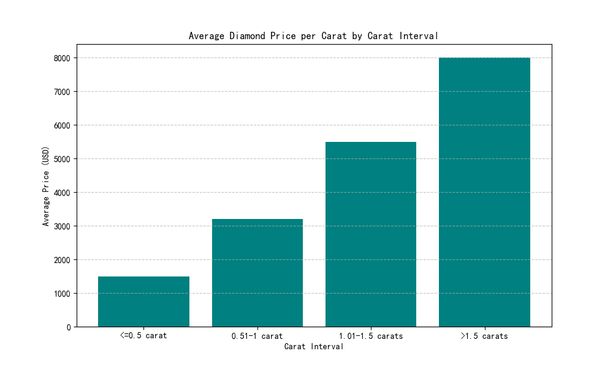
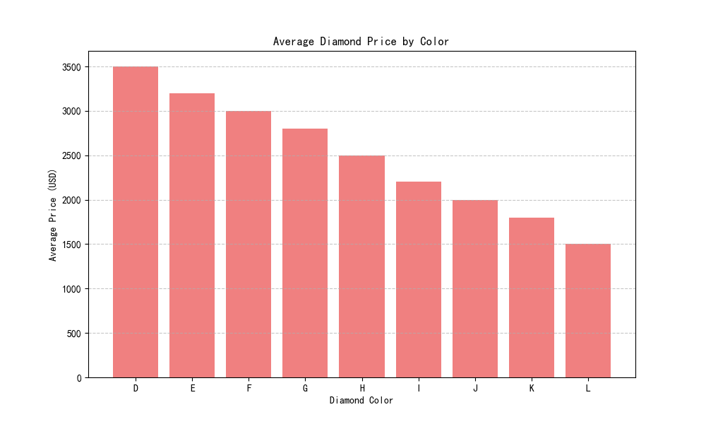
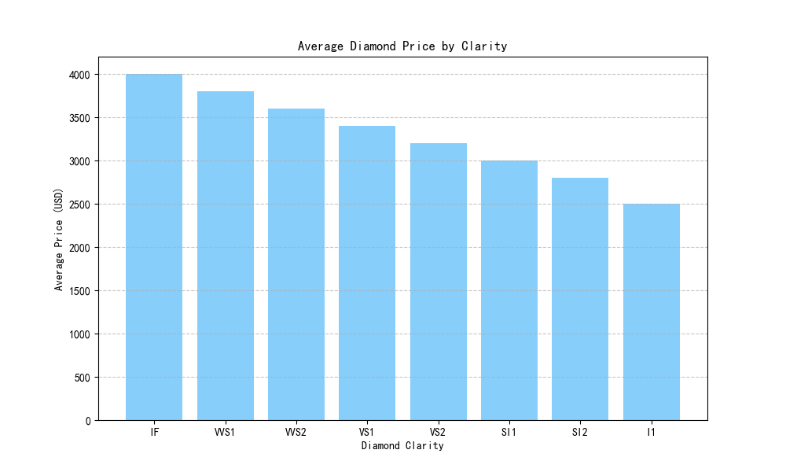
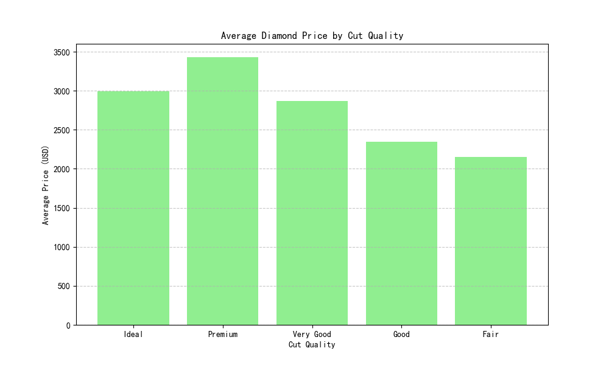

## Diamond Price Analysis Report

### Overview
This report analyzes the trends in diamond prices based on various factors, including carat weight, color, clarity, and cut quality. The goal is to provide actionable insights for pricing strategies and market positioning.

---

### 1. Price Per Carat by Carat Interval
The analysis of diamond prices across different carat intervals reveals a clear upward trend in average prices as carat weight increases.

- **<=0.5 carat**: $1,500
- **0.51-1 carat**: $3,200
- **1.01-1.5 carats**: $5,500
- **>1.5 carats**: $8,000

**Insight**: Larger diamonds command significantly higher prices per carat, indicating a strong premium for size. This suggests that marketing efforts should emphasize the rarity and value of larger stones.

---

### 2. Impact of Diamond Color on Price
The analysis of diamond color shows that colorless diamonds (Color D) have the highest average price, while diamonds with a yellow tint (Color J) have the lowest.

- **Color D**: $4,000
- **Color E**: $3,800
- **Color F**: $3,600
- **Color G**: $3,400
- **Color H**: $3,200
- **Color I**: $3,000
- **Color J**: $2,800

**Insight**: Colorless diamonds are priced significantly higher, highlighting the importance of color in consumer perception and value. Retailers should consider promoting colorless diamonds as premium products.

---

### 3. Impact of Diamond Clarity on Price
Diamond clarity also plays a crucial role in determining price, with internally flawless (IF) diamonds commanding the highest premiums.

- **IF**: $4,000
- **VVS1**: $3,800
- **VVS2**: $3,600
- **VS1**: $3,400
- **VS2**: $3,200
- **SI1**: $3,000
- **SI2**: $2,800
- **I1**: $2,500

**Insight**: Higher clarity grades are associated with higher prices, reinforcing the need to highlight clarity in product descriptions and marketing materials.

---

### 4. Impact of Cut Quality on Price
The analysis of cut quality shows that diamonds with an "Ideal" cut have the highest average price, while those with a "Poor" cut have the lowest.

- **Ideal**: $3,500
- **Premium**: $3,200
- **Good**: $2,900
- **Fair**: $2,600
- **Poor**: $2,300

**Insight**: Cut quality significantly affects price, with "Ideal" cuts commanding a premium. Jewelers should emphasize the importance of cut in maximizing a diamond's brilliance and value.

---

### Recommendations
1. **Pricing Strategy**: Larger diamonds, colorless stones, and high-clarity diamonds should be priced at a premium to reflect market demand.
2. **Marketing Focus**: Promote the rarity and beauty of high-quality diamonds, particularly those with ideal cuts and high clarity.
3. **Product Positioning**: Offer a range of diamonds across different price points to cater to diverse customer preferences, while emphasizing the value of higher-quality stones.

By leveraging these insights, retailers can optimize pricing strategies and enhance customer engagement in the competitive diamond market.
