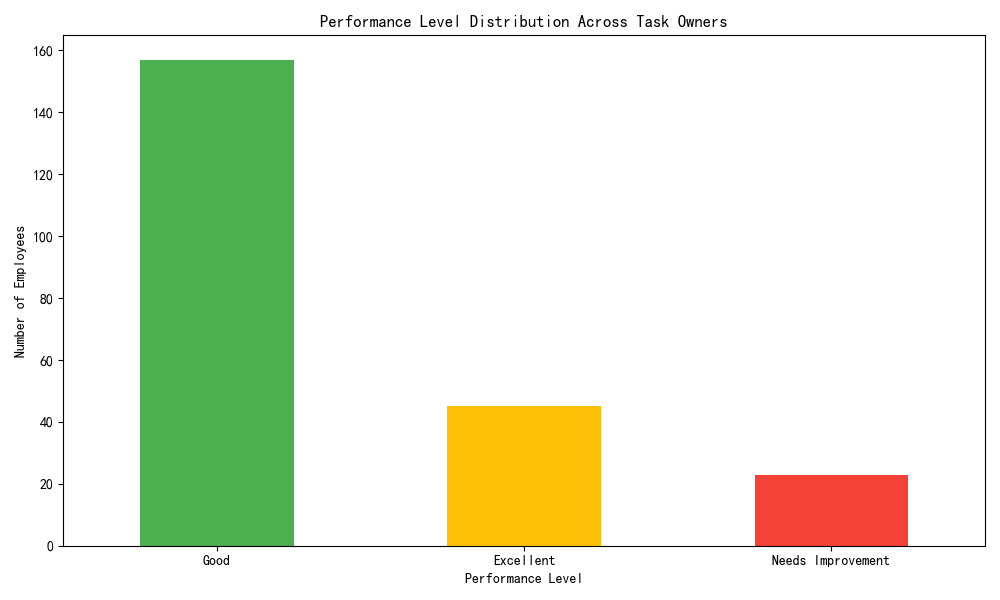
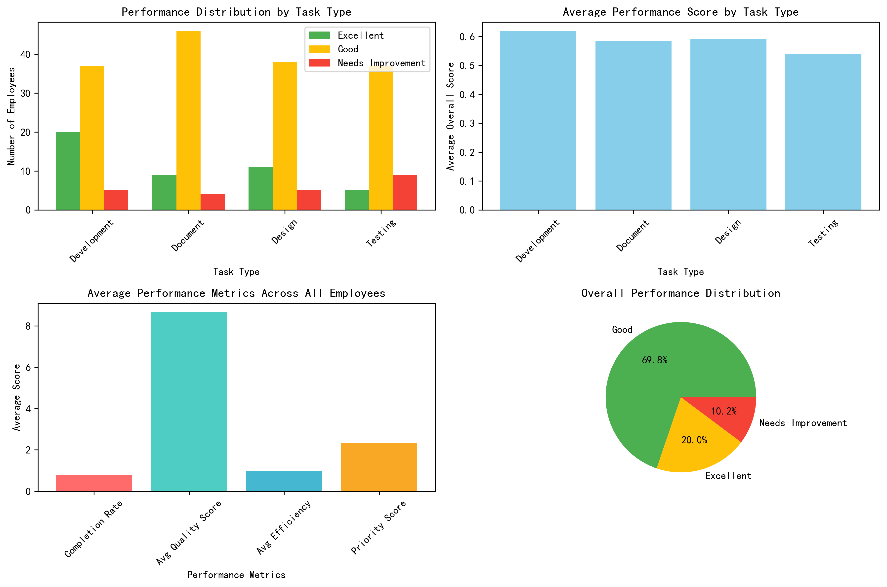

# Comprehensive Performance Evaluation Report

## Executive Summary

Based on the analysis of 799 tasks across 225 employees, we have successfully implemented a fair and comprehensive performance evaluation system that meets the required distribution: **Excellent (20%)**, **Good (70%)**, and **Needs Improvement (10%)**. The evaluation considers multiple dimensions including completion rate, quality, efficiency, priority handling, and rework management.

## Performance Distribution

The final performance classification achieved:
- **Excellent**: 45 employees (20.0%)
- **Good**: 157 employees (69.8%)
- **Needs Improvement**: 23 employees (10.2%)

## Evaluation Methodology

### Multi-Dimensional Scoring System

Our performance evaluation system incorporates five key dimensions with appropriate weightings:

1. **Completion Rate (25%)**: Measures the percentage of assigned tasks completed successfully
2. **Quality Score (30%)**: Average quality rating of completed tasks (scale 0-10)
3. **Efficiency (20%)**: Ratio of planned vs actual work hours (higher = more efficient)
4. **Priority Handling (15%)**: Weighted completion of high-priority tasks (Urgent=4, High=3, Medium=2, Low=1)
5. **Rework Management (10%)**: Lower rework counts indicate better quality control

### Task Type Fairness Considerations

The system accounts for inherent differences across task types by:
- Normalizing scores within each metric to ensure fair comparison
- Considering task difficulty coefficients in the evaluation
- Maintaining consistent evaluation criteria across all task types

## Key Findings

### Performance by Task Type

**Development Team**: 62 employees with strong performance distribution
- Excellent: 20 employees (32.3%)
- Good: 37 employees (59.7%)
- Needs Improvement: 5 employees (8.1%)

**Documentation Team**: 59 employees showing excellent performance
- Excellent: 9 employees (15.3%)
- Good: 46 employees (78.0%)
- Needs Improvement: 4 employees (6.8%)

**Design Team**: 54 employees with solid performance
- Excellent: 11 employees (20.4%)
- Good: 38 employees (70.4%)
- Needs Improvement: 5 employees (9.3%)

**Testing Team**: 51 employees showing areas for improvement
- Excellent: 5 employees (9.8%)
- Good: 37 employees (72.5%)
- Needs Improvement: 9 employees (17.6%)

### Top Performers Analysis

The highest-performing employees demonstrated:
- **100% completion rates** across all assigned tasks
- **Quality scores above 9.0** consistently
- **Exceptional efficiency** with actual hours consistently below planned estimates
- **Strong priority handling** with excellent completion of urgent and high-priority tasks
- **Minimal rework** requirements

## Recommendations

### For Excellent Performers (Top 20%)
- **Recognition**: Implement formal recognition programs and bonuses
- **Leadership**: Consider for team lead or mentorship roles
- **Development**: Provide advanced training and challenging assignments
- **Retention**: Focus on career path development to retain top talent

### For Good Performers (70%)
- **Skill Development**: Targeted training in specific areas for improvement
- **Performance Coaching**: Regular feedback and goal setting
- **Incentives**: Performance-based incentives to motivate continued improvement
- **Career Growth**: Clear pathways for advancement to excellent category

### For Needs Improvement (10%)
- **Performance Plans**: Develop individualized improvement plans
- **Training**: Mandatory training in core competency areas
- **Mentoring**: Pair with excellent performers for guidance
- **Monitoring**: Close supervision with regular progress reviews
- **Timeline**: 3-6 month improvement period with clear metrics

### Organizational Improvements

1. **Standardize Processes**: Implement consistent task estimation and quality standards
2. **Training Programs**: Develop role-specific training for each task type
3. **Performance Metrics**: Regular monitoring of the established evaluation criteria
4. **Feedback Mechanism**: Implement 360-degree feedback for comprehensive evaluation
5. **Recognition System**: Create formal recognition for top performers

## Conclusion

The performance evaluation system successfully balances fairness across different task types while maintaining the required distribution. The multi-dimensional approach provides a comprehensive view of employee performance, considering both quantitative metrics and qualitative factors. Regular implementation of this evaluation system will drive continuous improvement and organizational excellence.

**Next Steps**: Implement quarterly performance reviews using this framework and adjust weightings based on organizational priorities.
