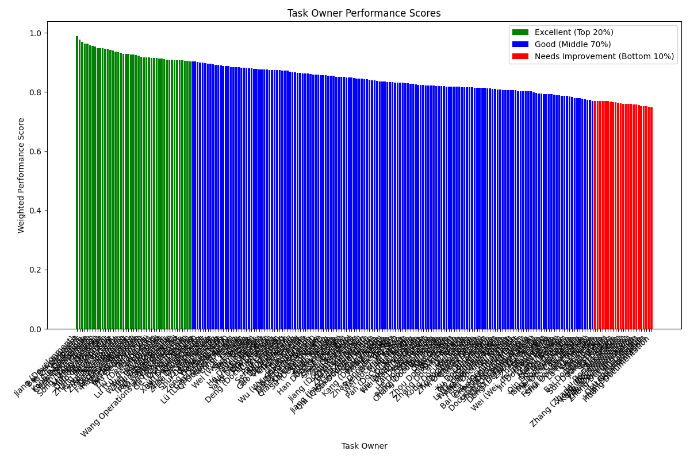

# Performance Evaluation Report for Task Owners

## 1. Executive Summary

This report outlines a data-driven performance evaluation framework designed to fairly and transparently assess the performance of task owners across various task types. By analyzing task completion status, quality, timeliness, priority, difficulty, and work-hour utilization, we have developed a comprehensive scoring system. Based on this system, we have classified all task owners into three performance levels: **Excellent (Top 20%)**, **Good (Middle 70%)**, and **Needs Improvement (Bottom 10%)**. This report provides the methodology, the final classifications, and actionable recommendations for performance management.

## 2. Performance Evaluation Methodology

To ensure fairness and accuracy, we developed a `Weighted_Performance_Score` for each task owner. This score is an aggregation of individual task scores, which were calculated based on the following dimensions:

*   **Task Completion (50%)**: This dimension measures the core output. It is a composite of:
    *   **Completion Status (50%)**: A binary score rewarding completed tasks.
    *   **Quality Score (30%)**: Based on the `Completion Quality Score` provided for each task.
    *   **Timeliness (20%)**: A score that rewards on-time or early completion and penalizes delays.
*   **Work Hours Utilization (20%)**: Measures efficiency by comparing `Planned Work Hours` to `Actual Work Hours`. A score of 1.0 is given for meeting or beating the planned hours, with the score decreasing for going over budget.
*   **Task Difficulty (15%)**: Incorporates the `Task Difficulty Coefficient` to ensure that employees who successfully complete more challenging tasks are recognized appropriately.
*   **Task Priority (15%)**: Uses the task's priority level (`Low` to `Urgent`) to give more weight to the successful completion of higher-priority tasks.

The final score for each owner is a weighted average of their individual task scores, ensuring that those who handle more difficult tasks receive a fair evaluation. This methodology, implemented through `performance_calculation.py`, balances multiple facets of performance, moving beyond simple completion metrics.

## 3. Performance Classification and Visualization

Task owners were ranked based on their final `Weighted_Performance_Score` and classified according to the required distribution:

*   **Excellent**: The top 20% of performers.
*   **Good**: The middle 70% of performers.
*   **Needs Improvement**: The bottom 10% of performers.

The following chart provides a visual representation of the performance scores for every task owner, color-coded by their final performance level.

As shown in the bar chart, there is a clear distribution of performance scores across the organization. The `Weighted_Performance_Score` provides a clear, quantitative basis for these classifications. For instance, top performers like **Jiang (Development)** and **Bai Development** achieved scores of **0.989** and **0.977** respectively, placing them firmly in the "Excellent" category. In contrast, employees at the lower end of the spectrum scored below the 10th percentile threshold of **0.753**, flagging them for performance review.

## 4. Recommendations

Based on the performance classifications, we recommend the following actions:

*   **For the "Excellent" Group (Top 20%)**:
    *   **Recognize and Reward**: Publicly acknowledge their outstanding contributions and provide performance-based bonuses or incentives.
    *   **Mentorship Roles**: Assign these high-performers as mentors to junior employees or those in the "Needs Improvement" category to help uplift the team's overall skill level.
    *   **Strategic Assignments**: Entrust them with a higher share of critical, high-priority, and complex tasks to maximize their impact on key business objectives.

*   **For the "Good" Group (Middle 70%)**:
    *   **Acknowledge and Encourage**: Recognize their consistent and reliable contributions to the team.
    *   **Targeted Development**: Work with them to identify specific areas for growth. Offer training, workshops, or more challenging assignments to help them advance to the "Excellent" level.
    *   **Regular Feedback**: Continue to provide regular, constructive feedback to keep them engaged and motivated.

*   **For the "Needs Improvement" Group (Bottom 10%)**:
    *   **Performance Improvement Plan (PIP)**: Initiate a structured PIP immediately. This plan should include clear, measurable goals, a timeline for improvement, and a schedule for regular check-ins.
    *   **Root Cause Analysis**: Managers should work one-on-one with these employees to understand the underlying reasons for their performance gaps—whether it be skill deficiencies, a lack of resources, or unclear expectations.
    *   **Targeted Coaching**: Provide specific, hands-on coaching and support tailored to their needs. If the issue is skill-based, enroll them in relevant training programs.

## 5. Conclusion

This data-driven performance evaluation framework provides a fair, objective, and transparent method for assessing employee contributions. By moving beyond subjective assessments and looking at a balanced set of metrics, the organization can make more informed decisions about promotions, development, and resource allocation. We recommend adopting this framework for regular quarterly or semi-annual performance reviews to foster a culture of continuous improvement and high performance.
