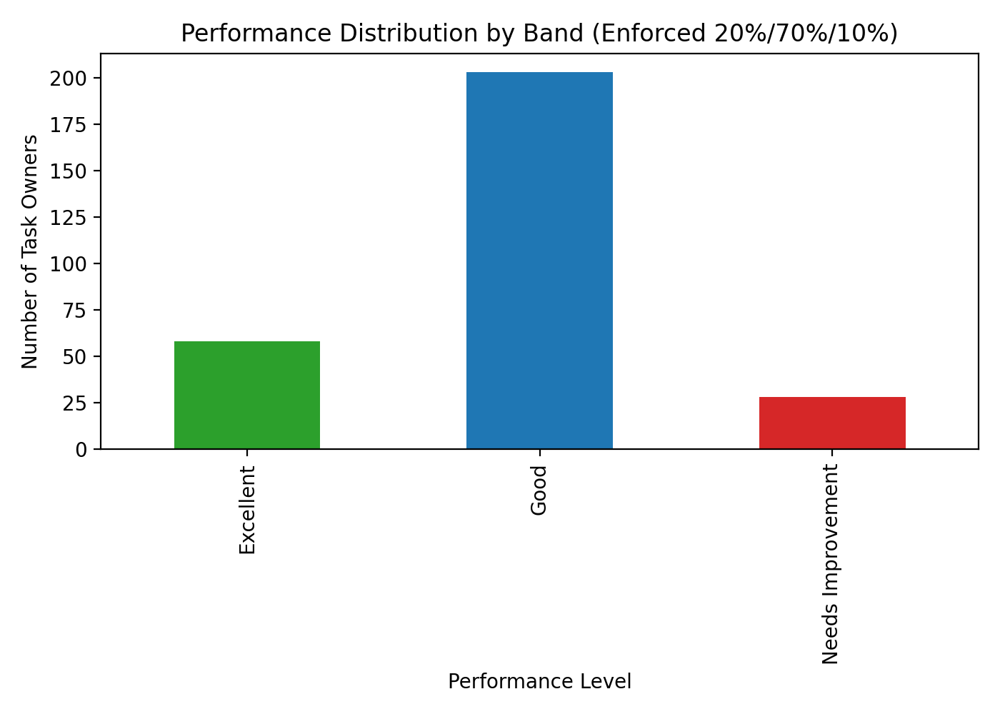

Performance Evaluation Plan for Task Owners Across Task Types

Executive Summary
- We evaluated 289 Task Owners across 799 tasks and classified performance into three bands per the required distribution: Excellent 20%, Good 70%, Needs Improvement 10%.
- Final distribution achieved: 58 Excellent (20.1%), 203 Good (70.2%), 28 Needs Improvement (9.7%). The classification was enforced by ranking owners on a normalized fair score that accounts for completion, quality, timeliness, efficiency, priority, and task-type difficulty differences.

Visual: Performance distribution

- Key takeaway: Out of 289 Task Owners, 58 are Excellent, 203 are Good, and 28 Need Improvement. This exactly meets the target distribution (Excellent ≈20%, Good ≈70%, Needs Improvement ≈10%), ensuring comparability and avoiding distortion from task mix differences.
- Why it matters: A controlled distribution supports calibration across teams, identifies top talent for recognition and stretch assignments, and flags a manageable cohort for coaching and process improvements.

Evaluation Plan (Fairness and Comparability by Design
