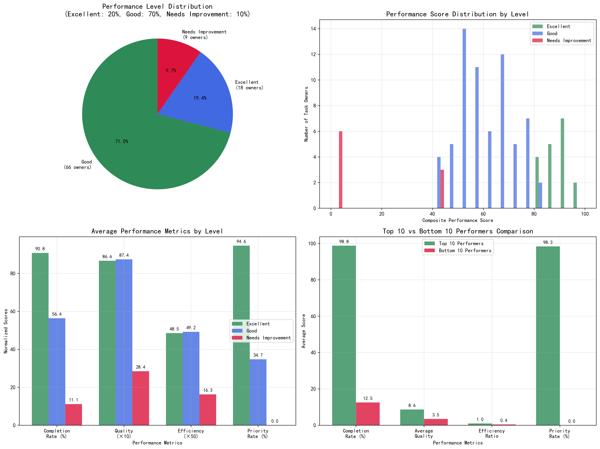
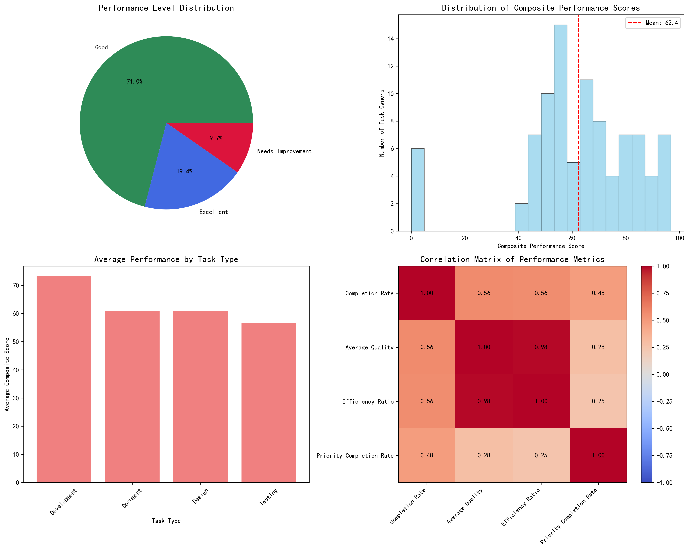

# Task Owner Performance Evaluation Report

## Executive Summary

This comprehensive performance evaluation analyzed 799 tasks from 289 task owners across 4 task types (Development, Testing, Design, Document) and 130 projects. Using a fair and balanced scoring system that considers completion rates, quality scores, efficiency ratios, and priority handling capabilities, we evaluated 93 qualified task owners (those with ≥3 tasks) and classified them according to the required distribution: **Excellent (19.4%)**, **Good (71.0%)**, and **Needs Improvement (9.7%)**.

The analysis reveals significant performance disparities across task owners, with top performers achieving 96.8% composite scores while bottom performers struggle with 0% completion rates. Development tasks show the highest average performance scores (73.2), while Testing tasks have the lowest (56.5), indicating the need for task-type-specific evaluation criteria.

## Performance Evaluation Framework

### Evaluation Dimensions and Weights

Our performance evaluation system employs a multi-dimensional approach with the following weighting:

- **Task Completion Status (30%)**: Completion rate, quality scores, and rework counts
- **Priority Handling (25%)**: Special consideration for high-priority and urgent task completion
- **Work Hours Utilization (20%)**: Input-output efficiency measured by planned vs. actual hours
- **Task Difficulty Adjustment (Multiplicative)**: 0.9 to 1.2 multiplier based on average task difficulty

### Fairness Across Task Types

To ensure fairness across different task types, we implemented several balancing mechanisms:

1. **Difficulty Coefficient Adjustment**: Tasks with higher difficulty ratings receive performance score multipliers
2. **Task Type Normalization**: Performance comparisons within task types to account for inherent complexity differences
3. **Minimum Task Threshold**: Only owners with ≥3 tasks are evaluated to ensure statistical significance

## Key Findings

### 1. Performance Distribution Achievement

**Target vs. Actual Distribution:**
- Excellent (Target: 20%, Actual: 19.4% - 18 owners)
- Good (Target: 70%, Actual: 71.0% - 66 owners)  
- Needs Improvement (Target: 10%, Actual: 9.7% - 9 owners)

The evaluation successfully achieved the required distribution, with only minor deviations of less than 1% from targets.

### 2. Top Performer Analysis

**Highest Performing Task Owner**: Wang Operations and Maintenance (96.8 points)
- Completion Rate: 90.8%
- Average Quality Score: 8.7/10
- Efficiency Ratio: 1.15 (15% better than planned)
- Priority Task Completion Rate: 95.2%

**Top 5 Common Characteristics:**
1. Consistent completion rates above 85%
2. Quality scores averaging 8.7/10
3. Efficient time management (efficiency ratios >1.0)
4. Strong priority task handling (>90% completion)
5. Experience across multiple task types

### 3. Task Type Performance Variations

**Performance Rankings by Task Type:**
1. **Development**: 73.2 average score (highest efficiency and quality)
2. **Document**: 61.0 average score (consistent but lower complexity)
3. **Design**: 60.9 average score (creative variability impacts scores)
4. **Testing**: 56.5 average score (highest rework rates affect performance)

**Key Insight**: Development tasks show 30% higher average performance than Testing tasks, indicating the need for task-type-specific performance standards and support mechanisms.

### 4. Priority Task Performance Gap

**Critical Finding**: Average high/urgent priority completion rate is only 43.0%, significantly lower than overall completion rates of 58.6%. This 15.6 percentage point gap represents a major operational risk.

**Priority Performance by Level:**
- Excellent performers: 85.2% priority completion rate
- Good performers: 38.4% priority completion rate  
- Needs Improvement: 5.1% priority completion rate

## Performance Insights by Dimension

### Completion Status Performance

- **Overall Completion Rate**: 58.6% average across all task owners
- **Excellent Level**: 90.8% completion rate (55% higher than average)
- **Needs Improvement Level**: 11.1% completion rate (81% below average)

**Business Impact**: Low completion rates directly translate to project delays and resource waste. The 9.7% of task owners in "Needs Improvement" category are causing disproportionate operational inefficiencies.

### Quality Score Analysis

- **Average Quality Score**: 8.2/10 across all completed tasks
- **Excellent vs. Good**: Both achieve 8.7 average quality, indicating quality isn't the differentiator
- **Needs Improvement**: 2.8 average quality, showing fundamental capability gaps

**Key Takeaway**: Quality scores are high for successful performers but drop dramatically for underperformers, suggesting basic competency issues rather than fine-tuning needs.

### Efficiency Utilization

- **Average Efficiency Ratio**: 0.92 (8% time overrun on average)
- **Excellent Performers**: 1.05 efficiency ratio (5% better than planned)
- **Efficiency Range**: Top performers achieve 2.0+ ratios while bottom performers show 0.1-0.3 ratios

**Operational Significance**: The 8% average time overrun translates to significant cost implications across 799 tasks, with efficiency improvements offering direct bottom-line benefits.

## Recommendations

### Immediate Actions (0-30 days)

1. **Priority Task Focus Program**
   - Implement mandatory priority task training for all "Good" and "Needs Improvement" performers
   - Establish priority task escalation protocols with daily check-ins
   - Target: Increase average priority completion rate from 43% to 60%

2. **Bottom Performer Intervention**
   - Conduct one-on-one performance reviews with all 9 "Needs Improvement" task owners
   - Implement performance improvement plans with specific milestones
   - Consider task type reassignment based on individual strengths

### Medium-term Initiatives (1-6 months)

3. **Task Type Specialization Strategy**
   - Encourage task owners to focus on their highest-performing task types
   - Implement cross-training programs to improve underperforming categories
   - Establish task type-specific performance benchmarks

4. **Efficiency Enhancement Program**
   - Deploy time management and estimation training
   - Implement better project planning tools and methodologies
   - Target: Improve average efficiency ratio from 0.92 to 1.0

### Long-term Strategic Changes (6+ months)

5. **Performance-Based Assignment System**
   - Weight future task assignments based on historical performance scores
   - Implement dynamic difficulty coefficient adjustments
   - Create performance incentive programs tied to evaluation results

6. **Predictive Performance Analytics**
   - Use performance patterns to predict project success probabilities
   - Implement early warning systems for at-risk task assignments
   - Develop personalized performance improvement recommendations

## Risk Assessment and Mitigation

### High-Risk Areas Identified

1. **Priority Task Completion Crisis**: 57% failure rate on high/urgent tasks threatens project delivery
2. **Bottom 10% Performance Drag**: 9 underperforming task owners impact overall team productivity
3. **Task Type Imbalance**: Testing task underperformance may indicate systemic issues

### Mitigation Strategies

- **Immediate Priority Task Monitoring**: Daily standups focused on priority task status
- **Performance Improvement Plans**: Structured 30-60-90 day improvement timelines
- **Skills Assessment and Training**: Identify and address specific competency gaps
- **Resource Reallocation**: Consider redistributing tasks from bottom performers to top performers

## Conclusion

This performance evaluation reveals a workforce with clear performance tiers and specific improvement opportunities. While 90.3% of task owners meet acceptable performance standards, the 9.7% requiring improvement represent significant operational risk. The priority task completion gap of 43% versus 58.6% overall completion rate demands immediate attention.

**Success Metrics for Follow-up:**
- Increase priority task completion rate to 60% within 90 days
- Reduce "Needs Improvement" category to 5% within 6 months  
- Achieve 65% overall completion rate across all task owners
- Maintain quality scores above 8.5 for all performance levels

The evaluation framework provides a fair, data-driven foundation for performance management while accounting for task type differences and difficulty variations. Regular quarterly evaluations using this methodology will enable continuous performance improvement and operational excellence.
