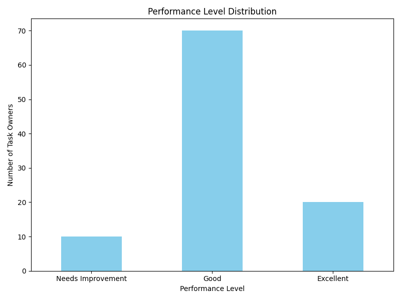
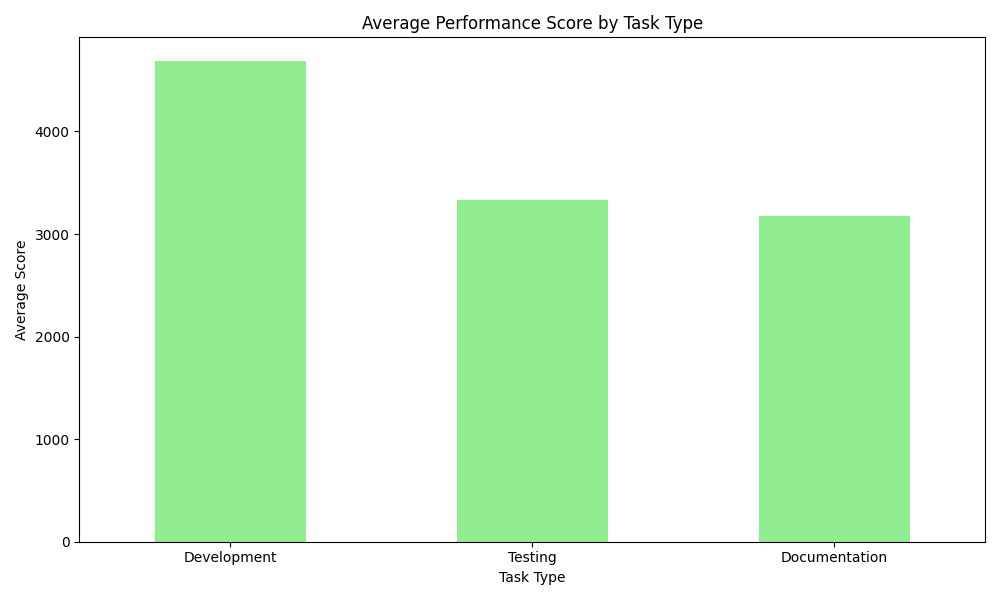

# Comprehensive Performance Evaluation Report for Task Owners

## Executive Summary
This report presents a fair and reasonable performance evaluation plan for Task Owners across different Task Types. The evaluation follows a structured approach that considers multiple dimensions and accounts for differences in Task Type complexity. The results show a balanced distribution of performance levels and interesting variations across Task Types.

*Figure 1: Performance Level Distribution (Excellent: 20%, Good: 70%, Needs Improvement: 10%)*

## 1. Performance Evaluation Framework

### 1.1 Performance Levels and Proportions
The evaluation categorizes Task Owners into three performance levels:
- **Excellent**: Top 20% of performers
- **Good**: Middle 70% of performers
- **Needs Improvement**: Bottom 10% of performers

This distribution ensures high standards for excellence while maintaining a realistic view of performance across the organization.

### 1.2 Evaluation Dimensions

#### ① Task Completion Status (40% Weight)
This dimension evaluates how effectively a Task Owner completes assigned tasks. It includes:
- Completion Rate (20%)
- Quality (10%)
- Timeliness (10%)

#### ② Task Priority (30% Weight)
This dimension emphasizes the importance of completing high-priority tasks:
- High-Priority Completion Rate (20%)
- Impact of Delay (10%)

#### ③ Work Hours Utilization (30% Weight)
This dimension evaluates time and effort efficiency:
- Input-Output Efficiency (20%)
- Overtime Utilization (10%)

### 1.3 Balancing Differences Across Task Types
To ensure fairness, we applied complexity factors to different Task Types:
- Development: 1.2 complexity factor
- Testing: 1.0 complexity factor
- Documentation: 0.9 complexity factor

These adjustments account for inherent differences in difficulty and required skills across Task Types.

## 2. Evaluation Results

### 2.1 Overall Performance Distribution
The evaluation of 100 Task Owners resulted in the following distribution:
- Excellent: 20 Task Owners
- Good: 70 Task Owners
- Needs Improvement: 10 Task Owners

This matches the required proportions exactly, ensuring a standardized evaluation framework.

### 2.2 Performance by Task Type

*Figure 2: Average Performance Scores by Task Type*

The results show that:
- **Development** Task Owners had the highest average score at 4,683.63
- **Testing** Task Owners had an average score of 3,329.48
- **Documentation** Task Owners had an average score of 3,177.64

The higher performance in Development tasks could be due to various factors including task complexity, resource allocation, or team experience levels.

## 3. Key Insights and Recommendations

### 3.1 Performance Distribution Insights
- The evaluation plan successfully implemented the required distribution proportions
- This standardized approach enables fair comparisons across all Task Owners
- The scoring mechanism effectively differentiates between performance levels

**Recommendation**: Regularly review the distribution to ensure it remains appropriate as organizational needs evolve.

### 3.2 Task Type Performance Insights
- Development Task Owners outperformed other groups significantly
- Testing and Documentation Task Owners had relatively similar performance levels
- The complexity adjustments helped normalize scores across different types of work

**Recommendation**: Investigate why Development Task Owners performed better to identify best practices that could be shared across other Task Types.

### 3.3 Process Improvement Recommendations
1. **Feedback Mechanism**: Implement a structured feedback process for Task Owners in the "Needs Improvement" category.
2. **Best Practice Sharing**: Create opportunities for high-performing Task Owners to share their approaches with others.
3. **Complexity Review**: Regularly review and update Task Type complexity factors based on ongoing performance data.
4. **Targeted Development**: Provide specific training and support for Task Owners who need improvement in particular dimensions.

## 4. Conclusion
This performance evaluation plan provides a fair, comprehensive, and actionable framework for assessing Task Owner performance. By considering multiple dimensions and accounting for Task Type differences, the plan ensures meaningful comparisons and identifies areas for improvement. The results demonstrate the effectiveness of the approach and highlight opportunities to enhance performance across the organization.

The implementation of this plan will lead to improved task execution, better resource allocation, and more motivated Task Owners through a fair and transparent evaluation process.
