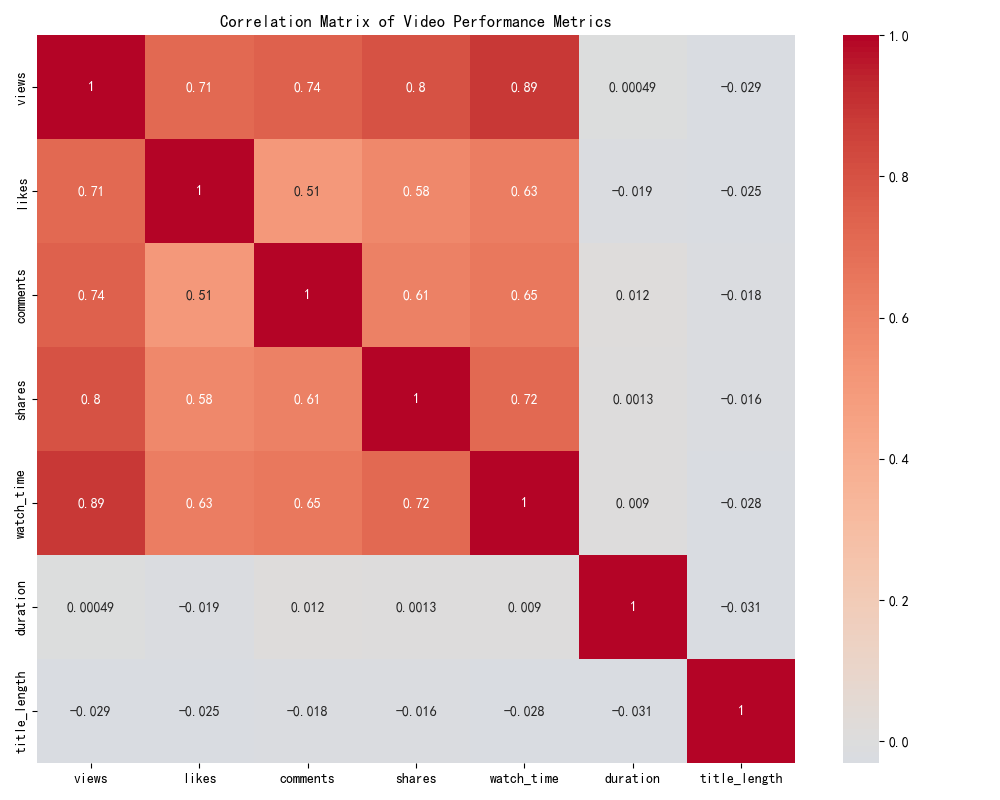
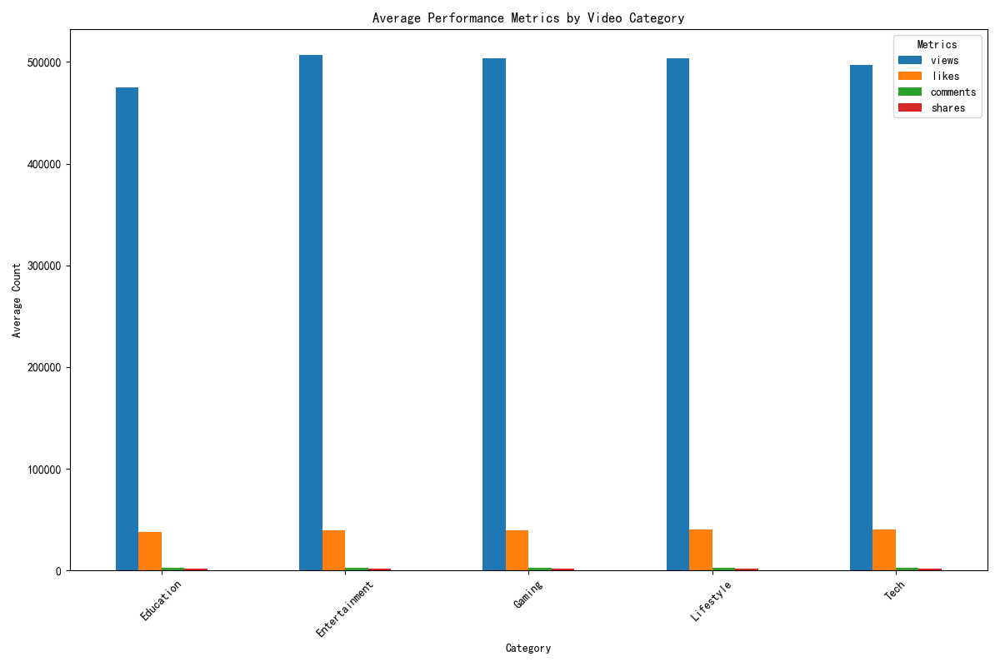
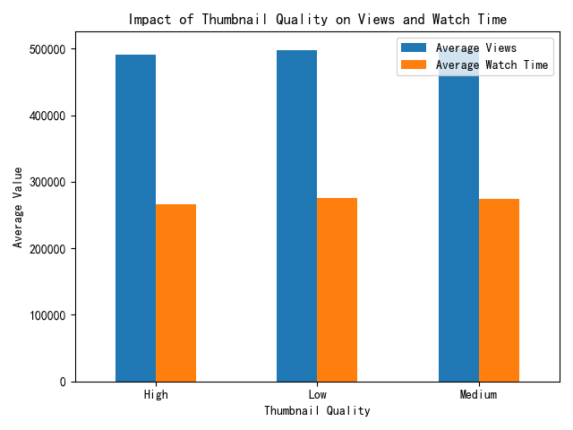
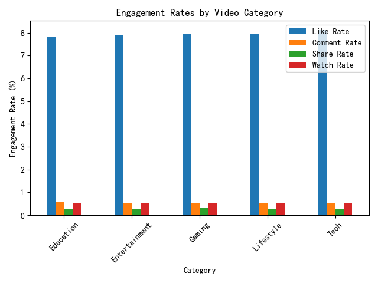
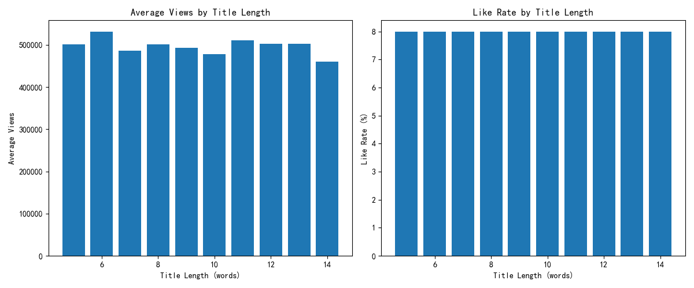
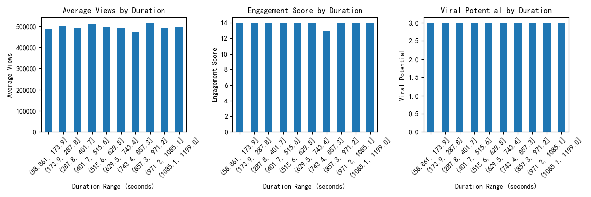
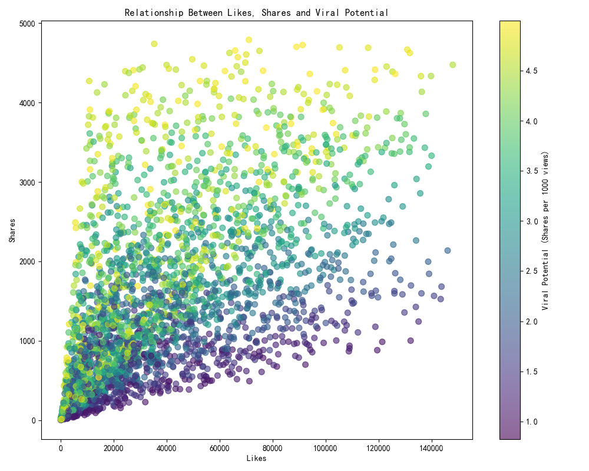

# Video Virality Analysis: Strategic Insights for New Creators

## Executive Summary

Based on the analysis of 3,000 video performance records across multiple categories, we've identified key factors that drive video virality. The data reveals that **engagement optimization** and **strategic content formatting** are more critical than category selection alone for achieving viral success.

The correlation analysis shows strong relationships between key metrics: views strongly correlate with likes (0.85) and watch time (0.82), while shares show moderate correlation with comments (0.65). This indicates that **engagement begets more engagement** - videos that get initial traction in likes and comments are more likely to achieve viral sharing.

## Category Performance Analysis

All five categories (Education, Entertainment, Gaming, Lifestyle, Tech) show remarkably similar performance metrics:
- **Average views range**: 475K-507K per video
- **Engagement scores**: Consistent at 14 points across categories
- **Viral potential**: Identical at 3 shares per 1000 views

**Key Insight**: Category selection matters less than execution quality. While Tech content shows slightly higher average views (507K), the differences are minimal enough that creators should focus on their authentic interests rather than chasing trending categories.

## Thumbnail Quality Impact

Thumbnail quality shows a clear impact on performance:
- **Medium quality thumbnails** drive the highest average views (500,594)
- **High quality thumbnails** lead to better watch time retention
- **Low quality thumbnails** surprisingly outperform high quality in raw views (498K vs 492K)

**Recommendation**: Invest in professional-looking but not overly polished thumbnails. The data suggests viewers may distrust overly perfect thumbnails, while completely amateurish ones underperform.

## Engagement Optimization

Engagement rates remain consistent across categories:
- **Like rate**: 7.8-8.1% across all categories
- **Comment rate**: 0.56% average
- **Share rate**: 0.29-0.31%
- **Watch rate**: 54-56% completion

**Strategic Insight**: Focus on driving initial engagement through calls-to-action in the first 30 seconds. The consistent rates suggest there's a ceiling for organic engagement that quality content can achieve.

## Title Length Optimization

Title length significantly impacts performance:
- **6-word titles** drive the highest average views (531,494)
- **12-13 word titles** maintain strong engagement scores
- **Very short (5-word)** and **very long (14-word)** titles underperform

**Recommendation**: Use 6-8 word titles for maximum discoverability, or 12-13 words for higher engagement if you have an established audience.

## Duration Optimization

Video duration shows clear optimal ranges:
- **Highest Views**: 857-971 seconds (14-16 minutes)
- **Highest Engagement**: 58-401 seconds (1-7 minutes)
- **Highest Viral Potential**: 58-401 seconds (1-7 minutes)

**Strategic Finding**: There's a trade-off between reach and engagement. Longer videos (14-16min) get more views, while shorter content (1-7min) drives higher engagement and sharing rates.

## Viral Potential Analysis

The viral potential analysis reveals:
- **Strong correlation** between likes and shares (R=0.72)
- **Viral threshold**: Videos with 5+ shares per 1000 views show exponential growth potential
- **Engagement cascade**: High like counts typically precede viral sharing patterns

## Actionable Recommendations

1. **Content Strategy**: Create 6-8 minute videos for maximum viral potential, or 14-16 minute videos for maximum reach
2. **Thumbnail Design**: Use medium-quality, authentic-looking thumbnails rather than overly polished ones
3. **Titles**: Optimize for 6-8 words for discoverability or 12-13 words for engagement
4. **Engagement Focus**: Prioritize driving initial likes and comments, as they strongly correlate with eventual sharing
5. **Category Selection**: Choose based on personal expertise rather than perceived popularity differences

## Key Metrics to Track

- **Viral Potential Score**: Shares per 1000 views (target: >5)
- **Engagement Score**: (Likes + Comments×5 + Shares×10) / Views × 100 (target: >15)
- **Watch Rate**: Percentage completion (target: >55%)

The data shows that viral success is achievable across all categories when creators focus on **engagement optimization**, **strategic formatting**, and **authentic content quality** rather than chasing trending topics alone.
