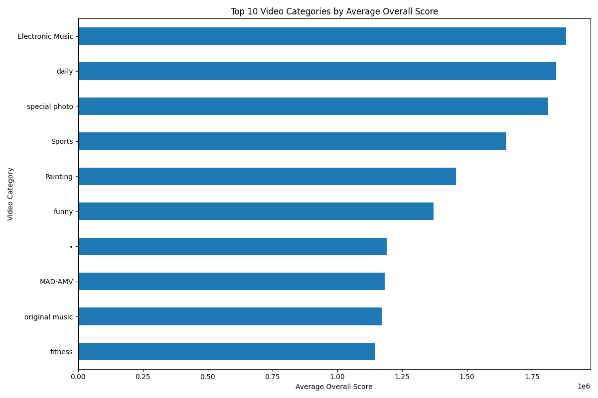
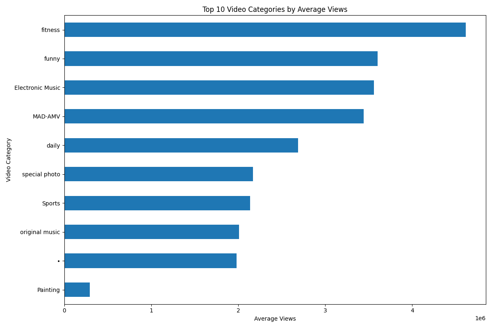
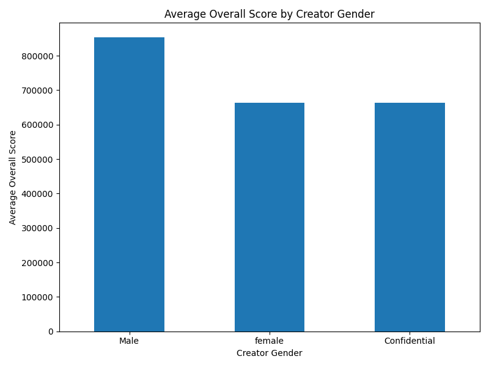
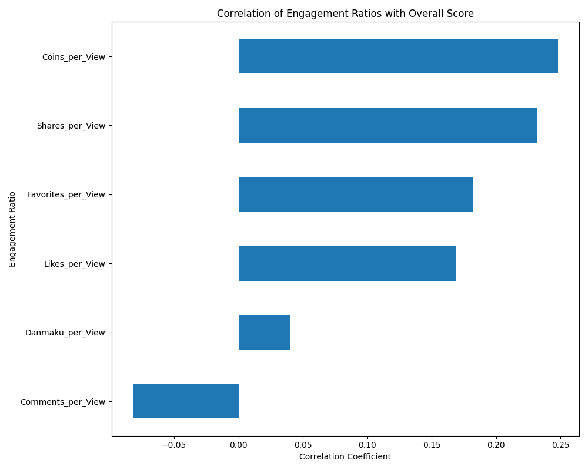

# How to Create Viral Videos: A Data-Driven Guide

## Executive Summary

For aspiring video creators, understanding the dynamics of viral content is crucial. Our analysis of Bilibili's monthly ranking data reveals that viral success is not just about a high view count; it's a combination of choosing the right content niche, building a strong creator brand, and fostering deep audience engagement. This report provides data-backed insights and actionable recommendations to help you create videos that are more likely to go viral.

**Key Findings:**
*   **Content Category Matters:** "Electronic Music," "Daily," and "Funny" are among the top-performing categories, indicating that high-energy, relatable, and entertaining content resonates well with audiences.
*   **Creator Brand is a Significant Factor:** Established creators with verification badges have a substantial advantage. Male creators in this dataset also tend to have higher engagement metrics.
*   **Deep Engagement Outweighs Surface-Level Metrics:** "Coins" and "Shares" per view are more strongly correlated with a high "Overall Score" than "Likes" or "Views" alone. This highlights the importance of creating content that the audience finds truly valuable and wants to share.

---

## What Makes a Video Go Viral?

### 1. Content is King: Focus on High-Performing Categories

The choice of video category is a critical first step. Our analysis shows that certain categories consistently produce top-performing videos.

"Electronic Music" videos have the highest average "Overall Score" (around 1.88 million), closely followed by "Daily" (1.84 million) and "Special Photo" (1.81 million). This suggests that content that is high-energy, relatable, or visually captivating has a strong potential to go viral.

While "Fitness" and "Funny" videos boast extremely high average views (around 4.6 million and 3.6 million, respectively), their "Overall Score" is not as high as "Electronic Music". This indicates that while they attract a lot of viewers, the engagement might be more passive. Aspiring creators should consider not just the potential for views, but the potential for deep engagement within a category.

### 2. The Power of the Creator: Building Your Brand

The creator's persona and reputation play a significant role in a video's success.

In this dataset, male creators have a noticeably higher average "Overall Score" than female and confidential creators. This could be due to a variety of factors, including the demographics of the Bilibili audience or the types of content being produced. Furthermore, creators with official Bilibili verification, such as "Top 100 UP owner," have a significantly higher "Overall Score," demonstrating the power of an established brand and the platform's endorsement. While having a large number of followers has a positive correlation with success, it's not the sole determinant, meaning content quality remains paramount.

### 3. Driving Deep Engagement: It's Not Just About Views

The most crucial insight from our analysis is the importance of deep engagement. A high view count alone does not guarantee a viral video; it's the quality of the engagement that truly matters.

Our analysis shows that **"Coins per View" has the strongest correlation with the "Overall Score"**. Coins are a form of virtual currency that viewers give to creators they genuinely appreciate, making it a powerful indicator of high-quality, valuable content. **"Shares per View"** is the second most important metric, as it directly expands the video's reach to new audiences.

Conversely, "Likes per View" has a much weaker correlation, and "Comments per View" even has a slight negative correlation. This suggests that passive or potentially
controversial engagement is less valuable than the active, appreciative engagement that coins and shares represent.

---

## Actionable Recommendations for Aspiring Creators

Based on our findings, here are three actionable recommendations to help you create viral videos:

1.  **Choose Your Niche Wisely:**
    *   **Target High-Engagement Categories:** Consider creating content in categories like "Electronic Music," "MAD·AMV," or "Original Music" that have a track record of high "Overall Scores" and "Coins per View."
    *   **Find Your Unique Angle:** Even in popular but crowded categories like "Daily" or "Funny," find a unique style or sub-niche to stand out.

2.  **Build a Strong Creator Brand:**
    *   **Consistency is Key:** Regularly produce high-quality content to build a loyal audience.
    *   **Engage with Your Community:** Respond to comments, ask for feedback, and build a relationship with your viewers to foster a sense of community.
    *   **Strive for Recognition:** As you grow, aim for Bilibili's official recognition programs to enhance your credibility and visibility.

3.  **Create for "Coins" and "Shares," Not Just "Views":**
    *   **Provide Exceptional Value:** Create content that is so good that viewers feel compelled to give "Coins" as a sign of appreciation. This could be a detailed tutorial, a stunning piece of art, or a hilarious and well-edited skit.
    *   **Include a Call to Action:** Explicitly ask your viewers to share the video if they enjoyed it. Make it easy for them to do so.
    *   **Focus on Quality Over Quantity:** It's better to produce one outstanding video that gets a lot of "Coins" and "Shares" than several mediocre videos that only get passive "Likes."

By focusing on these data-driven strategies, aspiring creators can significantly increase their chances of producing videos that not only get views but also achieve viral success.
