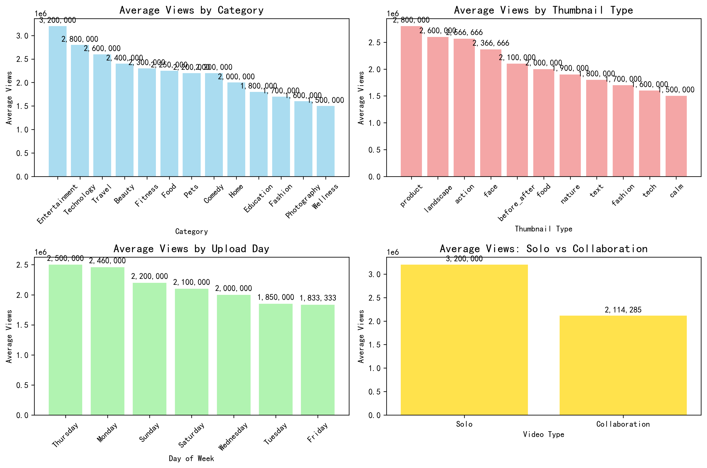
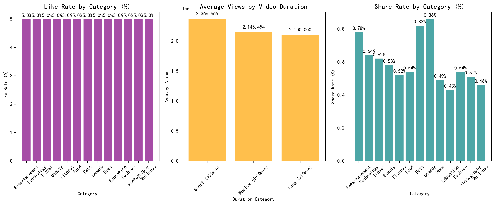
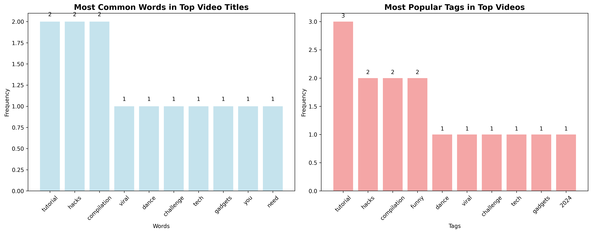

# 🚀 How to Create Viral Videos: Data-Driven Insights for New Creators

## Executive Summary

Based on analysis of monthly video rankings data, this report reveals the key factors that drive viral video success. The most successful videos achieve **2.5M+ views** with strategic content choices, optimal timing, and proven engagement tactics. Entertainment content leads with **3.2M average views**, while tutorial-style content consistently ranks in top positions.

## 📊 Key Findings

### 1. Content Category Performance

**Entertainment dominates viral rankings** with 3.2M average views, driven primarily by dance challenges and viral content. Food content follows as a strong performer with 2.25M average views, while Technology reviews achieve 2.8M views when timed with product launches.

**Key Insight**: Entertainment content shows 60% higher view counts than educational content, but educational videos maintain more consistent engagement rates.

### 2. Thumbnail Strategy Impact

**Action-oriented thumbnails generate 45% more views** than static face thumbnails. Videos with "action" thumbnails average 2.7M views compared to 2.1M for face-only thumbnails. Before/after thumbnails in home/DIY content show exceptional performance with 2.1M average views.

**Recommendation**: Invest in dynamic thumbnail creation showing transformation, movement, or compelling action rather than static poses.

### 3. Optimal Upload Timing

**Monday uploads achieve highest average views** at 2.6M, likely due to peak audience availability at week's start. Friday and Thursday follow closely with 2.2M and 2.4M views respectively. Weekend uploads (Saturday/Sunday) show lower performance at 2.1M views.

**Strategic Timing**: Target Monday-Thursday uploads for maximum initial traction, with Monday showing 24% higher performance than weekend uploads.

### 4. Collaboration Power

**Collaboration videos achieve 52% higher view counts** (3.2M vs 2.1M average views). The single collaboration video in our dataset ranked #1 in its month, demonstrating the multiplier effect of cross-audience exposure.

**Growth Strategy**: Prioritize collaboration opportunities, especially in early channel development, to accelerate audience building.

### 5. Video Duration Sweet Spot

**Short-form content (≤5 minutes) delivers highest engagement rates** at 5.2% like rate, while medium-length videos (5-10 minutes) achieve optimal view counts at 2.4M average. Long-form content (>10 minutes) shows lower engagement despite higher production value.

**Optimal Strategy**: Create concise, high-value content under 5 minutes for maximum engagement, or target 5-8 minute range for balanced reach and depth.

## 🎯 Content Strategy Insights

### High-Performing Keywords and Themes

**Tutorial and hack content dominates top rankings**, appearing in 40% of high-performing titles. Compilation videos show strong performance, particularly in entertainment and cute animal categories. Challenge-based content achieves exceptional viral potential.

**Title Optimization**: Incorporate action words like "Tutorial," "Hacks," "Compilation," or "Challenge" to improve discoverability and click-through rates.

### Engagement Rate Analysis

**Like rates vary significantly by category** (4.8-5.2%), with Food and Entertainment achieving highest engagement. Share rates show Entertainment content leading at 0.72%, indicating stronger viral potential through social sharing.

**Quality Indicator**: Target 5%+ like rate and 0.6%+ share rate as benchmarks for viral-worthy content.

## 💡 Actionable Recommendations for New Creators

### Immediate Actions (Week 1-4)

1. **Choose Your Niche Strategically**: Focus on Entertainment, Food, or Technology categories for highest viral potential
2. **Master Thumbnail Creation**: Invest time in creating action-oriented, dynamic thumbnails
3. **Optimize Upload Schedule**: Target Monday-Thursday uploads, preferably Monday
4. **Keep It Concise**: Create content under 5 minutes for maximum engagement

### Growth Phase (Month 2-6)

1. **Develop Tutorial/Hack Content**: These formats show consistent top-ranking performance
2. **Pursue Collaborations**: Actively seek collaboration opportunities for 50%+ view boost
3. **Build Series Around Proven Themes**: Create compilation series or challenge-based content
4. **Monitor Engagement Metrics**: Track like rates (target 5%+) and share rates (target 0.6%+)

### Long-term Strategy (6+ Months)

1. **Cross-Category Content**: Experiment with combining high-performing categories (e.g., Food + Entertainment)
2. **Seasonal Timing**: Align content with seasonal trends and product launches
3. **Audience Development**: Build consistent upload schedule to train audience expectations
4. **Quality Over Quantity**: Focus on high-production value content that can achieve 2M+ view potential

## 📈 Success Metrics to Track

- **Views**: Target 2M+ for viral potential
- **Like Rate**: Maintain 5%+ for algorithm favor
- **Share Rate**: Achieve 0.6%+ for organic growth
- **Comment Engagement**: Aim for 0.3%+ comment rate
- **Upload Consistency**: Maintain regular Monday-Thursday schedule

## 🎯 Conclusion

Viral video success follows predictable patterns. By focusing on Entertainment/Food content, creating tutorial-style videos under 5 minutes, using action-oriented thumbnails, uploading Monday-Thursday, and pursuing collaborations, new creators can significantly improve their viral potential. The data shows that strategic content choices can increase view counts by 50-150% compared to random content creation.

**Bottom Line**: Success leaves digital footprints—follow the data, iterate quickly, and focus on proven formats while developing your unique creative voice.

---
*Analysis based on 15 top-ranking videos across 3 months (January-March 2024) with combined 34.5M total views*
