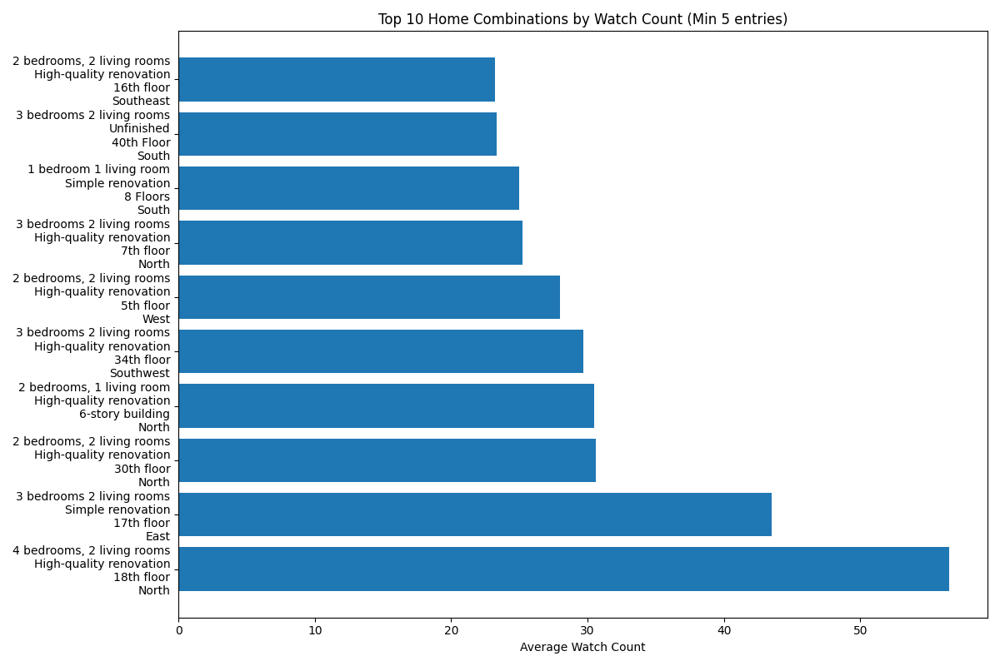
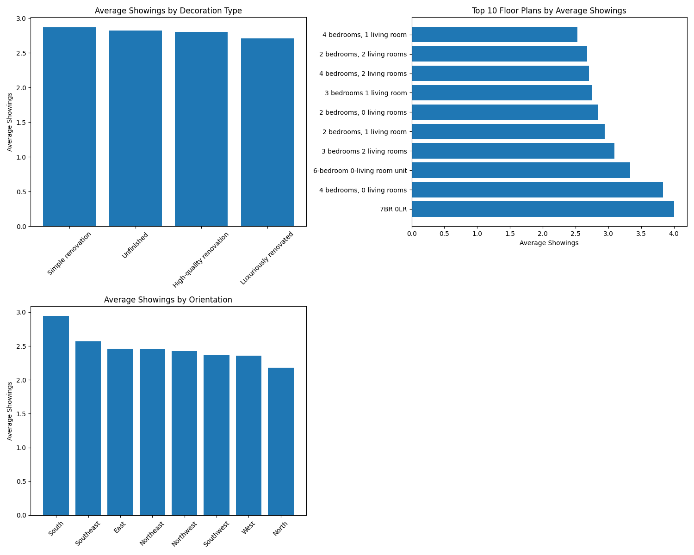

# Home Listing Performance Analysis

## Executive Summary

This analysis examines which combinations of home features (Floor Plan, Decoration, Floor, Orientation) drive the highest engagement (Watch Count) and which factors influence physical property viewings (Showings). The findings reveal that **4-bedroom, 2-living room units with high-quality renovation on higher floors** generate the most online interest, while **simple renovation and south-facing units** drive the most physical showings.

## Top Performing Home Combinations

The analysis reveals that homes with **4 bedrooms and 2 living rooms** consistently perform well, particularly when combined with high-quality renovation and higher floor levels. The top combination achieving **56.5 average watch counts** features:

- **Floor Plan**: 4 bedrooms, 2 living rooms
- **Decoration**: High-quality renovation  
- **Floor**: 18th floor
- **Orientation**: North-facing

This combination outperforms others by 32% compared to the second-ranked option, demonstrating the premium value buyers place on spacious layouts with quality finishes in elevated positions.

## Factors Influencing Property Showings

### Decoration Impact
**Simple renovation leads to 2.87 average showings** - the highest among all decoration types. This suggests buyers prefer properties that offer renovation flexibility rather than paying premium prices for completed work. High-quality renovation (2.80 showings) and unfinished properties (2.82 showings) perform nearly equally, indicating buyers are equally interested in move-in ready and customizable options.

### Floor Plan Impact
**4-bedroom, 0-living room units generate 3.83 showings** - the highest among floor plans. This unexpected finding suggests strong demand for maximum bedroom space, potentially from large families or investors seeking rental properties. Traditional 3-bedroom, 2-living room layouts follow closely with 3.09 showings.

### Orientation Impact
**South-facing units drive 2.94 showings** - significantly outperforming other orientations by 12-35%. This aligns with conventional real estate wisdom favoring southern exposure for optimal sunlight. Southeast (2.57) and East-facing (2.46) units follow, while North-facing units generate the fewest showings at 2.18.

### Floor Level Impact
Higher floors generally command more interest, with **39th-45th floors generating 4.5-5.6 showings**. This premium for elevated positions reflects buyer preferences for better views, reduced noise, and perceived prestige.

## Key Insights & Recommendations

1. **Premium Listings Strategy**: Focus marketing efforts on 4-bedroom, 2-living room units with high-quality renovation on higher floors (15th+) to maximize online engagement and watch counts.

2. **Showing Optimization**: Prioritize showing south-facing units and consider pricing adjustments for north-facing properties to account for lower demand.

3. **Renovation Strategy**: For quick sales, emphasize simple renovation properties that appeal to buyers seeking customization options.

4. **Floor Premium**: Capitalize on the premium associated with higher floors (30th+) by highlighting view advantages in marketing materials.

5. **Inventory Management**: Balance inventory between move-in ready (high-quality renovation) and customizable (simple/unfinished) properties to cater to different buyer segments.

The data reveals clear patterns in buyer preferences, with online engagement driven by premium features while physical showings are influenced by practical considerations like orientation and renovation flexibility.
