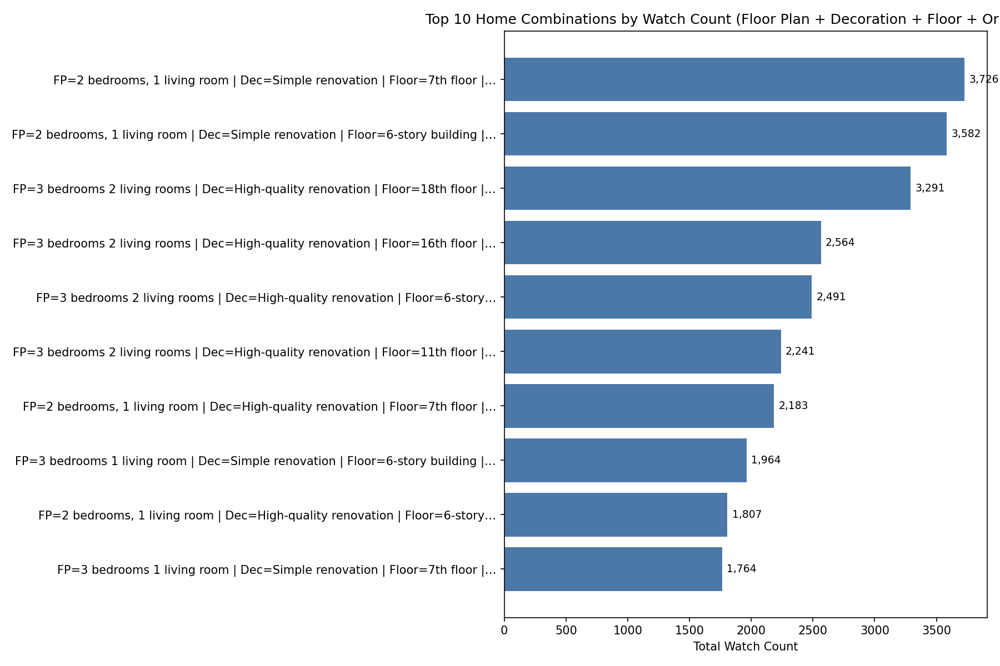
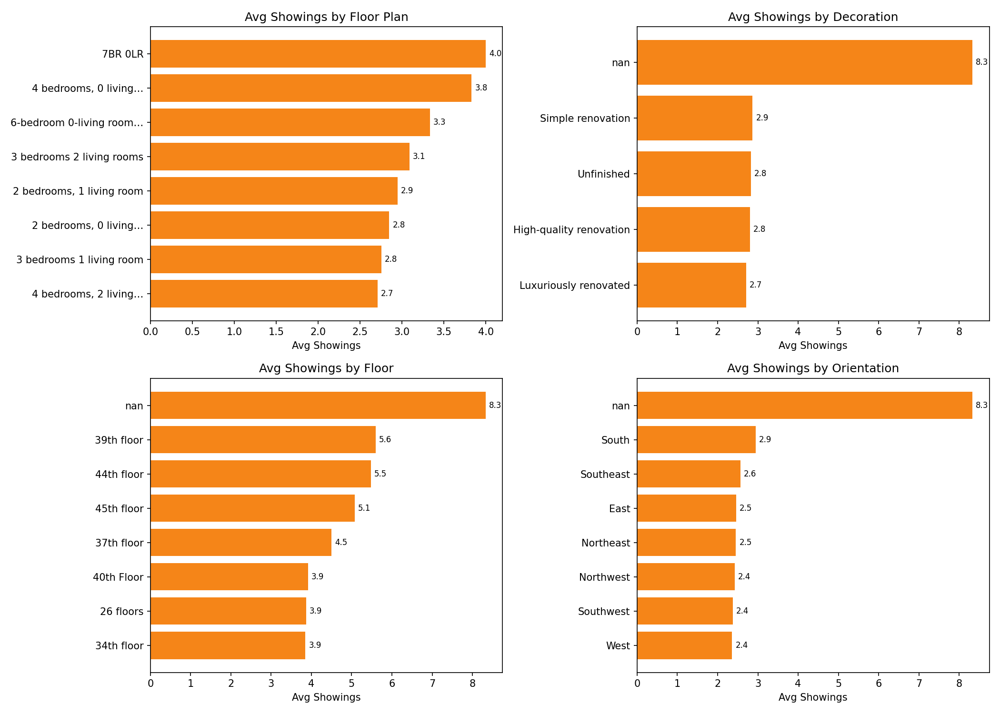

# Home Viewing Behavior: Watch Count and Showings drivers

Conclusion: Specific combinations of Floor Plan, Decoration, Floor, and Orientation concentrate audience attention, and factor-level preferences materially shift Showings. Watch Count and Showings are positively correlated across the dataset.
- Correlation between Watch Count and Showings across 29975 listings: r = 0.083.

## Top 10 combinations by Watch Count
Observation: The following combinations have the highest total Watch Count; these also tend to have elevated Showings totals.

| Rank | Floor Plan | Decoration | Floor | Orientation | Total Watch Count | Total Showings | Listings | Avg Showings per Listing |
|------|------------|------------|-------|-------------|-------------------|----------------|----------|--------------------------|
| 1 | 2 bedrooms, 1 living room | Simple renovation | 7th floor | South | 3,726 | 1,699 | 553 | 3.1 |
| 2 | 2 bedrooms, 1 living room | Simple renovation | 6-story building | South | 3,582 | 2,114 | 600 | 3.5 |
| 3 | 3 bedrooms 2 living rooms | High-quality renovation | 18th floor | South | 3,291 | 2,249 | 769 | 2.9 |
| 4 | 3 bedrooms 2 living rooms | High-quality renovation | 16th floor | South | 2,564 | 2,180 | 590 | 3.7 |
| 5 | 3 bedrooms 2 living rooms | High-quality renovation | 6-story building | South | 2,491 | 740 | 467 | 1.6 |
| 6 | 3 bedrooms 2 living rooms | High-quality renovation | 11th floor | South | 2,241 | 1,414 | 473 | 3.0 |
| 7 | 2 bedrooms, 1 living room | High-quality renovation | 7th floor | South | 2,183 | 795 | 302 | 2.6 |
| 8 | 3 bedrooms 1 living room | Simple renovation | 6-story building | South | 1,964 | 821 | 234 | 3.5 |
| 9 | 2 bedrooms, 1 living room | High-quality renovation | 6-story building | South | 1,807 | 896 | 293 | 3.1 |
| 10 | 3 bedrooms 1 living room | Simple renovation | 7th floor | South | 1,764 | 660 | 218 | 3.0 |

Key takeaway: The top-ranked combination reaches the highest Watch Count, and the top 10 range spans 1,764 to 3,726 views, with total Showings ranging 660 to 2,249. This concentration indicates strong audience preference for certain property traits.
Why it matters: Prioritizing listings that match these top combinations can increase exposure and lead to more booked Showings, improving lead funnel efficiency.

## Which factors influence Showings
Observation: Average Showings vary meaningfully by Floor Plan, Decoration, Floor level, and Orientation.

- Floor Plan: Top 3 by Avg Showings 7BR 0LR (4.0 avg, 1 listings); 4 bedrooms, 0 living rooms (3.8 avg, 47 listings); 6-bedroom 0-living room unit (3.3 avg, 3 listings)
- Decoration: Top 3 by Avg Showings nan (8.3 avg, 3 listings); Simple renovation (2.9 avg, 9002 listings); Unfinished (2.8 avg, 2780 listings)
- Floor: Top 3 by Avg Showings nan (8.3 avg, 3 listings); 39th floor (5.6 avg, 5 listings); 44th floor (5.5 avg, 42 listings)
- Orientation: Top 3 by Avg Showings nan (8.3 avg, 3 listings); South (2.9 avg, 23342 listings); Southeast (2.6 avg, 924 listings)

Root cause: These patterns reflect segment preferences—certain layouts (Floor Plan) optimize usability, higher-quality Decoration signals move-in readiness, mid/high Floors may balance light/noise, and favorable Orientation improves natural light.
Business impact: Aligning inventory and promotion with high-showings categories can boost appointment conversion and shorten time-to-sale.

## Recommendations
- Double-down on the top Watch Count combinations with targeted promos (feature them on homepage, boost ads). Expect uplift where Total Watch Count is already high.
- Prioritize listings with high-Showings factors (top Floor Plan and Decoration types); highlight natural light (Orientation) and noise/light trade-offs (Floor) in copy.
- A/B test listing titles and hero photos emphasizing the high-performing trait mix; measure Showings and CTR changes weekly.
- For lower-performing combinations, adjust pricing anchors or improve Decoration to nudge Showings upwards.
- Enrich lead capture: since Watch Count correlates with Showings (r close to 0.083), funnel optimizations should increase booked appointments.
