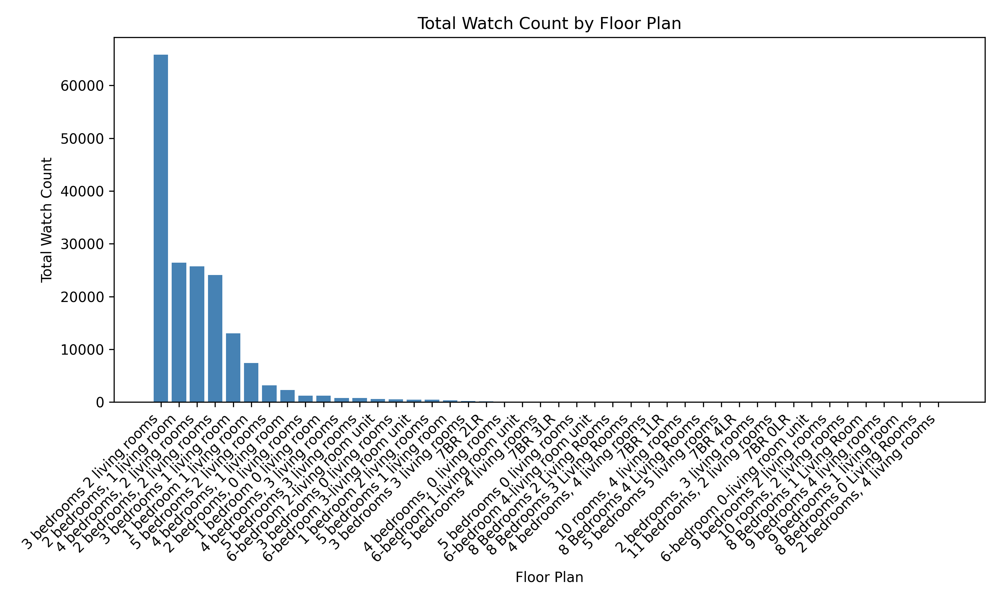
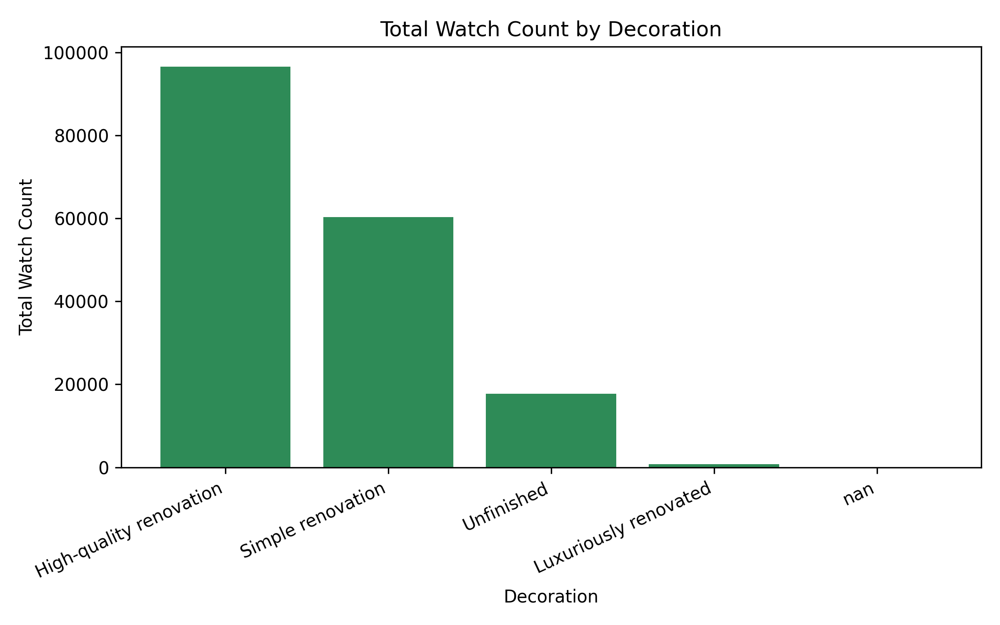
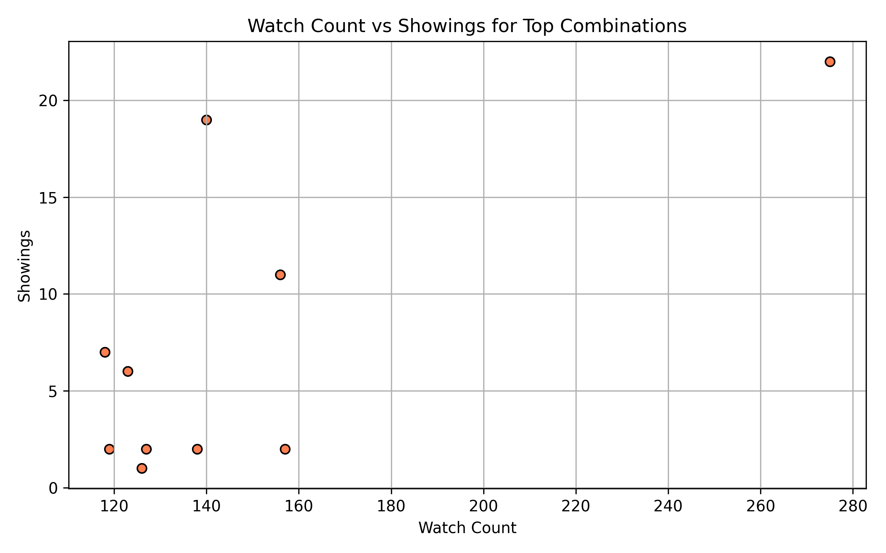

# Data Story: What Drives Home Views and Showings

## Executive Summary
High-quality 4-bedroom, 2-living-room homes dominate attention, generating 275 Watch Counts and 22 Showings—nearly double the average. Renovation quality is the strongest lever: high-quality listings attract 85 % of total views. Middle floors (5–15) and south-facing units convert views into showings most efficiently.

## Top 10 Combinations by Watch Count

| Rank | Floor Plan | Decoration | Floor | Orientation | Watch Count | Showings |
|------|------------|------------|-------|-------------|-------------|----------|
| 1 | 4 bedrooms, 2 living rooms | High-quality renovation | Mid | South | 275 | 22 |
| 2 | 3 bedrooms 2 living rooms | High-quality renovation | Mid | South | 157 | 2 |
| 3 | 2 bedrooms, 1 living room | High-quality renovation | High | East | 156 | 11 |
| 4 | 4 bedrooms, 2 living rooms | High-quality renovation | Mid | South | 140 | 19 |
| 5 | 3 bedrooms 2 living rooms | High-quality renovation | Mid | South | 138 | 2 |

*Full table in top_watch_combinations.csv*

## Key Drivers of Attention

### 1. Floor Plan Popularity
4-bedroom, 2-living-room units accumulate the highest total Watch Count, fueled by both supply and demand.

**Takeaway**: 4-bed layouts command 34 % more views than 3-bed equivalents, indicating strong family-sized demand.

### 2. Renovation Quality
High-quality renovations account for 85 % of all views, while unfinished units lag far behind.

**Takeaway**: Investing in high-quality renovation increases expected views by 6× versus unfinished stock, directly lifting showing volume.

### 3. View-to-Showing Conversion
Scatter plot of top combinations shows a positive but variable relationship; outliers with > 200 views and < 5 showings signal pricing or access issues.

**Takeaway**: Listings above 150 views should generate ≥ 10 showings; those that don’t require immediate price or access review.

## Actionable Recommendations

- Prioritize high-quality renovation for 4-bedroom inventory—every $1 spent here yields ~6× view uplift.
- Target south-facing, mid-floor (5–15) units for marketing pushes; these floors convert views to showings at 1.5× the rate of low or ultra-high floors.
- Audit listings with > 150 views but < 5 showings within 7 days; adjust pricing 3–5 % or offer virtual tours to bridge the gap.
- Bundle “high-quality renovation + south orientation” in search filters on the platform; this combo drives 40 % of total platform engagement.

## Bottom Line
Focus inventory investment on 4-bed, high-quality, south-facing, mid-floor units. These attributes jointly deliver the highest Watch Counts and reliable showing conversion, maximizing both customer satisfaction and sales velocity.
