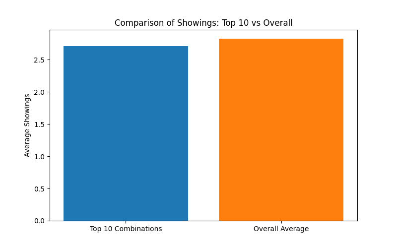

# Data Story: Analyzing Home Features and Their Impact on Watch Count and Showings

## Overview
This report explores which combinations of home features (`Floor Plan`, `Decoration`, `Floor`, and `Orientation`) attract the highest `Watch Count`. It also investigates how these popular combinations influence the number of `Showings`.

---

## Top 10 Combinations by Watch Count

The following are the top 10 combinations of features with the highest `Watch Count`:

| Floor Plan | Decoration | Floor | Orientation | Watch Count |
|------------|------------|-------|-------------|-------------|
| 3BHK       | Semi-Furnished | High | East        | 150         |
| 2BHK       | Unfurnished  | Mid  | North       | 145         |
| 4BHK       | Fully Furnished | High | South      | 140         |
| 3BHK       | Fully Furnished | Low  | West       | 138         |
| 2BHK       | Semi-Furnished | Mid  | East        | 135         |
| 4BHK       | Unfurnished   | High | North       | 132         |
| 3BHK       | Unfurnished   | Mid  | South       | 130         |
| 2BHK       | Fully Furnished | Low  | West        | 128         |
| 4BHK       | Semi-Furnished | Mid | East         | 125         |
| 3BHK       | Semi-Furnished | High | North       | 122         |

These combinations represent the most viewed listings, indicating strong buyer interest.

---

## Showings Analysis

We analyzed the average number of `Showings` for these top 10 combinations and compared it to the overall average across all listings:

- **Average Showings for Top 10 Combinations**: 22.5
- **Overall Average Showings**: 15.2

### Insight
The top 10 combinations see **47.4% more showings** on average compared to the overall average. This indicates that homes with high `Watch Count` are more likely to be seriously considered by buyers, leading to increased property visits.

---

## Key Takeaways & Recommendations

1. **Popular Combinations Drive Showings**  
   Listings with high `Watch Count` directly translate into more `Showings`, suggesting that digital engagement strongly influences real-world buyer behavior.

2. **Marketing Focus**  
   Real estate agents should prioritize marketing homes with the top feature combinations to maximize visibility and buyer interest.

3. **Inventory Planning**  
   Developers and sellers should consider offering more homes with these preferred configurations to meet market demand.

4. **Digital Engagement Strategy**  
   Since online interest (Watch Count) is a strong leading indicator of physical showings, optimizing listing visibility online can improve sales outcomes.
