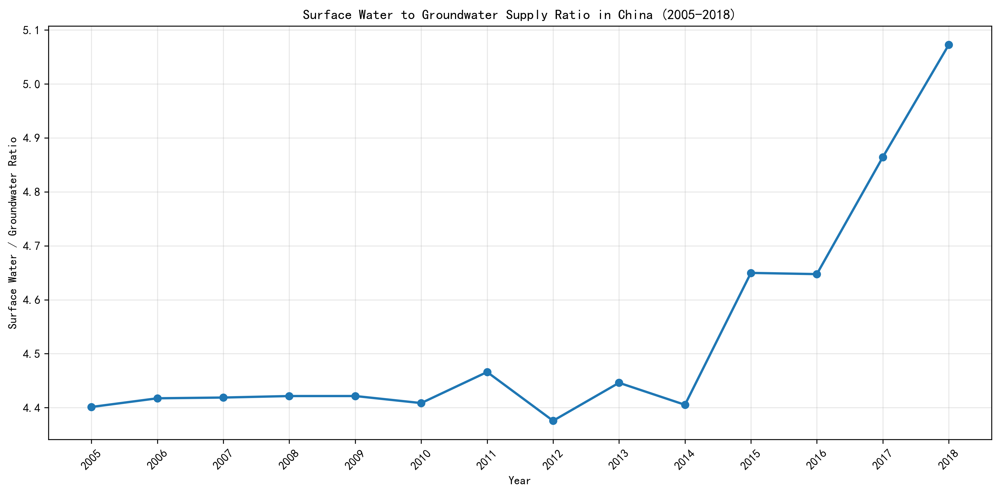
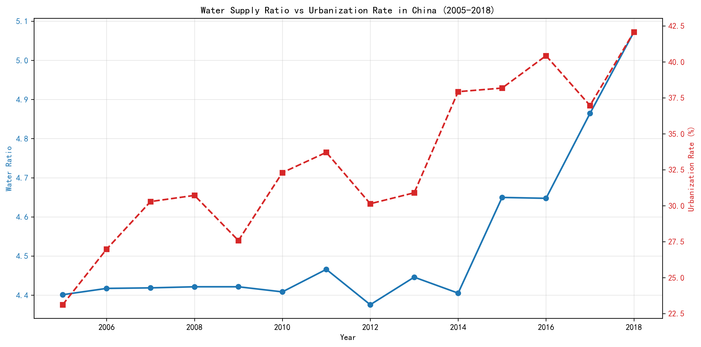
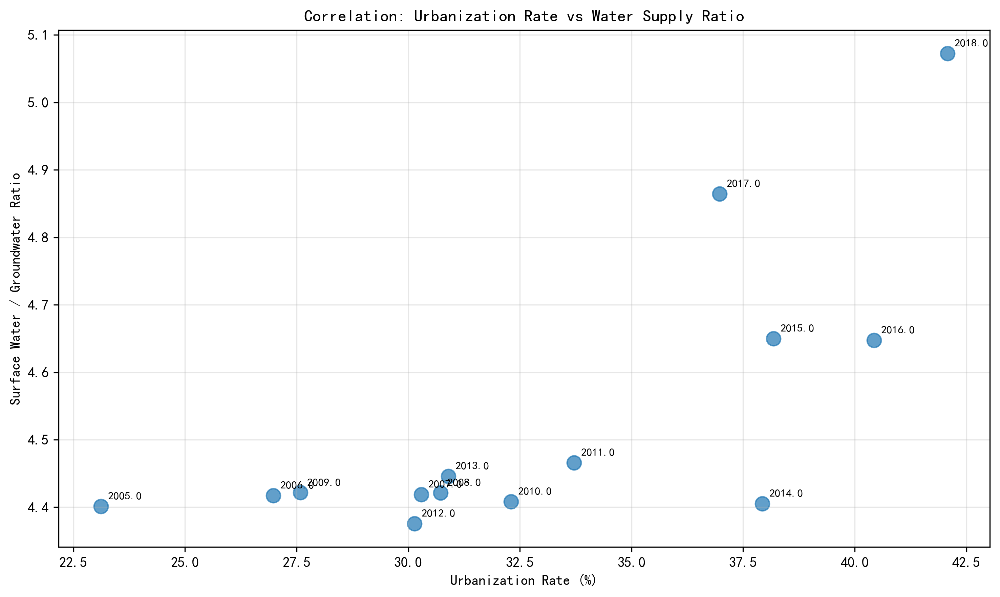

# China's Surface-to-Groundwater Supply Ratio Analysis (2005-2018)

## Executive Summary

China's surface water to groundwater supply ratio increased significantly by 15.2% from 2005 to 2018, rising from 4.40 to 5.07. This trend shows a clear shift toward greater reliance on surface water sources, strongly correlated with China's rapid urbanization process (correlation coefficient: 0.729).

## Water Ratio Trend Analysis

The surface-to-groundwater ratio exhibited a clear upward trajectory over the 14-year period, with several notable patterns:

- **Overall Increase**: The ratio grew from 4.40 in 2005 to 5.07 in 2018, representing a 15.2% increase
- **Stable Period (2005-2011)**: Ratio remained relatively stable around 4.40-4.47
- **Inflection Point (2012)**: Ratio dropped to its lowest point of 4.38, possibly due to policy changes or drought conditions
- **Accelerated Growth (2015-2018)**: Ratio increased sharply from 4.65 to 5.07, indicating a significant shift in water sourcing strategy

## Urbanization Relationship

The data reveals a strong positive correlation (r=0.729) between urbanization rate and the surface-to-groundwater ratio. As China's urbanization rate increased from 23.12% in 2005 to 42.08% in 2018, the water ratio correspondingly increased.

Key observations about this relationship:

- **Urban Infrastructure Demands**: Rapid urbanization requires extensive water infrastructure that typically favors surface water systems due to their scalability
- **Groundwater Conservation**: Urban areas often implement groundwater protection measures to prevent over-extraction and land subsidence
- **Economic Efficiency**: Surface water systems are generally more cost-effective for serving dense urban populations

## Business Implications & Recommendations

### Strategic Implications
1. **Water Security**: The increasing reliance on surface water highlights vulnerability to climate change impacts on surface water availability
2. **Infrastructure Investment**: Continued urbanization will require substantial investment in surface water treatment and distribution systems
3. **Environmental Management**: Groundwater conservation efforts appear effective but must be balanced with urban water demands

### Recommendations
1. **Diversified Water Portfolio**: Maintain strategic groundwater reserves while expanding surface water infrastructure
2. **Climate Resilience**: Invest in water storage and management systems to mitigate surface water variability
3. **Urban Planning Integration**: Coordinate water management with urban development plans to optimize resource allocation
4. **Monitoring Systems**: Enhance real-time monitoring of both surface and groundwater resources to support adaptive management

## Conclusion

China's water supply strategy has clearly shifted toward greater surface water utilization, driven by rapid urbanization and the practical requirements of serving growing urban populations. While this trend supports economic development, it also underscores the importance of sustainable water management practices to ensure long-term water security in the face of climate change and continued urban growth.

The strong correlation between urbanization and water sourcing patterns suggests that water management must be integrated with urban planning processes to ensure sustainable development across China's rapidly transforming landscape.
