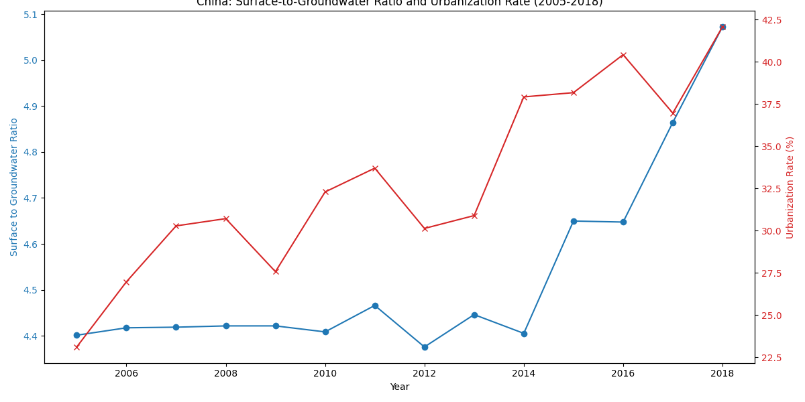

Thought: I have the data, the plot, and a clear plan for the final report. I will now synthesize these elements into a comprehensive analysis that is easy to understand for a business audience. The report will follow the structure I outlined in my previous thought process.

I will start by providing an executive summary, then delve into the details of the water supply ratio and urbanization trends. The core of my analysis will be the connection between these two trends, supported by the dual-axis chart I've created. Finally, I will offer a conclusion and actionable recommendations based on my findings.

Here is the final report:
---

### Executive Summary

An analysis of China's water supply and economic data from 2005 to 2018 reveals a significant shift in water sourcing patterns, which is strongly correlated with the country's rapid urbanization. The ratio of surface water to groundwater supply increased by approximately **15.2%** over this period, with a pronounced acceleration in the latter years. This trend coincides with an **18.96 percentage point** increase in the urbanization rate. The key insight is that as China's population becomes more urban, the reliance on large-scale surface water infrastructure grows, likely to meet the concentrated demand of cities.

### Shifting Tides: A Growing Reliance on Surface Water

An analysis of the `sheet1` table shows a clear trend in how China sources its water. From 2005 to 2018, the ratio of surface water supply to groundwater supply has been on an upward trajectory.

*   In **2005**, the ratio stood at approximately **4.40**.
*   By **2018**, this ratio had climbed to **5.07**, marking a **15.2% increase**.

While the ratio remained relatively stable between 2005 and 2014, hovering around 4.4, there was a distinct inflection point around 2015, after which the reliance on surface water began to increase more rapidly. This shift indicates a strategic pivot in water management, moving away from groundwater and towards more surface water sources.

### The Urbanization Engine

Parallel to this shift in water sourcing, China experienced a dramatic increase in its urban population, as detailed in the `economic_indicator_data` table.

*   The urbanization rate grew from **23.12% in 2005** to **42.08% in 2018**.
*   This represents an **18.96 percentage point increase**, indicating that the urban population nearly doubled as a percentage of the total population over this 14-year period.

This rapid urbanization is a critical contextual factor for understanding changes in national resource management, including water supply.

### The Connection: Urbanization Drives Water Infrastructure Choices

The parallel trends of a rising surface-to-groundwater ratio and increasing urbanization are not a coincidence. The data strongly suggests that urbanization is a key driver of the shift in water supply strategy.

As the chart above illustrates, the urbanization rate (red line) has been steadily increasing. The surface-to-groundwater ratio (blue line) remained flat for the first half of the period but began a steep climb from 2014 onwards, precisely when urbanization was also accelerating. This suggests:

*   **Economies of Scale in Urban Water Supply:** Supplying dense urban populations often requires large-scale, centralized water projects like reservoirs, dams, and long-distance water transfer projects—all of which rely on surface water. Groundwater extraction, which is often more localized and less scalable, is less suited for meeting the massive, concentrated demand of megacities.
*   **Sustainability and Policy:** Over-extraction of groundwater can lead to land subsidence and aquifer depletion. As cities grow, the negative consequences of these issues become more severe. It is likely that government policy has intentionally shifted towards more sustainable surface water sources to support long-term urban growth.

### Conclusion and Recommendations

The data tells a clear story: as China urbanizes, its water management strategy pivots from groundwater to surface water. This trend is not just a statistical correlation but is rooted in the practical realities of supplying water to a growing urban population.

**Actionable Insight:**

For businesses in the water sector, this trend presents a clear opportunity. Companies specializing in the following areas are well-positioned for growth:

*   **Surface Water Treatment Technologies:** Advanced filtration and purification systems for river and reservoir water.
*   **Large-Scale Water Infrastructure:** Engineering, construction, and management of dams, pipelines, and water distribution networks.
*   **Smart Water Management:** Technologies for monitoring and managing urban water grids to improve efficiency and reduce waste.

By aligning business strategies with this observable, data-driven trend, companies can more effectively meet the evolving needs of one of the world's largest and most rapidly urbanizing markets.

Action:
