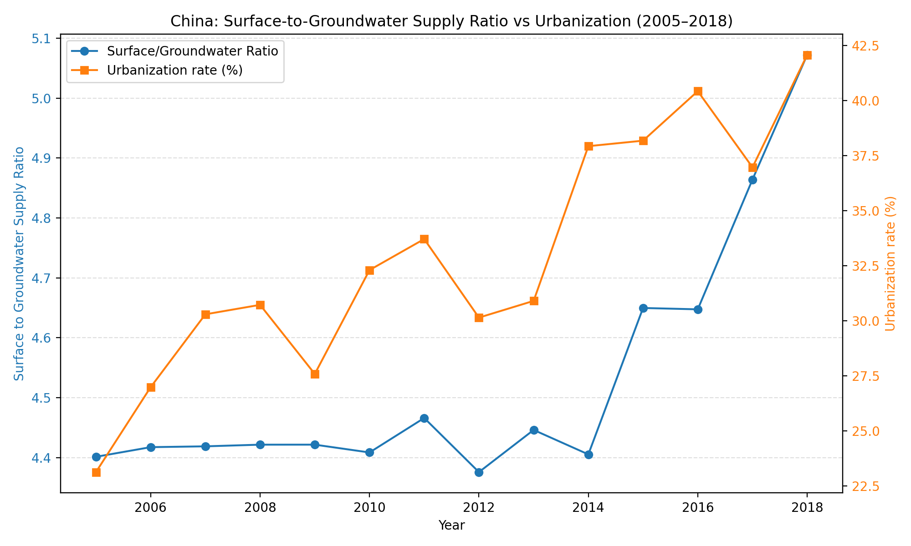

Executive summary
• China’s surface-to-groundwater supply ratio rose from 4.401 in 2005 to 5.072 in 2018 (+0.671, +15.2%), indicating a gradual shift toward surface water sources. The trend is broadly stable from 2005–2014 (avg 4.418) and steps up after 2015 (avg 4.808), with 2015 marking the largest year-over-year increase (+0.244).
• Urbanization rate (%) increased from 23.12% (2005) to 42.08% (2018), and is positively correlated with the ratio (overall correlation +0.729). The relationship strengthens in the later period (correlation +0.431 in 2015–2018 vs +0.209 in 2005–2014).

Data and method (what was analyzed)
• Tables/fields: sheet1 (Year, Surface Water Supply (100 million m³), Groundwater Supply (100 million m³), Region Name) joined with economic_indicator_data (Year, Region Name, Urbanization rate (%)) for Region Name='China'.
• Metric: Annual surface-to-groundwater ratio = Surface Water Supply / Groundwater Supply; computed for 2005–2018.
• Verification: Python dual-axis line plot comparing the ratio and Urbanization rate (%), saved as surface_to_ground_ratio_and_urbanization_2005_2018.png.

Visual evidence and takeaway

• Key takeaway: The ratio climbed from 4.401 (2005) to 5.072 (2018
