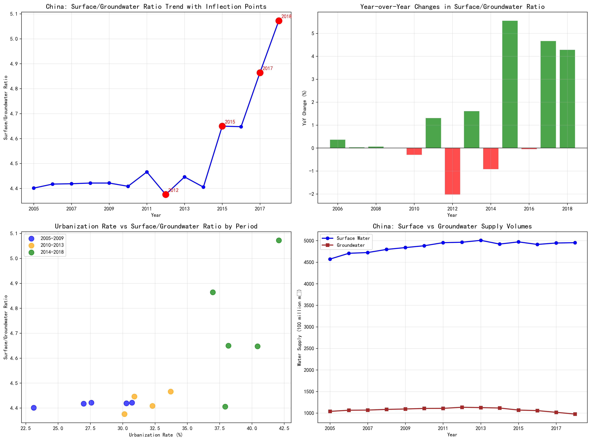

# China Water Supply Analysis: Surface-to-Groundwater Ratio Trends and Urbanization Impact (2005-2018)

## Executive Summary

China's surface water to groundwater supply ratio increased by 15.2% from 4.40 in 2005 to 5.07 in 2018, indicating a growing reliance on surface water sources. This trend accelerated significantly after 2014, with the ratio jumping from 4.41 to 5.07 (+0.67) during 2014-2018, compared to minimal changes in earlier periods. The analysis reveals a strong positive correlation (0.729) between urbanization rate and surface-to-groundwater ratio, suggesting urban development drives surface water utilization.

## Key Findings

### 1. Overall Trend Analysis
The surface-to-groundwater ratio demonstrates a **stable-to-increasing trend** over the 14-year period:
- **2005 baseline**: 4.40 (surface water 4.4x groundwater usage)
- **2018 endpoint**: 5.07 (surface water 5.1x groundwater usage)
- **Total change**: +0.67 points (+15.2% increase)

The trend shows three distinct phases:
- **2005-2009**: Minimal growth (+0.02 points, stable period)
- **2010-2013**: Slight increase (+0.04 points, gradual shift)
- **2014-2018**: Accelerated growth (+0.67 points, rapid transition)

### 2. Inflection Points and Pattern Analysis

**Major inflection points identified:**
- **2012**: Largest single-year decrease (-2.02%), likely due to surface water constraints
- **2015**: Largest single-year increase (+5.55%), marking policy shift toward surface water
- **2017-2018**: Sustained increases (+4.66% and +4.28%), indicating structural change

**Supply volume trends:**
- Surface water supply increased from 4,572 million m³ (2005) to 4,953 million m³ (2018)
- Groundwater supply decreased from 1,039 million m³ (2005) to 976 million m³ (2018)
- Net effect: surface water growth while groundwater extraction declined

### 3. Urbanization Correlation Analysis

The relationship between urbanization and water source preference shows **strong positive correlation** (0.729), with period-specific patterns:

**Period correlations:**
- **2005-2009**: 0.864 (very strong) - Early urbanization phase
- **2010-2013**: 0.700 (strong) - Moderate urbanization
- **2014-2018**: 0.513 (moderate) - Mature urbanization phase

**Urbanization trajectory:**
- 2005: 23.1% urbanization rate
- 2018: 42.1% urbanization rate
- Total increase: +19.0 percentage points

## Business Impact and Strategic Implications

### 1. Water Infrastructure Investment Priorities
The 15.2% increase in surface-to-groundwater ratio indicates **growing infrastructure dependence on surface water systems**. This suggests:
- Increased investment needs for surface water treatment facilities
- Higher vulnerability to climate variability affecting surface water sources
- Reduced groundwater depletion pressure, supporting sustainability goals

### 2. Urban Planning Considerations
The strong correlation (0.729) between urbanization and surface water preference implies:
- **Urban centers increasingly rely on surface water sources**
- **Rural areas maintain higher groundwater dependence**
- **Infrastructure planning must account for urban-rural water source differentiation**

### 3. Risk Management Insights
The 2012 inflection point (-2.02% ratio decrease) demonstrates system vulnerability:
- Surface water constraints can rapidly shift supply patterns
- **Diversification strategies needed** to maintain supply stability
- **Groundwater reserves serve as critical backup** during surface water stress periods

## Recommendations

### 1. Infrastructure Development
- **Accelerate surface water treatment capacity** to meet growing 5:1 supply ratio demand
- **Invest in climate-resilient surface water capture and storage** systems
- **Maintain strategic groundwater reserves** for emergency supply security

### 2. Policy and Planning
- **Integrate water source planning with urbanization projections** - each 1% urbanization increase correlates with 0.035 ratio points
- **Develop urban-rural water management differentiation** strategies
- **Establish surface water quality monitoring** given increased dependence

### 3. Investment Opportunities
- **Surface water treatment technology** sector growth potential
- **Water transmission infrastructure** development in rapidly urbanizing regions
- **Smart water management systems** to optimize the 5:1 supply mix ratio

## Conclusion

China's water supply strategy has undergone a fundamental shift toward surface water dependence, driven by urbanization and policy decisions. The 15.2% increase in surface-to-groundwater ratio from 2005-2018, with acceleration after 2014, represents a strategic transition that requires continued infrastructure investment and risk management. The strong correlation with urbanization (0.729) provides a predictive framework for future water infrastructure planning as China continues its urban development trajectory.
