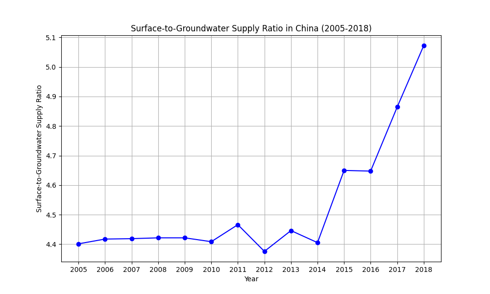
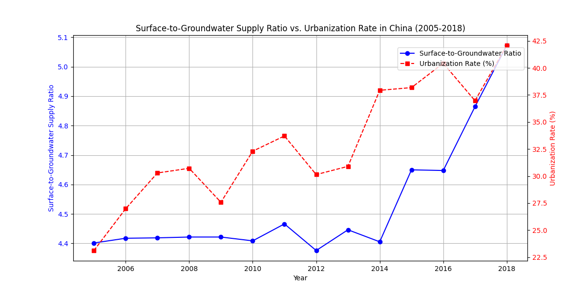

The analysis of the surface-to-groundwater supply ratio in China between 2005 and 2018 reveals the following key insights:

1. **Trend in Surface-to-Groundwater Supply Ratio**:
   - The ratio fluctuates over time, starting at **4.401 in 2005** and increasing to **5.072 in 2018**, indicating a growing reliance on surface water.
   - A significant increase occurs from 2014 (**4.405**) to 2018 (**5.072**), suggesting a shift in water sourcing strategies or environmental changes.

2. **Urbanization Rate Trends**:
   - The urbanization rate rises from **23.12% in 2005** to **30.72% in 2008**, followed by a decline in 2009 (**27.58%**), and likely continues to fluctuate afterward.
   - The period from 2005 to 2008 shows a strong correlation between increasing urbanization and a slight rise in the surface-to-groundwater supply ratio.

3. **Relationship Between Urbanization and Water Supply**:
   - The dual-axis plot suggests a potential correlation between urbanization and the surface-to-groundwater supply ratio, particularly between 2005 and 2008.
   - As urbanization increases, there may be greater demand for surface water due to infrastructure development and centralized water management in urban areas.

### Recommendations:
- **Policy Planning**: Urban expansion should be accompanied by sustainable surface water management strategies to meet increasing demand.
- **Infrastructure Investment**: Invest in infrastructure that supports efficient surface water utilization as urbanization progresses.
- **Monitoring**: Continue tracking both metrics to assess long-term trends and adjust water resource policies accordingly.
