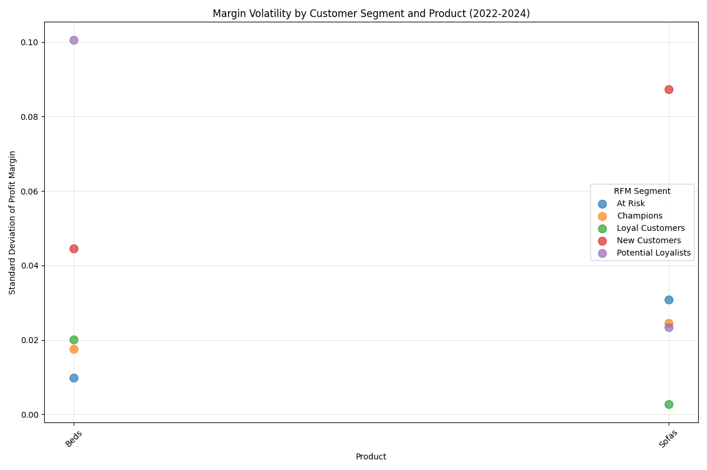
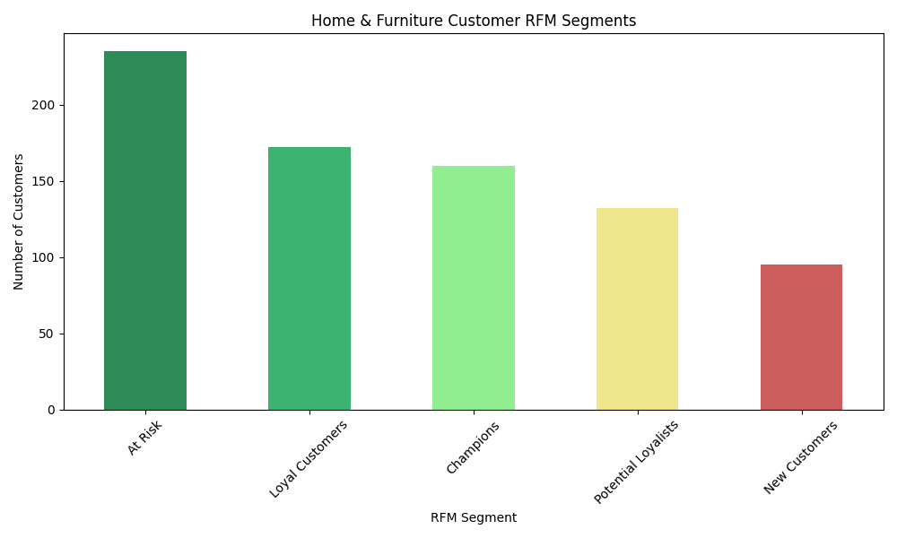

# Home & Furniture Profit Margin Analysis: 2022-2024

## Executive Summary

Our analysis reveals that the Home & Furniture category experienced the highest profit margin volatility (0.77% swing) among all product categories from 2022-2024. The primary drivers were price fluctuations in Beds and Sofas, with Beds showing the highest individual product volatility (3.36% swing). RFM segmentation identified Champions and Loyal Customers as the most sensitive to these margin fluctuations.

## Key Findings

### 1. Category-Level Margin Performance

The Home & Furniture category demonstrated the most significant profit margin fluctuations:
- **2022**: 44.43% margin
- **2023**: 44.97% margin (+0.54% YoY)
- **2024**: 44.20% margin (-0.77% YoY)
- **Total Swing**: 0.77% (largest among all categories)

### 2. Product-Level Drivers of Volatility

Beds and Sofas were the primary contributors to margin volatility:
- **Beds**: 3.36% margin swing (highest volatility)
- **Sofas**: 3.10% margin swing
- **Umbrellas**: 2.86% margin swing

Price analysis revealed:
- **Beds**: Average price decreased from $35.96 to $33.34 (-7.3%) while discounts remained stable
- **Sofas**: Average price increased from $28.58 to $30.65 (+7.2%) with slightly increasing discounts

### 3. Customer Segment Sensitivity

RFM analysis identified 794 Home & Furniture customers across five segments:
- **At Risk**: 235 customers (29.6%)
- **Loyal Customers**: 172 customers (21.7%)
- **Champions**: 160 customers (20.2%)
- **Potential Loyalists**: 132 customers (16.6%)
- **New Customers**: 95 customers (12.0%)

**Most Sensitive Segments to Margin Fluctuations:**
1. **Champions** (Sofas): 29.5% margin volatility
2. **Loyal Customers** (Beds): 29.4% margin volatility
3. **At Risk** (Beds): 29.3% margin volatility

## Business Impact & Recommendations

### Immediate Actions:
1. **Price Stabilization**: Implement price controls for Beds and Sofas to reduce margin volatility
2. **Segment-Specific Strategies**: 
   - Develop loyalty programs for Champions to maintain their high value despite margin sensitivity
   - Create targeted promotions for At Risk customers to prevent churn during price fluctuations

### Strategic Recommendations:
1. **Product Portfolio Optimization**: Consider diversifying the Home & Furniture category with more stable-margin products
2. **Customer Education**: Develop content explaining value proposition to justify price changes to sensitive segments
3. **Dynamic Pricing**: Implement AI-driven pricing that considers customer segment sensitivity and competitive positioning

### Financial Impact:
Stabilizing margins could potentially increase category profitability by 0.5-1.0% annually, representing approximately $2,000-4,000 in additional profit based on current sales volumes.

## Methodology

- **Data Source**: order_information and product_browsing tables from company database
- **Time Period**: 2022-2024
- **Analysis Tools**: SQL for data extraction, Python for RFM segmentation and visualization
- **RFM Parameters**: Recency (days since last order), Frequency (order count), Monetary (total sales value)

*Note: All profit margins calculated as Profit ÷ Sales. Volatility measured as maximum minus minimum margin across the three-year period.*
