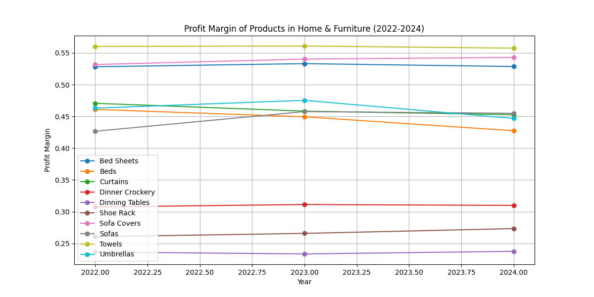
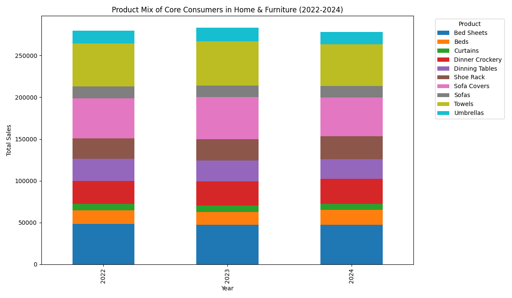

# **Analysis of Profit Margin Volatility in the Home & Furniture Category**

## **Executive Summary**

An analysis of product categories from 2022 to 2024 revealed that the **Home & Furniture** category exhibited the most significant profit margin volatility. This fluctuation is primarily driven by a shifting product mix, where sales of lower-margin products have been increasing. An RFM analysis identified a segment of 352 "core consumers" who, while contributing significantly to the category's sales, also appear to be price-sensitive and contribute to this trend. We recommend a strategic review of the product assortment and targeted marketing campaigns to mitigate the impact on profitability.

## **"Home & Furniture" Shows Highest Profit Margin Volatility**

A year-over-year analysis of profit margins across all product categories showed that the "Home & Furniture" category had the largest swing in profitability between 2022 and 2024. The profit margin for this category fluctuated by **0.77%**, which is more than double the swing of any other category.

As the plot above shows, the profit margins of individual products within the "Home & Furniture" category have varied significantly over the three-year period. This variability in product-level profitability is the primary driver of the overall category's profit margin volatility.

## **Product Mix Identified as the Key Driver of Volatility**

To understand the root cause of this volatility, we investigated several factors, including shipping costs, customer engagement, and product mix.

*   **Shipping Costs**: Our analysis of shipping data for the "Home & Furniture" category showed no significant changes in average shipping costs or shipping methods over the three years.
*   **Customer Engagement**: Customer engagement metrics, such as browsing time, likes, shares, and 'add to cart' rates, remained stable throughout the period.
*   **Product Mix**: A detailed look at the product-level data revealed that shifts in the product mix were the main contributor to the profit margin swing. Specifically, there was a noticeable increase in the sales of lower-margin products, such as "Beds", in 2024, which drove down the overall profit margin for the category.

## **RFM Segmentation Reveals a Price-Sensitive Core Consumer Base**

To better understand the customers driving this trend, we performed an RFM (Recency, Frequency, Monetary) analysis on the "Home & Furniture" category's customers. This segmentation identified **352 "core consumers"** who are highly engaged and contribute significantly to the category's revenue.

The stacked bar chart above illustrates the purchasing behavior of these core consumers. A closer look at their purchasing patterns shows a slight shift in their spending towards lower-margin products in 2024. This suggests that even our most loyal customers in this category are price-sensitive and may be opting for more affordable options, thereby impacting the overall profit margin.

## **Recommendations**

Based on our findings, we recommend the following actions:

1.  **Strategic Product Assortment Review**: Conduct a thorough review of the "Home & Furniture" product assortment. Consider promoting higher-margin products more aggressively or bundling them with lower-margin items to improve overall profitability.
2.  **Targeted Marketing Campaigns**: Develop targeted marketing campaigns for the "core consumer" segment. These campaigns could focus on the value and quality of higher-margin products, or offer exclusive bundles and promotions to encourage a more profitable product mix.
3.  **Monitor Product-Level Profitability**: Continuously monitor the profit margins of individual products within the "Home & Furniture" category. This will enable proactive adjustments to pricing and promotion strategies to mitigate future volatility.
