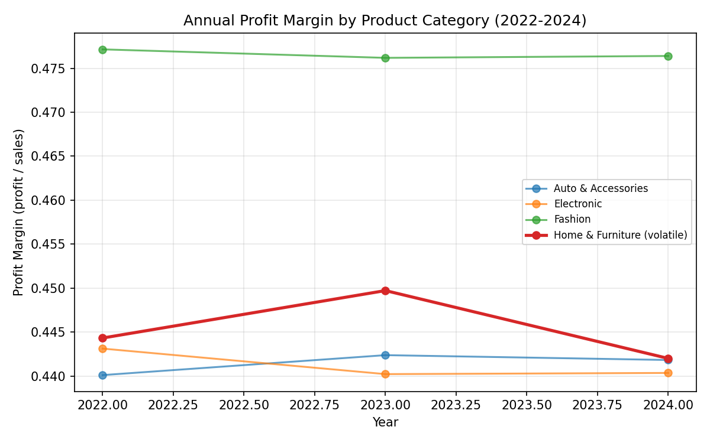
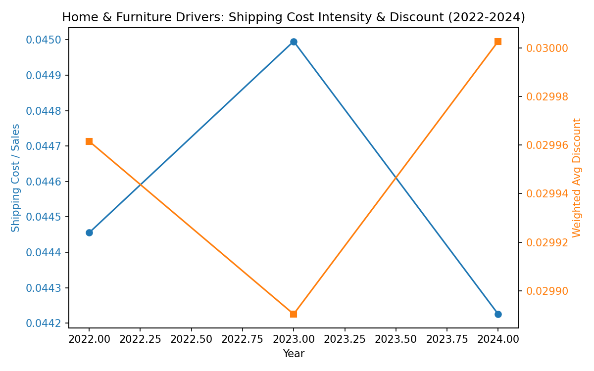

Executive Summary: Home & Furniture shows the largest profit margin swing from 2022–2024, moving from 44.43% (2022) to 44.97% (2023) and down to 44.20% (2024)—a 0.77 percentage-point swing (max 0.4497, min 0.4420). Shipping intensity and discount rates remained stable, indicating the volatility is most consistent with a SKU/product mix effect rather than pricing or fulfillment. RFM analysis finds 159 core consumers out of 794, who are slightly less discount-sensitive but accept slightly higher shipping cost intensity, suggesting opportunities to stabilize margin by guiding mix and fulfillment strategies, particularly for non-core customers.

Visualization 1 — Annual profit margin by category: 

Key takeaway: Among categories, Home & Furniture has the largest margin swing of 0.0077 (0.77 pp), with margins at 44.43% (2022), 44.97% (2023), and 44.20% (2024). Other categories are more stable: Fashion at 47.71% (2022), 47.62% (2023), 47.64% (2024), Electronic at 44.31%, 44.02%, 44.04%, and Auto & Accessories at 44.01%, 44.24%, 44.18%. This matters because small margin changes at scale (Home & Furniture sales: 444,842 in 2022; 441,108 in 2023; 433,457 in 2024) materially impact profit (e.g., 198,373 in 2023 down to 191,589 in 2024).

Methodology note: I queried order_information via Python (pandas + sqlite3), grouping by Product Category and year, and computed profit ÷ Sales. For example, profit and sales sums used: Home & Furniture 2022 profit 197,652.9 / sales 444,842.0, 2023 profit 198,372.8 / sales 441,108.0, 2024 profit 191,588.6 / sales 433,457.0.

Drivers Analysis (2022–2024) for Home & Furniture:
- Shipping intensity: 0.0445 (2022), 0.0450 (2023), 0.0442 (2024), measured as total Shipping Cost ÷ Sales.
- Discount (weighted by Sales): 0.0300 (2022), 0.0299 (2023), 0.0300 (2024).
- Shipping Method mix: 100% Second Class in each year.
- Product concentration: HHI 0.1271 (2022), 0.1280 (2023), 0.1237 (2024); top-5 product share 71.39% (2022), 71.88% (2023), 70.65% (2024).
- Engagement (product_browsing): top-5 vs rest are similar—Browsing Time mean 18.00 vs 17.72 minutes; Add-to-Cart rate 0.673 vs 0.676; like rate 0.555 vs 0.555; share rate 0.489 vs 0.498.

Visualization 2 — Volatile category drivers over time:

Key takeaway: Discount was flat (~3.0%), and shipping intensity fluctuated within a narrow band (4.42–4.50%). With shipping entirely Second Class and discounts stable, the margin decline in 2024 (−0.77 pp from 2023) is most consistent with product mix shifts towards slightly lower-margin SKUs. The product concentration metrics corroborate some mix broadening (top-5 share fell from 71.88% to 70.65%; HHI decreased from 0.1280 to 0.1237), which can dilute the average margin.

RFM Segmentation (Home & Furniture customers):
- Setup: Recency from Order Date (days since last order vs max order date), Frequency by unique Order ID, Monetary by total profit.
- Core consumers: 159 out of 794 (R≥4, F≥4, M≥4
