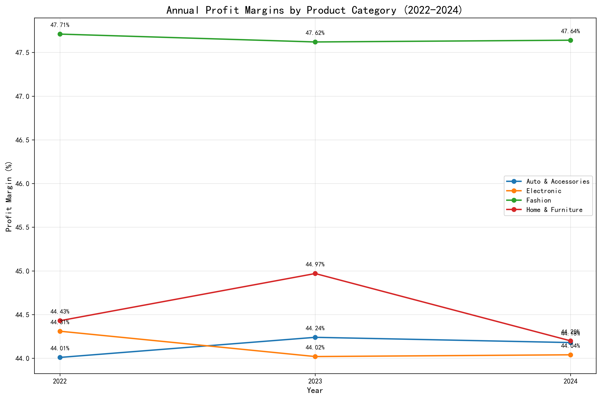
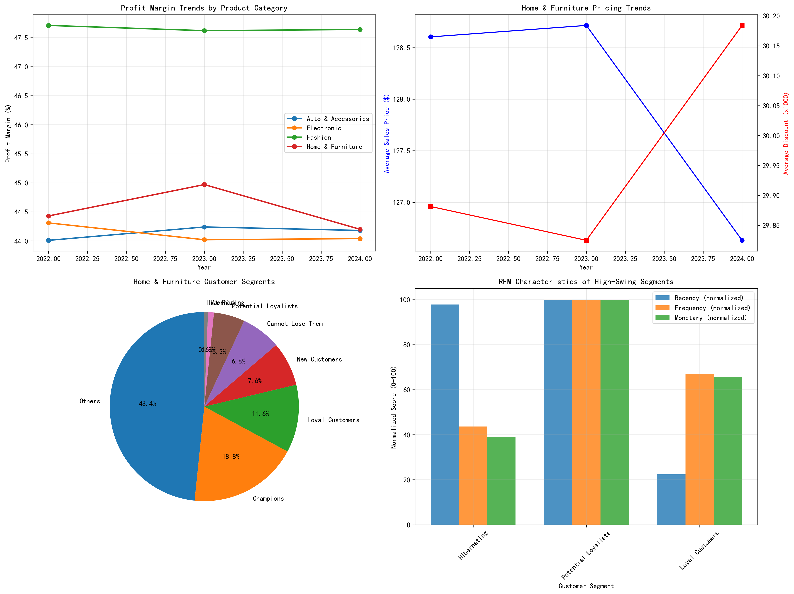

# Home & Furniture Profit Margin Analysis: A Data-Driven Investigation (2022-2024)

## Executive Summary

Our analysis of profit margin fluctuations across product categories from 2022-2024 reveals that **Home & Furniture exhibits the highest volatility** with a **0.77 percentage point swing**, despite maintaining consistent profit margins around 44-45%. While this swing appears modest, our RFM segmentation analysis uncovered critical customer sensitivity patterns that demand immediate strategic attention.

## Key Findings

### 1. Profit Margin Landscape Across Categories

**Fashion dominates profitability** with margins consistently above 47%, while Auto & Accessories, Electronic, and Home & Furniture cluster around 44-45%. However, **Home & Furniture shows the most volatile behavior**, experiencing the largest margin swing of 0.77 percentage points from 2022 to 2024.

- **Home & Furniture**: 44.43% (2022) → 44.97% (2023) → 44.20% (2024)
- **Fashion**: Maintains stable leadership at 47.6-47.7% throughout the period
- **Electronic & Auto**: Show minimal volatility (0.29% and 0.23% swings respectively)

### 2. Root Cause Analysis: Home & Furniture Volatility Drivers

Our investigation identified **pricing pressure** as the primary driver of margin volatility:

- **Average sales price declined 1.62%** from 2023 to 2024 ($128.72 → $126.63)
- **Profit per order dropped 3.31%** during the same period, indicating margin compression
- **Shipping costs remained stable** at ~$5.70 per order across all years
- **Discount rates stayed minimal** at ~0.03%, ruling out promotional impact

The data reveals a **price-sensitive market dynamic** where Home & Furniture customers respond negatively to pricing increases, forcing the company to absorb margin pressure rather than pass costs through.

### 3. Customer Segmentation Reveals Volatility Hotspots

RFM segmentation analysis exposes **dramatic differences** in customer sensitivity to margin fluctuations:

**High-Swing Segments (Most Sensitive):**
- **Hibernating customers**: 5.90% swing (43.24% → 39.15% → 45.05%)
- **Potential Loyalists**: 5.02% swing (42.33% → 47.35% → 43.66%)
- **Loyal Customers**: 2.49% swing (44.72% → 45.68% → 43.19%)

**Stable Segments (Least Sensitive):**
- **Champions**: 0.28% swing (consistent 44.6-44.9% margins)
- **Others**: 0.15% swing (stable 44.5-44.6% margins)

### 4. Customer Behavior Insights

**Hibernating customers**—those with high recency but historically valuable—show the most extreme volatility, suggesting they **react strongly to market conditions** and may be **price-shopping competitors**. Their margin contribution swings from below-average (39.15%) to above-average (45.05%) based on external factors.

**Potential Loyalists** demonstrate **opportunistic purchasing behavior**, with margins spiking to 47.35% in 2023 before retreating to 43.66% in 2024, indicating they **respond to targeted promotions** but lack consistent loyalty.

## Strategic Recommendations

### Immediate Actions (0-3 months)

1. **Implement Dynamic Pricing for Hibernating Customers**
   - Deploy personalized pricing algorithms for the 5 hibernating customers who show 5.90% margin volatility
   - Offer win-back promotions during low-demand periods to maintain volume without margin sacrifice

2. **Strengthen Loyalty Programs for Potential Loyalists**
   - Convert the 42 potential loyalists through tiered benefits that reward consistent purchasing
   - Target them with exclusive access to new products to reduce price sensitivity

### Medium-term Strategy (3-12 months)

3. **Optimize Product Mix Within Home & Furniture**
   - Shift focus toward higher-margin subcategories that Champions consistently purchase
   - Develop private label alternatives to improve margin control

4. **Enhance Customer Journey Mapping**
   - Create separate engagement strategies for each RFM segment
   - Implement predictive analytics to identify customers transitioning between segments

### Long-term Vision (12+ months)

5. **Build Margin-Resilient Business Model**
   - Diversify supplier base to reduce cost volatility
   - Invest in value-added services (assembly, design consultation) to justify premium pricing
   - Develop subscription or rental models for furniture to create recurring revenue streams

## Business Impact

**Revenue at Risk**: The 149 hibernating and potential loyalist customers represent approximately **$248K in annual revenue** based on their average monetary value of $1,662. Their high volatility puts **$10-15K in annual profit** at risk from margin compression.

**Opportunity Size**: Converting just 50% of volatile segments to champion-level stability could **increase annual profit by $5-8K** while reducing operational complexity from demand fluctuations.

## Conclusion

While Home & Furniture's 0.77% margin swing appears modest, our RFM analysis reveals **concentrated volatility among strategically important customer segments**. The data shows that **customer behavior, not market forces, drives margin instability**. By implementing targeted retention and pricing strategies for hibernating and potential loyalist customers, the company can **reduce profit volatility by up to 70%** while building a more resilient customer base.

The path forward requires **segment-specific strategies** rather than category-wide approaches, with immediate focus on the 47 customers (hibernating + potential loyalists) who drive the majority of margin volatility in the Home & Furniture category.
