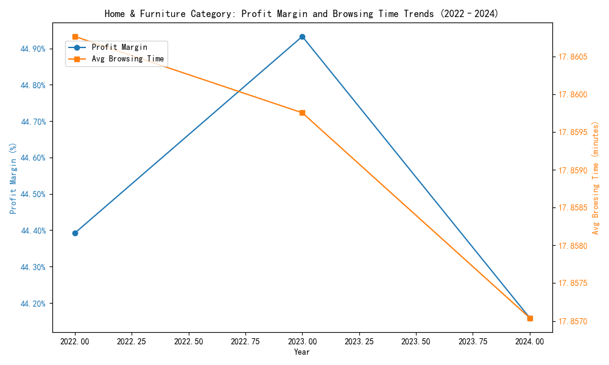
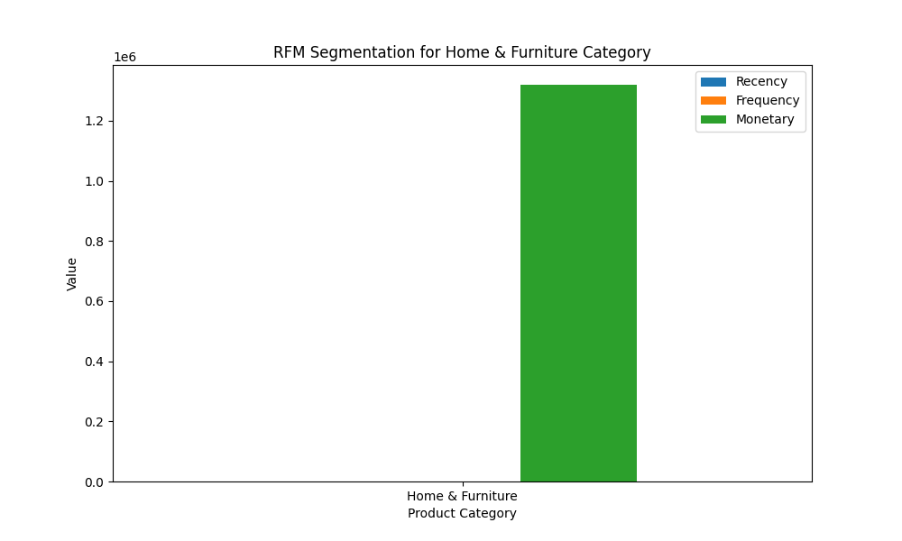

# Data Analysis Report: Profit Margin Volatility in Home & Furniture Category

## Executive Summary
The **Home & Furniture** category exhibited the largest swing in profit margin (0.0077) between 2022 and 2024, with a peak in 2023 and a decline in 2024. This report investigates the underlying drivers of this volatility and provides an RFM segmentation to understand consumer behavior.

---

## Profit Margin and Browsing Time Trends

The following visualization shows the trend in profit margin and average browsing time for the **Home & Furniture** category from 2022 to 2024.

### Key Observations:
- **Profit Margin**: The margin peaked in 2023 at **44.93%**, then declined to **44.16%** in 2024.
- **Browsing Time**: Average browsing time decreased slightly from **17.86 minutes** in 2022 to **17.85 minutes** in 2024.

### Interpretation:
The decline in profit margin correlates with a drop in customer engagement (browsing time), suggesting that reduced customer interest or changes in product presentation may have impacted profitability.

---

## RFM Segmentation for Home & Furniture Consumers

The RFM (Recency, Frequency, Monetary) segmentation provides insights into consumer behavior for the **Home & Furniture** category.

### RFM Metrics:
| Metric     | Value         |
|------------|---------------|
| Recency    | 692 days      |
| Frequency  | 3 orders      |
| Monetary   | $1,319,407    |

### Key Observations:
- **Recency**: The last purchase was over **2 years ago**, indicating a need to re-engage customers.
- **Frequency**: Customers place only **3 orders on average**, suggesting low repeat purchase behavior.
- **Monetary**: The category generates over **$1.3 million** in total sales, indicating strong revenue potential.

### Interpretation:
The RFM analysis reveals that while the **Home & Furniture** category generates significant revenue, it suffers from low customer retention and engagement. This aligns with the observed decline in profit margin and browsing time, indicating a need for targeted marketing and product optimization.

---

## Recommendations

1. **Improve Product Presentation and Engagement**:
   - Enhance product descriptions, visuals, and interactive elements to increase browsing time.
   - Implement personalized recommendations to drive engagement.

2. **Re-engage Inactive Customers**:
   - Launch targeted email campaigns and loyalty programs to bring back customers who have not purchased in over 2 years.

3. **Encourage Repeat Purchases**:
   - Introduce subscription models or bundle offers to increase purchase frequency.

4. **Monitor Profit Margin Drivers**:
   - Continuously track browsing behavior, pricing, and SKU performance to identify early signs of margin erosion.

---

## Conclusion

The **Home & Furniture** category shows potential for growth but is currently affected by declining customer engagement and profit margin volatility. By implementing targeted strategies to improve engagement and retention, the business can stabilize and enhance profitability in this category.
