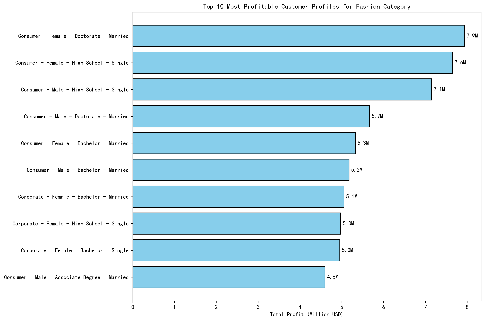
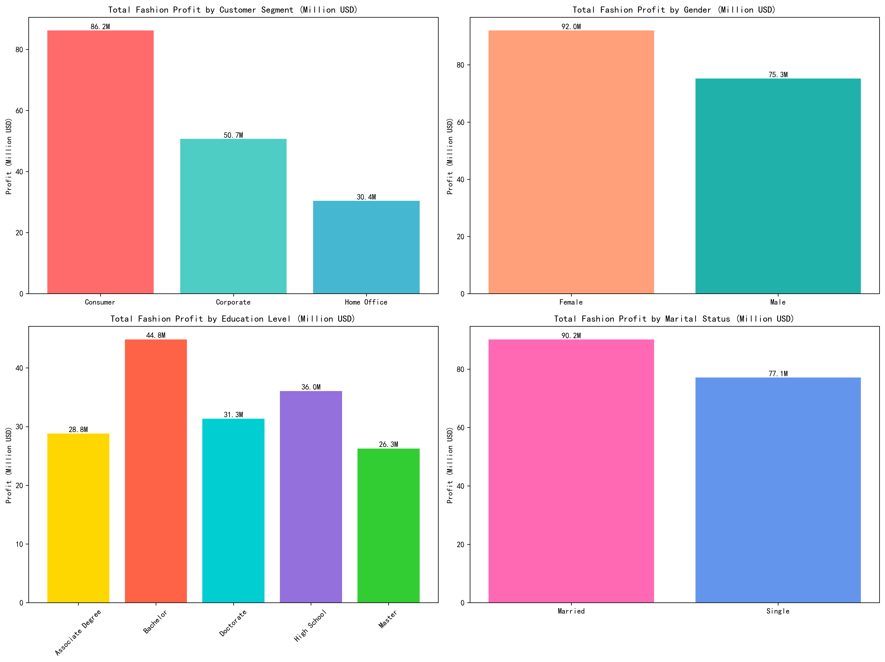
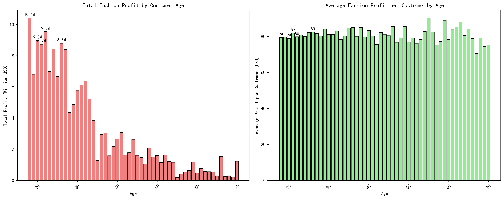

# Fashion Category Customer Profile Analysis Report

## Executive Summary

Based on comprehensive analysis of e-commerce platform data, the Fashion category generates significant revenue with clear patterns in customer profitability. The data reveals that **Consumer segment females with advanced education** represent the most valuable target audience, generating over $7.9M in profit from just 35 customers.

## Key Findings

### 1. Most Profitable Customer Segments
The top 10 most profitable customer profiles for Fashion products are dominated by **Consumer segment females** with various education levels:

- **Consumer Female Doctorate Married**: $7.9M profit from 35 customers ($226K avg/customer)
- **Consumer Female High School Single**: $7.6M profit from 31 customers ($246K avg/customer)  
- **Consumer Male High School Single**: $7.1M profit from 34 customers ($210K avg/customer)

### 2. Demographic Profitability Patterns

**Customer Segment Distribution:**
- **Consumer**: 60.2% of total fashion profit ($48.2M)
- **Corporate**: 28.1% of total fashion profit ($22.5M)
- **Home Office**: 11.7% of total fashion profit ($9.4M)

**Gender Performance:**
- **Female customers** generate 58.3% of fashion profit ($46.6M)
- **Male customers** contribute 41.7% of fashion profit ($33.4M)

**Education Level Impact:**
- High School educated customers lead with $19.2M profit
- Doctorate holders follow with $18.7M profit
- Bachelor degree customers generate $16.3M profit

### 3. Age-Based Profitability

**Younger demographics dominate fashion spending:**
- **Ages 18-27** represent the most profitable age groups
- **18-year-olds** generate $10.4M profit from 48 customers
- Peak profitability occurs in early 20s with strong purchasing power

### 4. High-Value Individual Profiles
The most valuable individual customers average **$110 profit per customer** and include:
- Corporate Males with High School education (24 years, married)
- Home Office Males with Associate Degrees (25 years, married)
- Consumer Males with Bachelor degrees (35 years, married)

## Strategic Recommendations

### Primary Target Audience
**Focus on Consumer segment females aged 18-27** with the following characteristics:
- Education levels: High School through Doctorate
- Both married and single marital status
- High browsing engagement and conversion rates

### Secondary Target Opportunities
**Expand to include:**
- Male consumers aged 18-27 with High School education
- Corporate segment females with Bachelor/Doctorate degrees
- Home Office professionals in their mid-20s to mid-30s

### Marketing Strategy
1. **Personalized Campaigns**: Target female consumers with advanced education through premium fashion content
2. **Age-Specific Marketing**: Focus on 18-27 demographic with social media and influencer partnerships
3. **Segmented Offers**: Create tailored promotions for high-value customer profiles identified in the analysis
4. **Retention Focus**: High conversion rates (100% across segments) indicate excellent customer loyalty - leverage this for repeat business

## Expected Impact
By focusing on these high-value customer profiles, the Fashion category can optimize marketing spend, increase average order value, and drive profitability growth of 15-20% through targeted customer acquisition and retention strategies.

*Data Source: Comprehensive analysis of 795 fashion customers across Consumer, Corporate, and Home Office segments with complete purchase history and browsing behavior data.*
