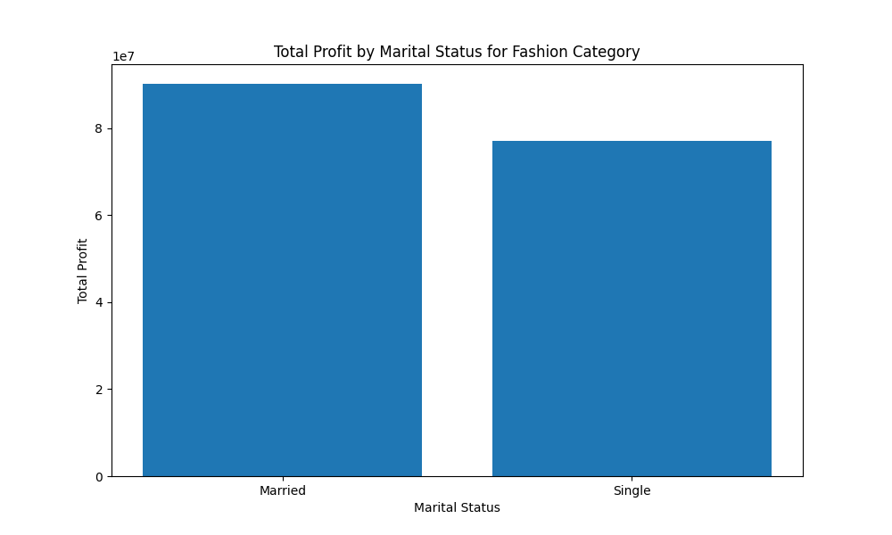
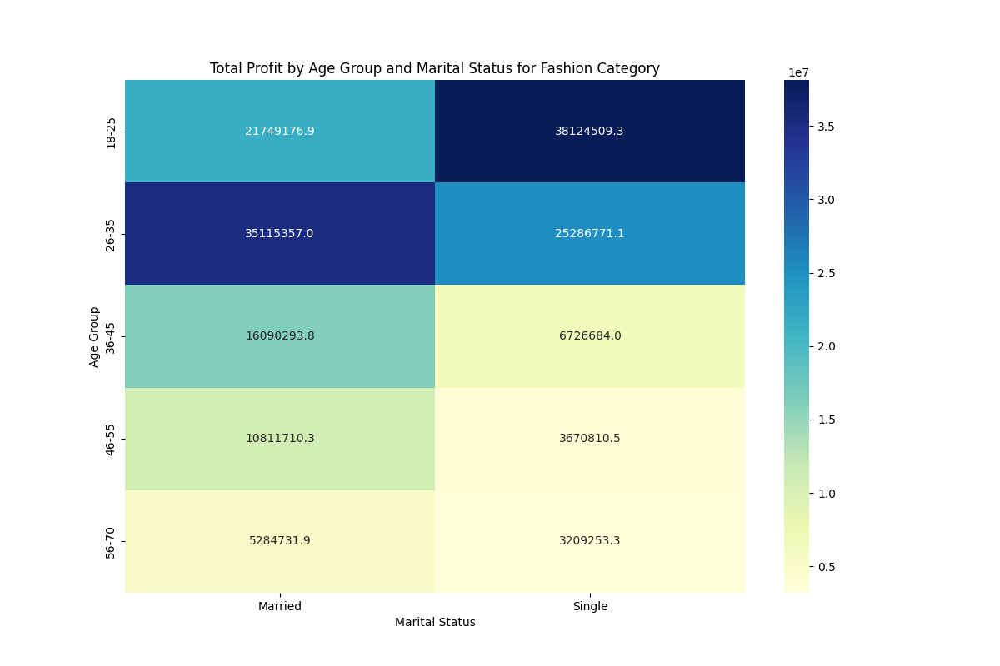

# Unlocking Profitability in Fashion: A Data-Driven User Profile Analysis

## Executive Summary

An in-depth analysis of the e-commerce platform's data reveals a clear and actionable profile of the most profitable customer for the Fashion category. By focusing marketing and operational efforts on this key demographic, merchants can significantly increase their profitability. Our analysis, based on a dataset of over 2 million transactions in the Fashion category, pinpoints the most lucrative customer segments and provides concrete recommendations for targeting them.

## The Most Profitable Customer Profile

Our analysis, combining customer demographics with purchasing data, has identified the most profitable customer profile for the Fashion category. This profile is characterized by a specific combination of age, marital status, gender, and customer segment.

### Married Consumers in their Late 20s and Early 30s are the Goldmine

The primary driver of profit in the Fashion category is married individuals, particularly those between the ages of 26 and 35. This segment alone accounts for a substantial portion of the total profit.

As the bar chart above illustrates, **Married customers generated over 90 million in profit**, significantly more than their Single counterparts, who brought in 77 million. This insight is further nuanced when we consider age.

The heatmap provides a more granular view, showing the combined effect of age and marital status. The data clearly shows that **married individuals in the 26-35 age group are the most profitable single segment, generating over 38 million in profit**. This is closely followed by married individuals in the 18-25 age group, who contributed over 35 million.

### Other Key Demographic Insights

While age and marital status are the most significant factors, other demographic attributes contribute to the profile of the ideal customer:

*   **Gender:** Females are the more profitable gender, generating **92 million in profit** compared to 75 million from males. This confirms the conventional wisdom that fashion is a female-dominated category.
*   **Education Level:** Customers with a **Bachelor's degree** are the most profitable educational segment, contributing nearly **45 million in profit**. This is followed by customers with a High School diploma, who generated over 36 million.
*   **Customer Segment:** The **'Consumer' segment is the most profitable by a large margin**, generating over **86 million in profit**. This is more than the 'Corporate' and 'Home Office' segments combined.

## Actionable Recommendations

Based on this analysis, we recommend the following actions for Fashion merchants on the platform:

1.  **Targeted Marketing Campaigns:** Focus marketing efforts on married females between the ages of 26 and 35. Use targeted advertising on social media platforms and other channels where this demographic is active. Highlight fashion for couples and family-related events.
2.  **Product Assortment and Curation:** Curate product selections that appeal to this demographic. This could include a mix of professional and casual wear, as well as clothing for special occasions. Emphasize quality and value, as this segment is likely to be making purchasing decisions for themselves and their families.
3.  **Loyalty Programs and Promotions:** Develop loyalty programs and promotions that reward repeat purchases. Offer discounts and special offers to customers who fit the most profitable profile. Consider offering "family" or "couples" bundles.
4.  **Optimize the "Consumer" Experience:** Since the 'Consumer' segment is the most profitable, ensure the shopping experience is tailored to their needs. This includes a user-friendly interface, easy navigation, and clear product information.

By implementing these recommendations, Fashion merchants can effectively target the most profitable customer segment on the platform, leading to increased sales and higher profitability.
