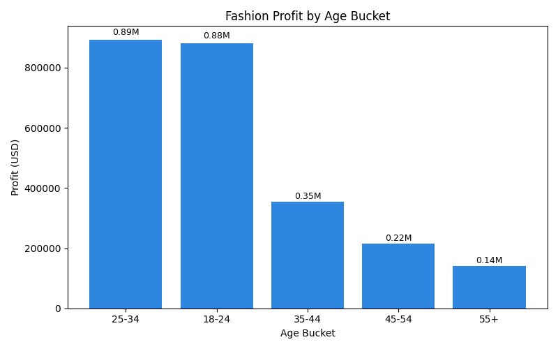
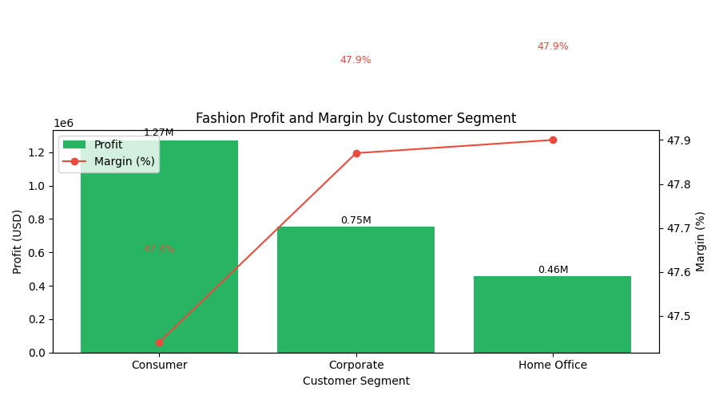

Executive Summary
- Focus your Fashion operations on Consumers aged 25–34 and 18–24, with a creative bias toward Female shoppers. These two age groups together generate 1.77M USD profit (71.4% of category profit), and Female customers contribute 1.37M USD (55%) with slightly higher margins.
- Prioritize “Consumer” segment for scale (1.27M USD profit, 51.2% share), and selectively invest in Corporate/Home Office for margin (≈47.9% margins) where tailored assortments can lift profitability.
- Regionally, Central, South, and North concentrate 46% of Fashion profit, while North Asia and EMEA provide margin headroom (≈48.4% and 47.9%).

Data & Method
- Data sources: order_information (Sales, profit, Product Category), customer_information (gender, age, Customer Segment, Region), product_browsing (Browsing Time, like, share, Add to Cart).
- Key approach: Aggregation per unique Customer ID to avoid duplicate inflation (795 distinct customers vs 51,289 rows). Verified attributes are consistent per customer (no multi-valued gender/age/segment/region).
- Fashion totals used for context (from SQL): Sales 5.21M USD, Profit 2.48M USD, Margin 47.66%, Orders 30,775.
- Conversion proxy: orders_per_addtocart from product_browsing to indicate funnel efficiency.

Insight 1: Age drives most profit—target 25–34 and 18–24
Observation: The 25–34 bucket delivered 893,367 USD profit (margin 47.79%, AOV 170.08 USD) and 18–24 delivered 880,235 USD profit (margin 47.51%, AOV 168.32 USD). Combined, 18–34 contributed 1,773,602 USD (71.4% of Fashion profit). Query grouped deduplicated profiles by age bucket using order_information fields Sales, profit and Product Category='Fashion'.
Root Cause: Younger shoppers show high engagement and purchase frequency (orders: 10,990 for 25–34 and 11,007 for 18–24), consistent with platform demographics and Fashion item relevance.
Business Impact / Recommendation: Concentrate assortment, pricing, and campaigns on 18–34. Launch weekly drops for basics and trend SKUs, optimize AOV with bundles around ~169–170 USD price points, and run time-limited promos for these cohorts.

Key takeaway: 25–34 profit reached 0.89M USD (+1.5% vs 18–24), at 47.79% margin. This matters because it identifies the single largest profit pool and validates that pricing around ~170 USD sustains healthy margins.

Insight 2: Segment strategy—scale in Consumer, margin in Corporate/Home Office
Observation: Consumer segment generated 1,271,091.9 USD profit (51.2% share, margin 47.44%), Corporate 753,602.7 USD (30.3%, margin 47.87%), Home Office 459,260.6 USD (18.5%, margin 47.90%). Query joined deduplicated customer profiles to Fashion orders and summarized by segment.
Root Cause: Consumer carries the bulk of buyers and orders (15,876 orders), while Corporate/Home Office have slightly higher margins, likely driven by more premium or utility-focused SKUs.
Business Impact / Recommendation: Use Consumer as the growth engine (breadth, weekly campaigns). Pilot higher-margin lines for Corporate/Home Office (quality upgrades, value packs) to lift profitability without discounting.

Key takeaway: Consumer profit is 1.27M USD at 47.44% margin, while Corporate/Home Office margins edge to ≈47.9%. This matters because it signals where to chase volume versus margin optimization.

Insight 3: Gender dynamics—Female drives volume; Male converts more per add-to-cart
Observation: Female profit is 1,366,498.5 USD (55% share) at 47.77% margin; Male profit is 1,117,456.7 USD (45%) at 47.52% margin. Engagement differs: Female add-to-cart = 14,081 vs Male = 6,288, but orders per add-to-cart are higher for Male (2.2172 vs 1.1954).
Root Cause: Female shoppers browse and add to cart more, while Male shoppers tend to buy more of what they add—suggesting different funnel behaviors.
Business Impact / Recommendation: For Female cohorts, streamline checkout (free returns, faster shipping, cart reminders) to translate high engagement into purchases. For Male cohorts, increase add-to-cart events via product bundles, personalized recommendations, and targeted onsite prompts.

Insight 4: Region focus—scale in Central/South/North; margin headroom in North Asia/EMEA
Observation: Central drives the highest profit at 523,405.8 USD (21.1% share, margin 47.43%, AOV 169.11 USD), followed by South 318,378.4 USD (12.8%) and North 259,948.3 USD (10.5%). Margin leaders: North Asia 48.37% (197,207.3 USD), EMEA 47.93% (157,357.3 USD), North 47.88% (259,948.3 USD).
Root Cause: Central/South/North likely have larger active shopper bases in your catalog and logistics advantage; North Asia/EMEA preference for higher-margin SKUs suggests price elasticity and premium appetite.
Business Impact / Recommendation: Allocate demand-gen and inventory to Central/South/North for scale. In North Asia/EMEA, test premium pricing, upsell higher-quality materials, and highlight brand/value to capture margin.

Insight 5: Top cross-profile cohorts—quick wins
Observation: Top cohort (by profit) is Female 18–24 Consumer at 257,950 USD (margin 47.79%, AOV 168.72 USD). Next: Male 25–34 Consumer at 212,560.9 USD (margin 47.33%), Female 25–34 Consumer at 212,417.6 USD (margin 47.43%).
Root Cause: These cohorts combine scale of “Consumer” with high propensity to buy in the 18–34 age band.
Business Impact / Recommendation: Launch targeted campaigns for these cohorts first (social channels for 18–24, influencer collabs for 25–34), emphasize trend-led assortments and curated bundles at ~170 USD.

Primary Target Profile to Operate Fashion Well
- Age: 25–34 (and 18–24 as a close second).
- Segment: Consumer.
- Gender: Emphasis on Female for engagement; maintain tailored tactics for Male to boost add-to-cart.
- Regions: Central, South, North for scale; North Asia/EMEA for margin optimization.

Action Plan
- Assortment & Pricing: Trend basics, seasonal drops, and bundles targeting ~169–170 USD AOV. Introduce premium variants for Corporate/Home Office.
- Promotions: Weekly campaigns for 18–34 Consumers with time-limited offers; corporate loyalty perks to protect margins.
- Personalization: Female—cart recovery, fit guides, fast shipping messaging. Male—bundle suggestions, minimal friction on add-to-cart, tailored recommendations.
- Regional execution: Stock depth and paid media in Central/South/North; premium storytelling in North Asia/EMEA.

Evidence & Steps
- SQL fields used: order_information.Product Category, Sales, profit; customer_information.gender, age, Customer Segment, Region; product_browsing.Add to Cart.
- Aggregation method: Deduplicated per Customer ID (795 unique) to avoid join inflation; attributes validated as single-valued per customer.
- Python plotting code executed to produce visuals saved in the current directory: fashion_profit_by_age.png and fashion_profit_margin_by_segment.png.

Why this matters
- You will capture the largest profit pools quickly by focusing on 18–34 Consumers, while keeping margin resilience by tailoring premium offers to Corporate/Home Office and margin-rich regions. The data shows clear scale, healthy margins (~47.5–48%), and actionable funnel differences by gender that you can exploit to improve conversion and profit.
