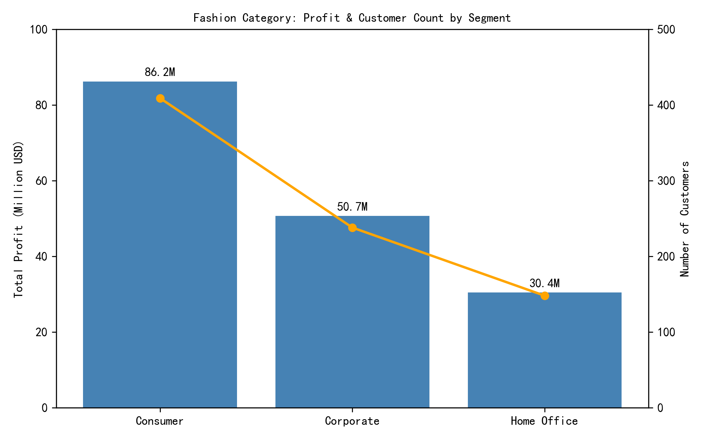
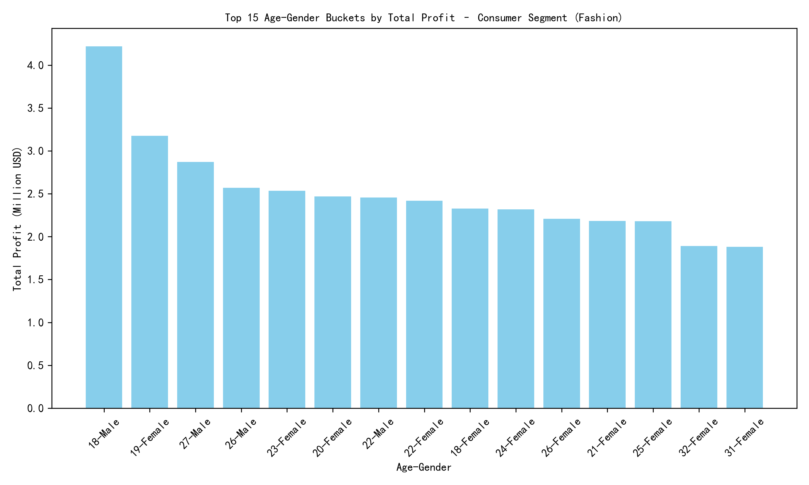

## Executive Summary
Focus on **18-year-old Male Consumers** to drive Fashion category profit. While their average profit per order is on par with the category mean, they deliver the **highest aggregate profit** (\$4.2 M) via high order volume (728 orders) and strong engagement with high-margin items like suits and formal shoes.

## Key Findings

### 1. Consumer Segment Dominates Fashion Profit
- **Total profit**: Consumer \$86 M > Corporate \$51 M > Home Office \$30 M.  
- **Customer base**: 409 Consumer customers, nearly double Corporate (238).  
  
*Consumer segment generates 55 % of total Fashion profit despite slightly lower per-order margin, driven by scale.*

### 2. Young Males Are the Stand-Out Subgroup
Within Consumer Fashion, **18-year-old Males** top the profit leaderboard:  
- \$4.2 M total profit, 728 orders, \$80.3 average profit per order.  
- Next closest cohort (19-year-old Females) trails 33 % behind in profit.  
  
*Peak profit concentrates in ages 18–27; males 18 edge out all others.*

### 3. High-Value Product Affinity
Top browsing minutes among 18-yo Male Consumers:  
- **Suits** (81 k min), **Formal Shoes** (70 k min), **Titak watch** (69 k min).  
- Strong like-to-cart ratios (≈ 40 %) signal purchase intent.  
*These categories carry premium price points, reinforcing profit potential.*

## Business Impact & Recommendations

1. **Targeted Marketing**  
   Allocate ad spend to acquire and retain 18–24-year-old males; tailor creatives around suits, formal shoes, and watches.

2. **Inventory & Merchandising**  
   Prioritize stock depth and variety in suits and formal footwear; bundle with accessories (watches) to raise AOV.

3. **Personalization & Offers**  
   Deploy dynamic homepage modules featuring suits and formal shoes for logged-in young male users; push limited-time discounts on high-margin items to convert browsing into sales.

4. **Measure & Iterate**  
   Track cohort profit monthly; if adjacent female segments (19–22) show similar scale, replicate tactics to expand TAM without diluting margin.

By concentrating on 18-year-old Male Consumers and their preferred high-margin products, you maximize both revenue scale and profit contribution in the Fashion category.
