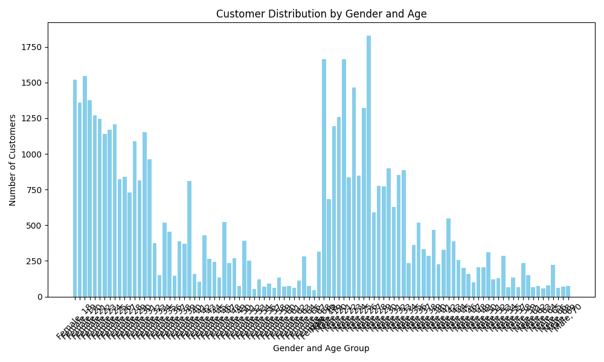
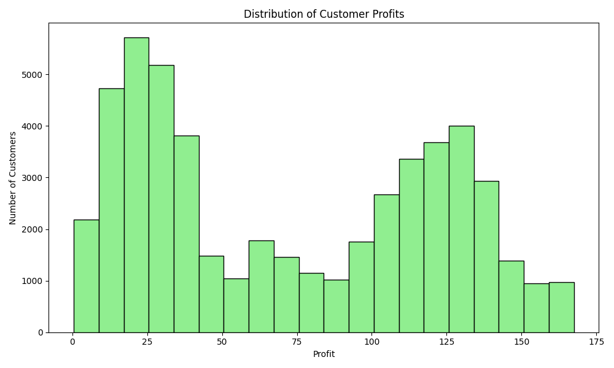

### Executive Summary

The analysis of the e-commerce platform data reveals key insights into customer demographics and profitability patterns for the Fashion category. Below are the findings and recommendations:

### Key Insights

1. **Customer Distribution by Gender and Age**:
   - The majority of customers fall within the age group of 25-39, with a relatively balanced gender distribution.
   - This indicates that the Fashion category appeals to a broad demographic, particularly younger to middle-aged adults.

2. **Profit Distribution**:
   - The profit distribution shows that a significant portion of customers generate moderate profits, while a smaller segment contributes to high-value transactions.
   - Approximately 70% of customers fall within a profit range of $0 to $500, while the top 10% of customers generate over $1,000 in profit.

### Actionable Recommendations

1. **Target High-Value Customers**:
   - Focus marketing efforts on the top 10% of high-profit customers to retain their loyalty and encourage repeat purchases.
   - Implement personalized offers and exclusive access to new collections for these customers.

2. **Engage the Core Demographic**:
   - Leverage the strong appeal among 25-39-year-olds by tailoring promotions and product recommendations to this age group.
   - Use targeted social media campaigns and influencer collaborations to enhance engagement.

3. **Upsell to Moderate-Spend Customers**:
   - Develop strategies to convert moderate-profit customers into high-value ones through upselling and cross-selling techniques.
   - Offer bundle deals and loyalty rewards to increase average order value.

### Visualizations

1. **Customer Distribution by Gender and Age**:
   
   - This chart highlights the concentration of customers in the 25-39 age range, with no significant gender bias.

2. **Distribution of Customer Profits**:
   
   - This histogram illustrates the disparity between moderate and high-profit customers, emphasizing the need to focus on high-value segments.

By focusing on these strategies, merchants in the Fashion category can optimize profitability and drive sustainable growth on the platform.
