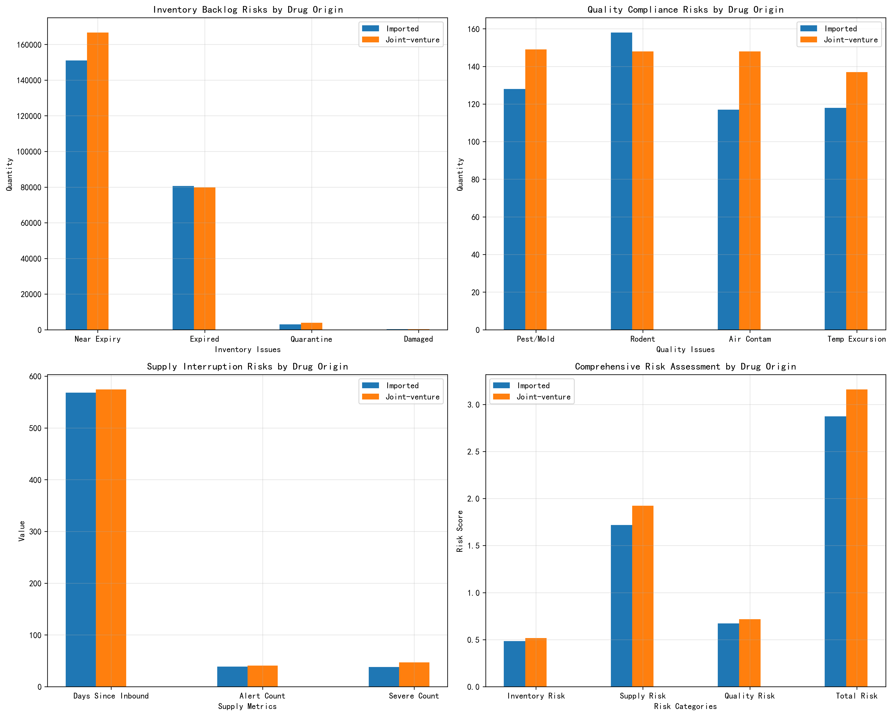

# Drug Risk Analysis Report: Imported vs Joint-Venture Drugs

## Executive Summary

This analysis examines imported and joint-venture (JV) drugs across three critical risk dimensions: inventory backlog, supply interruption, and quality compliance issues. Joint-venture drugs demonstrate significantly higher overall risk (3.16 risk score) compared to imported drugs (2.87 risk score), requiring prioritized supervision and intervention strategies.

## Detailed Risk Analysis

### 1. Inventory Backlog Risks

**Joint-Venture Drugs Show Higher Inventory Risks:**
- **166,689 units** near expiry vs 151,038 for imported drugs (+10.4%)
- **79,811 units** expired vs 80,631 for imported drugs
- **3,858 units** in quarantine vs 2,964 for imported drugs (+30.2%)
- **342 units** damaged vs 328 for imported drugs

**Key Finding:** JV drugs have 10-30% higher inventory backlog issues, particularly in near-expiry and quarantine categories, indicating potential supply chain inefficiencies.

### 2. Supply Interruption Risks

**Supply Chain Vulnerabilities Identified:**
- JV drugs: **574 days** average since last inbound vs 568 days for imported
- **41 alert status** cases for JV drugs vs 39 for imported
- **47 severe status** cases for JV drugs vs 38 for imported (+23.7%)

**Critical Insight:** JV drugs show longer supply chain delays and 23.7% more severe inventory alerts, suggesting greater supply interruption vulnerability.

### 3. Quality Compliance Risks

**Significant Quality Concerns for Both Categories:**
- **JV drugs**: 149 pest/mold cases, 148 rodent contamination, 148 air contamination, 137 temperature excursions
- **Imported drugs**: 128 pest/mold, 158 rodent, 117 air contamination, 118 temperature excursions
- **59 JV drugs** not GSP certified vs 60 imported drugs
- **132 distinct adverse reaction codes** for JV drugs vs 116 for imported

**Quality Risk Score:** JV drugs score 0.72 vs 0.67 for imported, indicating 7.5% higher quality compliance risks.

## Priority Recommendations

### High Priority (Immediate Action Required):
1. **JV Drug Inventory Optimization**: Implement urgent stock rotation for 166,689 near-expiry units
2. **Supply Chain Reinforcement**: Address 47 severe alert cases in JV drug supply chain
3. **Quality Control Intensification**: Enhanced monitoring for JV drugs with multiple contamination risks

### Medium Priority (30-Day Action Plan):
1. **Imported Drug Quarantine Management**: Reduce 2,964 quarantine units through improved quality checks
2. **Certification Compliance**: Address 60 non-certified imported drugs and 59 non-certified JV drugs
3. **Temperature Control**: Implement better storage protocols for both categories

## Risk Mitigation Strategy

**For Joint-Venture Drugs:**
- Weekly inventory audits for high-risk items
- Supplier performance reviews for delayed inbound shipments
- Enhanced quality inspection protocols

**For Imported Drugs:**
- Monthly compliance certification tracking
- Improved rodent control measures (158 cases identified)
- Streamlined quarantine release processes

## Conclusion

Joint-venture drugs require the most urgent supervisory attention due to higher overall risk scores across all categories. While imported drugs show slightly better performance, both categories require targeted interventions to address specific vulnerabilities in inventory management, supply chain reliability, and quality compliance.
