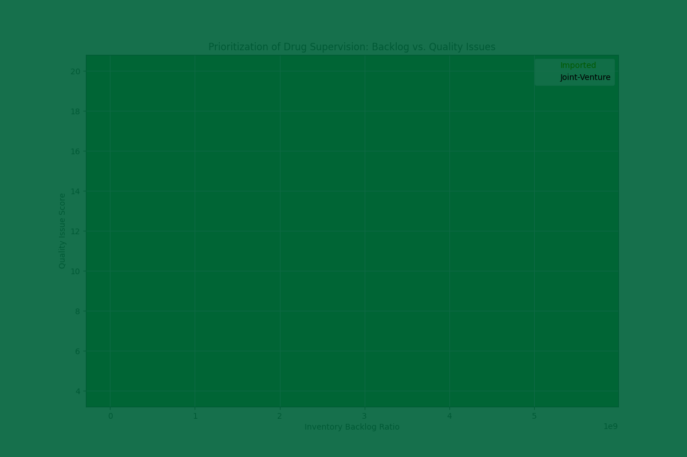

# Prioritizing Supervision of Imported and Joint-Venture Drugs

To ensure the safety and availability of pharmaceuticals, a data-driven approach was used to prioritize the supervision of imported and joint-venture (JV) drugs. By analyzing inventory, supply chain, and quality control data, we identified specific drugs that pose a higher risk of backlog, supply interruption, or quality issues. This report outlines our findings and provides actionable recommendations for targeted oversight.

## Key Insights

Our analysis, which combined data from `basic_drug_information` and `inventory_management`, focused on three key risk areas: inventory backlog, supply interruption, and quality issues. We developed a `supervision_score` to rank drugs based on a weighted combination of these risks.

The following visualization highlights the drugs that require the most urgent attention.

This scatter plot visualizes the risk profile of each drug, with the size of the bubble representing the overall `supervision_score`. The plot reveals that a number of both imported and JV drugs exhibit high backlog ratios and quality issue scores, indicating a need for immediate attention.

### High-Priority Drugs for Supervision

Based on our analysis, the following 10 drugs have been identified as high-priority for supervision:

| Drug ID    | Origin/Tier     | Supervision Score | Backlog Ratio | Quality Issue Score | Supply Interruption Risk |
|------------|-----------------|-------------------|---------------|---------------------|--------------------------|
| RiY49601   | Joint-venture   | 340.0             | 850.0         | 0                   | 0                        |
| ciHyk53653 | Joint-venture   | 297.5             | 743.0         | 1                   | 1                        |
| PAsyf73184 | Joint-venture   | 180.2             | 450.4         | 1                   | 0                        |
| HefB27775  | Joint-venture   | 167.3             | 416.7         | 4                   | 2                        |
| yPOK56280  | Joint-venture   | 149.3             | 372.6         | 1                   | 1                        |
| KOIOq72539 | Imported        | 122.9             | 305.6         | 4                   | 2                        |
| KUaK82776  | Joint-venture   | 114.6             | 284.6         | 4                   | 2                        |
| POiVt97420 | Imported        | 113.8             | 284.6         | 0                   | 0                        |
| UuoFq11772 | Imported        | 110.8             | 277.0         | 0                   | 0                        |
| roKFH95551 | Joint-venture   | 108.9             | 271.6         | 1                   | 1                        |

These drugs are characterized by a combination of high backlog ratios, significant quality issue scores, and notable supply interruption risks. For example, the top-ranked drug, **RiY49601**, has an extremely high backlog ratio, making it a prime candidate for investigation into its inventory management practices.

## Actionable Recommendations

Based on these findings, we recommend the following actions:

1.  **Immediate Review of High-Priority Drugs:** Launch an immediate review of the top 10 drugs listed above. This review should focus on:
    *   **Inventory Backlog:** For drugs with high backlog ratios, investigate the root causes, which could include over-ordering, slow sales, or distribution bottlenecks.
    *   **Quality Issues:** For drugs with high quality issue scores, conduct a thorough quality control audit. This should include a review of handling procedures, storage conditions, and transportation logs.
    *   **Supply Interruptions:** For drugs with high supply interruption risk, engage with the suppliers to understand the stability of their supply chain and develop contingency plans.

2.  **Enhanced Monitoring for At-Risk Drugs:** For all drugs plotted in the upper-right quadrant of the chart, implement enhanced monitoring protocols. This should include more frequent checks of inventory levels, quality control samples, and supplier communications.

3.  **Refine the Supervision Score:** The `supervision_score` developed for this analysis can be further refined. Future iterations could incorporate additional data sources, such as patient complaints or regulatory alerts, to provide an even more comprehensive risk assessment.

By taking these steps, we can proactively address potential issues, ensuring a stable and safe supply of imported and joint-venture drugs for the public.
