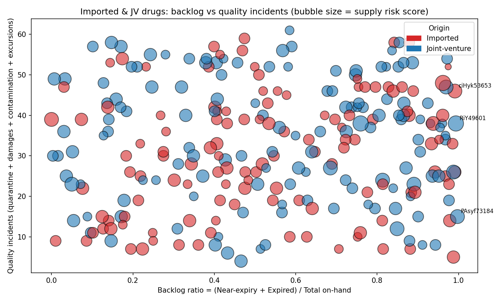

Report: Prioritizing Supervision for Imported & JV Drugs (Inventory Backlog, Supply Interruption, Quality Risk)

Executive summary
- Conclusion: Imported and JV drugs show widespread risk—76% have severe backlog (backlog ratio ≥30%), 78% have elevated supply interruption risk (score ≥2), and 100% hit quality risk score ≥2. Three SKUs require immediate, prioritized supervision: PAsyf73184 (JV), RiY49601 (JV), ciHyk53653 (Imported).
- Scope: 264 SKUs total (Imported: 125; JV: 139), derived from basic_drug_information joined to inventory_management and pricing_system.
- Why it matters: Near-expiry/expired accumulation ties up capital and drives write-offs; supply interruptions jeopardize availability; quality issues trigger regulatory/compliance exposure and returns.

What we measured (key fields and logic)
- Origin filter: \"Origin / Tier (Domestic/Imported/JV)\" in basic_drug_information.
- Inventory backlog: Backlog ratio = (\"Near-expiry Quantity\" + \"Expired Quantity\") / total on-hand (Qualified + Quarantine + Near-expiry + Expired + Returned + Damaged).
- Supply interruption risk score (0–5): 2 points if \"Qualified Quantity\"=0; +1 if outbound–inbound gap ≥30 days (julianday(\"Last Outbound Date\") - julianday(\"Last Inbound Date\")); +1 if \"Inventory Status\" ∈ {Frozen, Scrapped}; +1 if \"Abnormal Price Fluctuation Flag\" is present.
- Quality incidents: Sum of \"Quarantine Quantity\", \"Damaged Quantity\", \"Pest/Mold Damage Quantity\", \"Rodent Contamination Quantity\", \"Air Contamination Quantity\", \"Temp/Humidity Excursion Record\".
- Quality risk score: +1 if \"GSP Certification Status\" not clearly valid; +1 if \"Adverse Reaction Code\" present; +1 if quality incidents ≥10.
- Method: SQL aggregation and Python calculations; visualization saved as imported_jv_risk_scatter.png. Python code executed is included in the transcript.

Portfolio-level findings (Imported + JV only)
- Severe backlog is pervasive: mean backlog ratio is 54.38%, with 201 out of 264 SKUs (76%) ≥30% backlog. This indicates high risk of expiry-related losses and markdowns.
- Supply interruption risk is elevated: 206 SKUs (78%) have supply risk score ≥2, driven by zero qualified stock, long inbound/outbound gaps, status freezes/scraps, and abnormal price flags.
- Quality risk is universal: 264 SKUs (100%) hit quality risk score ≥2, reflecting incident counts and compliance/adverse flags. This increases regulatory risk and potential returns/rejections.

Visual insight
- Observation: The scatter shows backlog ratio (x-axis) vs. quality incidents (y-axis) for imported (red) and JV (blue) SKUs; bubble size reflects supply risk score. Clusters in the upper-right indicate SKUs simultaneously high on backlog and quality incidents, with many large bubbles signaling compounded supply risk.
- Key takeaway with numbers: Numerous SKUs exceed backlog ratios of 0.90 while posting 20–50 quality incidents and supply risk scores of 3–5. For example, ciHyk53653 (Imported) has backlog ratio 0.991, quality incidents 46, and supply risk score 4; RiY49601 (JV) has backlog ratio 0.994, quality incidents 38, and supply risk score 5.
- Why it matters: These SKUs are at imminent risk of write-offs and stockouts while also triggering quality/compliance issues—requiring immediate, cross-functional supervision.

Top risks by dimension
- Inventory backlog (top examples):
  - PAsyf73184 (JV, North China Pharmaceutical, 1mg*27): backlog ratio 0.997; quality incidents 15; supply risk score 4.
  - RiY49601 (JV, CSPC Hebei Zhongrun, 3mg*16): backlog ratio 0.994; quality incidents 38; supply risk score 5.
  - ciHyk53653 (Imported, North China Pharmaceutical, 2mg*14): backlog ratio 0.991; quality incidents 46; supply risk score 4.
  - Implication: These SKUs are heavily near-expiry/expired, signaling aggressive sell-down or redistribution is needed.
- Supply interruption (top examples):
  - KOIOq72539 (Imported, North China Pharmaceutical, 4mg*13): supply risk score 5; backlog ratio 0.962; quality incidents 48.
  - RiY49601 (JV): supply risk score 5; backlog ratio 0.994; quality incidents 38.
  - roKFH95551 (JV, Qilu, 4mg*6): supply risk score 5; backlog ratio 0.759; quality incidents 38.
  - Implication: Zero qualified stock, frozen/scrapped statuses, longer inbound-outbound gaps, and market stress flags elevate stockout risk despite high backlog; demand-supply misalignment is likely.
- Quality incidents (top examples):
  - FGE54537 (JV, North China Pharmaceutical, 3mg*7): quality incidents 61; backlog ratio 0.585; supply risk score 1.
  - ihE02967 (Imported, CSPC Hebei Zhongrun, 1mg*22): quality incidents 59; backlog ratio 0.474; supply risk score 2.
  - VZQ51717 (Imported, Yangtze River Pharmaceutical, 4mg*19): quality incidents 58; backlog ratio 0.842; supply risk score 2.
  - Implication: Elevated quarantine/damage/contamination/excursions point to process or storage nonconformities; compliance actions are urgent.

Prioritized supervision list (cross-dimensional intersection)
- Immediate priority (appear across multiple risk lists):
  - PAsyf73184 (JV): backlog ratio 0.997; quality incidents 15; supply risk score 4; quality risk score 3.
  - RiY49601 (JV): backlog ratio 0.994; quality incidents 38; supply risk score 5; quality risk score 3.
  - ciHyk53653 (Imported): backlog ratio 0.991; quality incidents 46; supply risk score 4; quality risk score 3.
- Rationale: These SKUs concurrently exhibit extreme backlog, high incident counts, and strong supply risk signals. Without intervention, they will likely cause write-offs, stockouts, and regulatory scrutiny.

Observation → Root Cause → Business Impact / Recommendation
1) Inventory backlog
- Observation: Mean backlog ratio 54.38%; 201/264 SKUs ≥30%; multiple SKUs >0.99.
- Root cause: Over-purchasing against slow sales; limited channel throughput; delayed rotation causing near-expiry accumulation.
- Impact: Capital lock-up, expiry write-offs, and price markdowns.
- Recommendations:
  - Launch rapid sell-down for top-backlog SKUs (e.g., targeted discounts and hospital/pharmacy allocations). 
  - Rebalance inventory via inter-warehouse transfers; prioritize high-turn sites.
  - Tighten reorder parameters for imported/JV SKUs; cap orders where backlog ratio >0.3.

2) Supply interruption
- Observation: 206/264 SKUs (78%) with risk score ≥2; multiple SKUs with zero qualified stock and frozen/scrapped statuses.
- Root cause: Supply chain instability (price shocks, compliance freezes, delayed inbound replenishment).
- Impact: Stockouts and missed prescriptions; revenue loss and patient risk.
- Recommendations:
  - For high-risk SKUs (e.g., KOIOq72539, RiY49601), pre-emptive sourcing from alternative suppliers; expedite inbound.
  - Unfreeze lots after investigation where safe; clear scrapped units and replace with compliant batches.
  - Monitor price flags and renegotiate supply terms to stabilize procurement.

3) Quality risk
- Observation: All 264 SKUs score ≥2 on quality risk; repeated incidents (up to 61 per SKU).
- Root cause: Storage/handling deviations (temperature/humidity excursions, contamination, physical damage), and compliance/adverse flags.
- Impact: Regulatory exposure, returns, and potential treatment risks.
- Recommendations:
  - Immediate GSP audit for imported/JV storage and transport; reinforce cold-chain adherence.
  - Root-cause analysis on incident-heavy SKUs (e.g., FGE54537, ihE02967); retrain warehouse staff and update SOPs.
  - Implement stricter quarantine resolution SLAs and escalate suppliers with recurring adverse issues.

Imported vs JV differences (qualitative)
- Both categories populate top-risk clusters; imported (red) and JV (blue) appear mixed in upper-right of the scatter, indicating similar risk levels across origins. Supervision should focus on the specific SKUs above rather than origin alone.

Notes on approach
- SQL steps: We filtered origin and aggregated inventory/quality fields from inventory_management and pricing_system linked by \"Drug ID\"; computed ratios and scores in Python.
- Visualization: Scatter of backlog ratio vs. quality incidents with bubble size as supply risk score; annotated top-priority SKUs.

Next actions (operational plan)
- Week 1: Cross-functional war room for the three immediate SKUs; execute sell-down, alternative sourcing, and quality audits.
- Week 2–3: Parameter tuning in ERP (reorder caps tied to backlog ratio) and supplier scorecard updates (incident thresholds).
- Ongoing: Weekly dashboard refresh from the same SQL/Python pipeline; alert when backlog ratio >0.3 or supply risk score ≥3.

Appendix: Key counts and metrics
- Imported: 125 SKUs; JV: 139 SKUs.
- Mean backlog ratio: 0.5438.
- Severe backlog count: 201.
- Supply risk count (score ≥2): 206.
- Quality risk count (score ≥2): 264.
