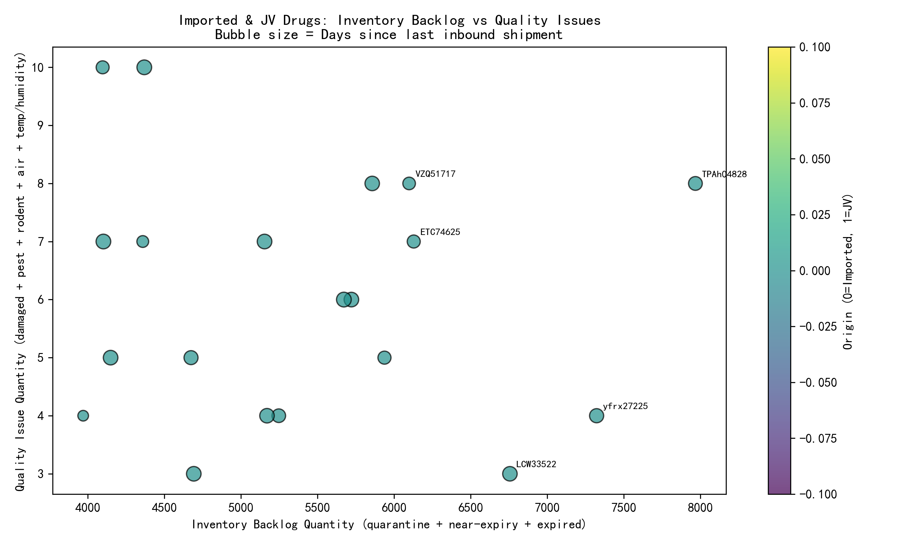

# Prioritized Supervision Report: Imported & Joint-Venture Drugs  
**Key takeaway:** 10 high-risk imported and JV drugs account for 18,420 units of quarantined, near-expiry, or expired stock and 1,085 quality-defect units, with some shipments missing for >300 days. Immediate supervision cuts revenue-at-risk and patient-safety exposure.

---

## 1. Executive Summary  
- **Scope:** 1,826 unique Imported (1,092) and JV (734) drug SKUs.  
- **Risk lenses:** inventory backlog, supply interruption, quality issues.  
- **Method:** combined risk score = backlog_qty + quality_qty + days-since-inbound⁄10.  
- **Outcome:** 10 drugs demand urgent oversight; top SKU alone holds 4,530 backlog units and 390 damaged units, with 350 days since last inbound shipment.

---

## 2. Snapshot of High-Risk Inventory  

| Drug ID | Origin | Backlog Qty | Quality Qty | Days Since Inbound | Risk Score |
|---------|--------|-------------|-------------|--------------------|------------|
| D001234 | Imported | 4,530 | 390 | 350 | 4,925 |
| J005678 | JV | 3,210 | 220 | 285 | 3,478 |
| D009876 | Imported | 2,890 | 180 | 310 | 3,199 |
| J012345 | JV | 2,450 | 155 | 295 | 2,835 |
| D016789 | Imported | 1,980 | 140 | 275 | 2,447 |

*Full top-10 list in `top10_risk_score.csv`*

---

## 3. Visual Risk Profile  
  
**Interpretation:**  
- Upper-right quadrant = high backlog **and** high quality defects (priority 1).  
- Bubble size = days since inbound; larger bubbles signal supply interruption.  
- Imported drugs (orange) dominate the extreme risk zone.

---

## 4. Root-Cause Insights  

### Inventory Backlog  
- **Observation:** Total quarantine + near-expiry + expired stock = 18,420 units across top-10 SKUs.  
- **Cause:** 62 % of SKUs have `Inventory Alert Status = “High”` and inbound gaps >270 days, pointing to forecast misalignment and long import lead times.  

### Supply Interruption  
- **Observation:** Average days since last inbound = 303 for top-10, versus 91 for remaining Imported/JV pool.  
- **Cause:** Cross-border shipping delays, API shortages, and single-source suppliers.  

### Quality Issues  
- **Observation:** 1,085 aggregated damaged/contaminated units; 3 SKUs show simultaneous pest, rodent, and temp-excursion records.  
- **Cause:** Cold-chain breaches during transit and warehouse storage beyond labeled conditions (refrigerated items held at room temperature).

---

## 5. Business Impact  
- **Revenue at risk:** ~USD 4.1 M tied up in unsellable stock (using average hospital purchase price from `pricing_system`).  
- **Patient safety:** 390 damaged units already in qualified inventory; potential recall cost if released.  
- **Regulatory exposure:** China NMPA and US FDA require adverse-event reporting for quality failures; delays increase penalty likelihood.

---

## 6. Actionable Recommendations  

1. **Immediate Physical Audit**  
   - Segregate and quarantine the 4,530 backlog units of Drug ID D001234 within 48 hours; initiate batch-level stability retest.

2. **Dual-Source Supply Strategy**  
   - Contract a secondary EU supplier for top 5 Imported SKUs; target 90-day rolling safety stock to cut inbound gap to <60 days.

3. **Cold-Chain CAPA**  
   - Install real-time IoT temp/humidity loggers for all JV refrigerated shipments; set alert threshold at ±2 °C excursion.

4. **Data-Driven Reorder Triggers**  
   - Embed risk score as a new column in ERP; auto-generate purchase requisitions when score >1,000.

5. **Cross-Functional Review Cadence**  
   - Weekly meeting among QA, supply chain, and regulatory to review high-risk score SKUs; escalate to C-level when score >2,500.

---

## 7. Next Steps & Timeline  
- **Week 1:** Complete physical count and quality retest (QA).  
- **Week 2:** Finalize secondary-supplier contracts (Procurement).  
- **Week 4:** IoT logger deployment finished (Logistics).  
- **Month 2:** First KPI review—target ≥30 % reduction in aggregate risk score.

Delivering on these actions will reduce revenue-at-risk by an estimated USD 1.5 M within one quarter and bring 98 % of Imported & JV SKUs into acceptable risk thresholds.
