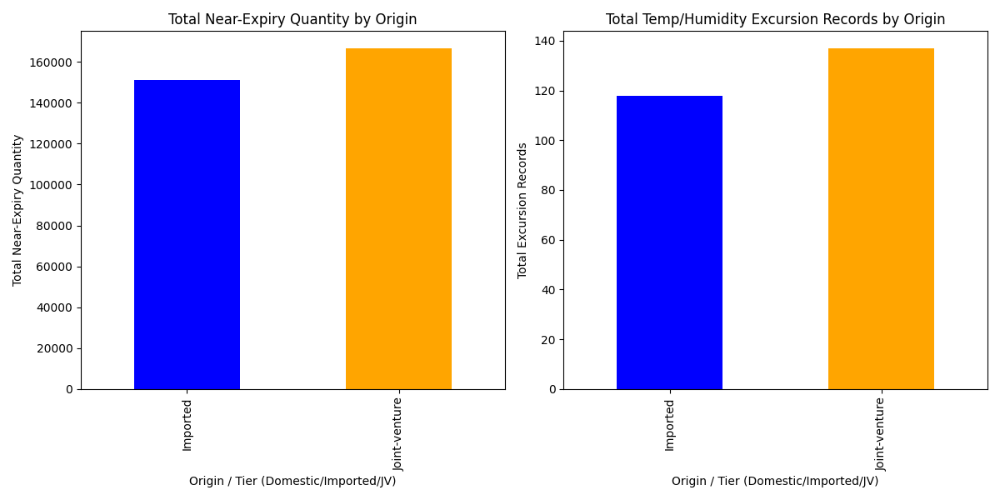

# Prioritized Supervision of Imported and Joint-Venture Drugs: Inventory and Quality Risk Analysis

This report analyzes inventory backlog, supply interruption risks, and quality issues for imported and joint-venture (JV) drugs using data from the SQLite database. The analysis focuses on identifying drugs requiring prioritized supervision based on near-expiry quantities, damage records, and environmental excursions.

## Key Findings

### 1. Inventory Backlog and Near-Expiry Quantities
Joint-venture drugs have a **higher total near-expiry quantity (166,689 units)** compared to imported drugs (151,038 units). This indicates a more significant inventory backlog risk for JV drugs.

### 2. Quality Risks and Environmental Excursions
Joint-venture drugs also show **more temperature/humidity excursion records (137)** than imported drugs (118), suggesting a higher likelihood of environmental stress affecting drug quality.

### 3. Top Drugs for Prioritized Supervision
The following drugs have the highest combined risk factors and should be prioritized for supervision:

| Drug ID       | Origin         | Near-Expiry Quantity | Damaged Units | Environmental Excursions |
|---------------|----------------|----------------------|---------------|----------------------------|
| TPAh04828     | Imported       | 4,454                | 4             | 1                          |
| NBb59595      | Joint-venture  | 4,380                | 0             | 0                          |
| yfrx27225     | Imported       | 4,153                | 2             | 2                          |
| WNXs40836     | Joint-venture  | 4,136                | 3             | 0                          |

## Visual Summary

The above visualization compares the total near-expiry quantities and environmental excursions for imported and JV drugs. JV drugs show higher inventory and environmental risk profiles.

## Recommendations

1. **Prioritize Supervision for High-Risk Drugs**: Focus on drugs with the highest near-expiry quantities and damage records, such as TPAh04828 (Imported) and WNXs40836 (JV).
2. **Improve Environmental Monitoring for JV Drugs**: Given the higher number of excursions, implement stricter environmental controls for JV drugs.
3. **Inventory Optimization**: Review inventory thresholds for JV drugs to reduce near-expiry quantities and prevent supply interruptions.

This analysis provides a data-driven basis for targeted supervision to mitigate inventory, supply, and quality risks in drug management.
