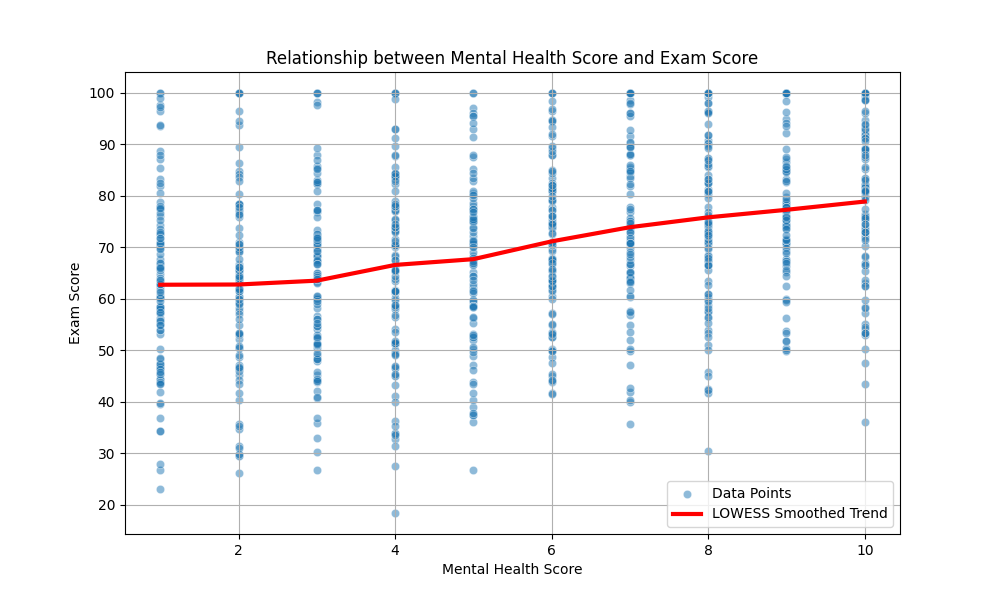
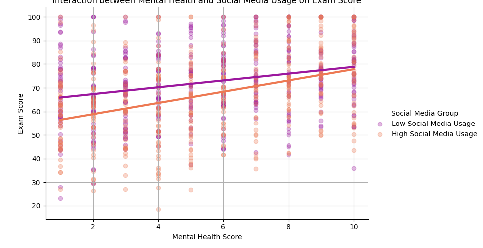

# The Impact of Mental Health on Academic Performance: A Data-Driven Analysis

This report explores the relationship between student mental health and exam performance, based on a comprehensive dataset of student information. Our analysis addresses three key questions: the overall trend between mental health and exam scores, the marginal effect of mental health when controlling for other factors, and the interactive effects of other variables on this relationship.

## 1. The Overall Relationship: A Positive but Complex Trend

**Finding:** There is a clear positive correlation between `Mental health score` and `Exam score`. However, the relationship is not perfectly linear.

Our initial analysis revealed a moderate positive Pearson correlation of 0.326. As shown in the following scatter plot with a LOWESS smoothed trend line, the `Exam score` consistently rises with the `Mental health score`. The trend is monotonic, meaning that on average, a better mental health score is always associated with a better exam score. Noticeably, the slope is steepest in the lower range of mental health scores (1-5), suggesting that interventions for students with the poorest mental health could yield the most significant academic returns.

**Why it matters:** This initial finding establishes that mental health is a significant factor in academic success. The non-linear nature of this relationship suggests that a one-size-fits-all approach to mental health support may not be optimal. Instead, resources might be prioritized for those with the most severe mental health challenges.

## 2. Quantifying the Marginal Effect of Mental Health

**Finding:** `Mental health score` remains a powerful predictor of `Exam score` even after accounting for learning habits, lifestyle, and demographics.

To isolate the effect of mental health, we ran a multiple linear regression analysis. After controlling for variables such as `Daily study time`, `Social media usage time`, `Attendance rate`, and `Parents' education level`, `Mental health score` was highly statistically significant (p < 0.001).

*   **Coefficient:** For each one-point increase in `Mental health score`, the `Exam score` is expected to increase by **1.86 points**, holding all other factors constant.
*   **Confidence Interval:** We are 95% confident that the true effect lies between 1.71 and 2.01 points.
*   **Explanatory Power:** The inclusion of `Mental health score` in the model accounted for an additional **9.9%** of the variance in `Exam score` (increase in adjusted R-squared from 0.750 to 0.849), a substantial contribution to the model's explanatory power.

**Why it matters:** This robustly demonstrates that mental health is not merely correlated with academic performance but is a significant, independent contributor. The effect size of 1.86 points is substantial and highlights the academic cost of poor mental health. This provides a strong evidence base for investing in mental health services as a direct means of improving academic outcomes.

## 3. The Dampening Effect of Social Media: An Interaction Analysis

**Finding:** High social media usage significantly weakens the positive relationship between mental health and exam scores.

Our final analysis explored interaction effects to understand what factors might amplify or dampen the impact of mental health. The most significant finding was the interaction between `Mental health score` and `Social media usage time` (p = 0.002).

The interaction plot below visualizes this effect. For students with low social media usage (the blue line), the positive relationship between mental health and exam scores is strong and steep. For students with high social media usage (the red line), the slope is much flatter. This indicates that even a good mental health score does not translate into as high an exam score if the student spends a lot of time on social media.

**Mechanistic Implications:** The negative coefficient of the interaction term (-0.173) quantifies this dampening effect. For each additional hour of daily social media use, the positive effect of a one-point increase in mental health score on exam scores is reduced by 0.173 points. This suggests that excessive social media use may act as a cognitive drain, or that it may be a symptom of other underlying issues not fully captured by the `Mental health score`, which in turn hinders academic performance.

## Recommendations

Based on these findings, we propose the following actionable recommendations:

1.  **Prioritize Mental Health Resources for At-Risk Students:** Given the steep improvement in exam scores associated with better mental health at the lower end of the scale, educational institutions should focus resources on identifying and supporting students with the most acute mental health needs.
2.  **Integrate Mental Health into Academic Support:** The strong, independent effect of mental health on exam scores warrants a more integrated approach. Academic advisors should be trained to recognize signs of mental distress and refer students to appropriate services.
3.  **Launch Digital Wellness Initiatives:** The significant dampening effect of social media usage on the benefits of good mental health calls for the promotion of digital literacy and wellness programs. Workshops and resources aimed at helping students manage their social media consumption could mitigate this negative interaction and help them better translate their well-being into academic success.
