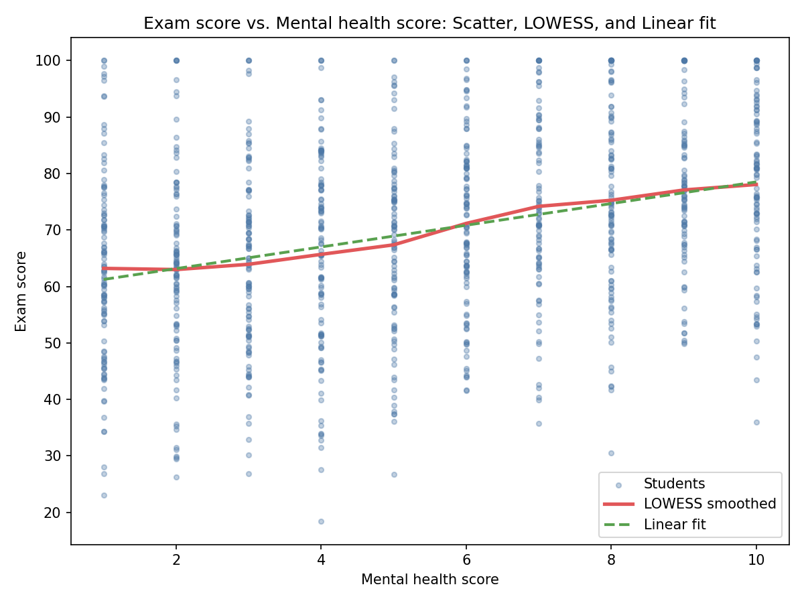
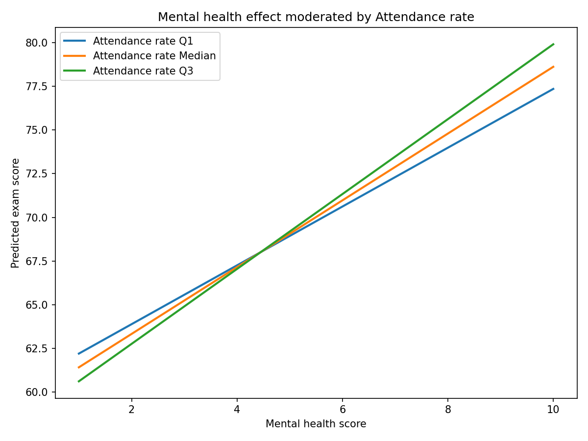

Executive Summary
• Mental health score is positively and approximately linear with Exam score, with no evidence of inflection. Pearson r = 0.326; linear slope = 1.919 exam points per 1-point mental health (p = 3.62e-26). A quadratic term is not significant (p = 0.375), and AIC favors the linear specification (8381.9 vs 8383.1).
• After controlling for learning and lifestyle covariates, mental health remains strongly predictive: coefficient = 1.860 (95% CI [1.708, 2.011], p = 1.21e-99), adding 9.7 percentage points to R² (base 0.755 → full 0.852) and a conditional partial R² of 0.395. A 10-point mental health increase corresponds to +18.60 exam points (CI [17.08, 20.11]).
• The effect of mental health is amplified by higher Attendance rate and dampened by greater Social media usage time. Interaction MH×Attendance rate = +0.035 (p = 6.05e-08); MH×Social media usage time = −0.167 (p = 0.00214). This implies mental health’s benefit grows with better attendance and shrinks with heavier social media use.

Data and Methods
• Data: sheet1 (N = 1,000). Key columns used: Mental health score, Exam score; controls: Daily study time, Social media usage time, Attendance rate, Sleep duration, Exercise frequency, Diet quality, Part-time job, Internet quality, Parents' education level, Gender, Age, Extracurricular activity participation.
• SQL steps: verified table existence and row count; queried ranges for interaction interpretation (Attendance rate: min 12.9, max 100.0, avg 83.0479; Social media usage time: min 0.0, max 13.0, avg 2.5856).
• Python/Stats: Univariate OLS and LOWESS smoothing; multivariate OLS with categorical dummies via Patsy C(); interaction tests by adding MH×covariate terms and selecting the most significant. Code executed in mh_exam_analysis.py. Figures saved: mh_exam_lowess.png; mh_interaction_top.png.

Q1. Overall relationship between Mental health score and Exam score
Conclusion: The trend is monotonic and well-approximated by a linear model without inflection.
• Evidence: Pearson correlation r = 0.326 (moderate positive). Linear OLS slope = 1.919 (p = 3.62e-26). Quadratic curvature term is non-significant (p = 0.375); F-test for adding the square yields p = 0.375; AIC increases slightly with quadratic (8383.1 vs 8381.9), indicating linear adequacy.
• Interpretation: Each 1-point increase in Mental health score associates with +1.92 exam points on average. The LOWESS curve tracks a steadily rising line with no noticeable bends or thresholds.

Visual: Univariate trend shape

Key takeaway: The scatter with LOWESS smoothing and linear fit shows a consistent upward slope across the full mental health range. Numerically, the linear slope is 1.919 exam points per mental health point (p = 3.62e-26), and adding curvature does not improve model fit (quadratic p = 0.375; AIC linear 8381.9 vs quadratic 8383.1). This matters because it supports using a simple, interpretable linear effect size in planning interventions and forecasting.

Q2. Marginal effect after controls
Conclusion: Mental health remains a strong, statistically significant predictor after controlling for study habits, attendance, lifestyle, internet, parental education, demographics, and age.
• Full-model coefficient: 1.860 (95% CI [1.708, 2.011], p = 1.21e-99). This implies a 10-point increase in Mental health score yields +18.60 exam points (CI [17.08, 20.11]).
• Model fit and incremental explanatory power: R² increases from 0.755 (base controls only) to 0.852 (with mental health), delta-R² = +0.097 (9.7 percentage points). Conditional partial R² for mental health = 0.395, indicating substantial unique variance explained beyond other covariates.
• Why it matters: Even after accounting for Daily study time, Social media usage time, Attendance rate, Sleep duration, Exercise frequency, Diet quality, Part-time job, Internet quality, Parents' education level, Gender, Age, and Extracurricular activity participation, mental health independently contributes markedly to academic performance. This justifies investment in mental health programs as a high-leverage driver of exam outcomes.

Q3. Interactions: moderators that amplify or dampen mental health’s effect
Conclusion: Attendance rate strengthens the mental health effect; Social media usage time weakens it. Other tested interactions are not conventionally significant.
• Amplifier—Attendance rate:
  - Interaction term MH×Attendance rate = +0.035 (p = 6.05e-08).
  - Scale context: Attendance rate ranges 12.9–100.0 (avg 83.05). A 30-point increase in attendance (e.g., 60% → 90%) raises mental health’s slope by +1.05 exam points per mental health point (0.035 × 30).
  - Mechanism: High attendance likely increases exposure to instruction and assessment practice, allowing mental health-driven motivation/focus to translate more efficiently into learning gains.
• Dampener—Social media usage time:
  - Interaction term MH×Social media usage time = −0.167 (p = 0.00214).
  - Scale context: Social media usage time ranges 0–13 hours/day (avg 2.59). Each additional hour reduces mental health’s slope by 0.167 exam points per mental health point. For a +3 hour increase (e.g., 1 → 4 hours), the slope declines by −0.50 per mental health point.
  - Mechanism: Greater social media usage may displace study time or fragment attention, curbing how mental health advantages (e.g., resilience, stress regulation) convert into exam performance.

Visual: Mental health effect moderated by Attendance rate

Key takeaway: Predicted exam scores rise more steeply with Mental health score at higher Attendance rate levels (lines diverge meaningfully). The estimated MH×Attendance rate coefficient is 0.035 (p = 6.05e-08), meaning mental health’s benefit accelerates as attendance improves. This matters because boosting attendance can multiply the returns from mental health initiatives.

Additional tested interactions (for transparency)
• Diet quality: MH×Diet quality (Poor vs baseline) coefficient −0.318, p = 0.132 (not significant).
• Gender: MH×Gender (Male vs baseline) coefficient +0.228, p = 0.142 (not significant).
• Extracurricular activity participation: MH×Yes coefficient +0.226, p = 0.159 (not significant).
These do not meet conventional significance thresholds and thus are not emphasized for policy.

Recommendations
• Invest in mental health support as a core academic lever: With a controlled coefficient of 1.860 (p ≈ 1e-99) and delta-R² of +9.7 points, mental health explains substantial performance differences. Programs might include counseling access, stress-management workshops, and mindfulness training.
• Pair mental health initiatives with attendance improvement: Because MH×Attendance rate is strongly positive, improving attendance (e.g., through incentive programs, flexible scheduling, early alerts for absences) will amplify mental health’s payoff.
• Manage social media usage to prevent dampening effects: Introduce digital well-being education, time-management coaching, and study-friendly device policies; aim to reduce daily social media hours, especially for students with otherwise strong mental health.
• Maintain core study and lifestyle supports: Continue focusing on Daily study time, Sleep duration, and Exercise frequency, which are included as controls and collectively yield high base R² (0.755). This integrated approach sustains the environment where mental health improvements translate into exam gains.

Technical Appendix (methods trace)
• Univariate models: OLS Exam score ~ Mental health score; LOWESS smoothing (frac=0.25) for shape assessment; quadratic term via I(MH²) for curvature test.
• Multivariate model: OLS Exam score ~ Mental health score + numeric covariates (Daily study time, Social media usage time, Attendance rate, Sleep duration, Exercise frequency, Age) + categorical dummies (Diet quality, Part-time job, Internet quality, Parents' education level, Gender, Extracurricular activity participation).
• Interactions: Added MH×Attendance rate, MH×Social media usage time, and similar terms one-by-one; selected top interaction by p-value; visualized predictions holding other covariates at means/modes.
• Figures: mh_exam_lowess.png (scatter with LOWESS and linear fit); mh_interaction_top.png (predicted lines by Attendance rate level).

Overall: The relationship between Mental health score and Exam score is monotonic and linear; the effect remains very strong after comprehensive controls; and Attendance rate and Social media usage time are key moderators. Prioritizing mental health while improving attendance and managing social media promises the largest gains in exam performance.
