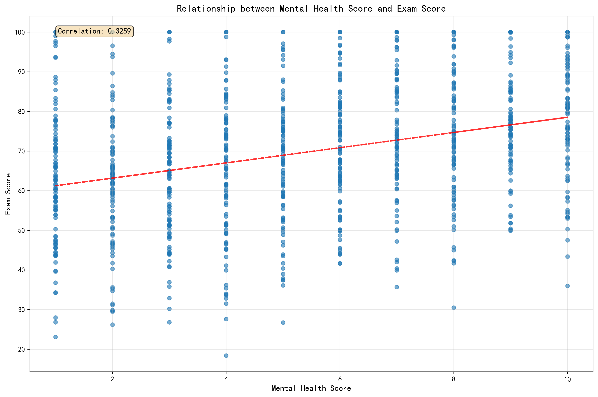
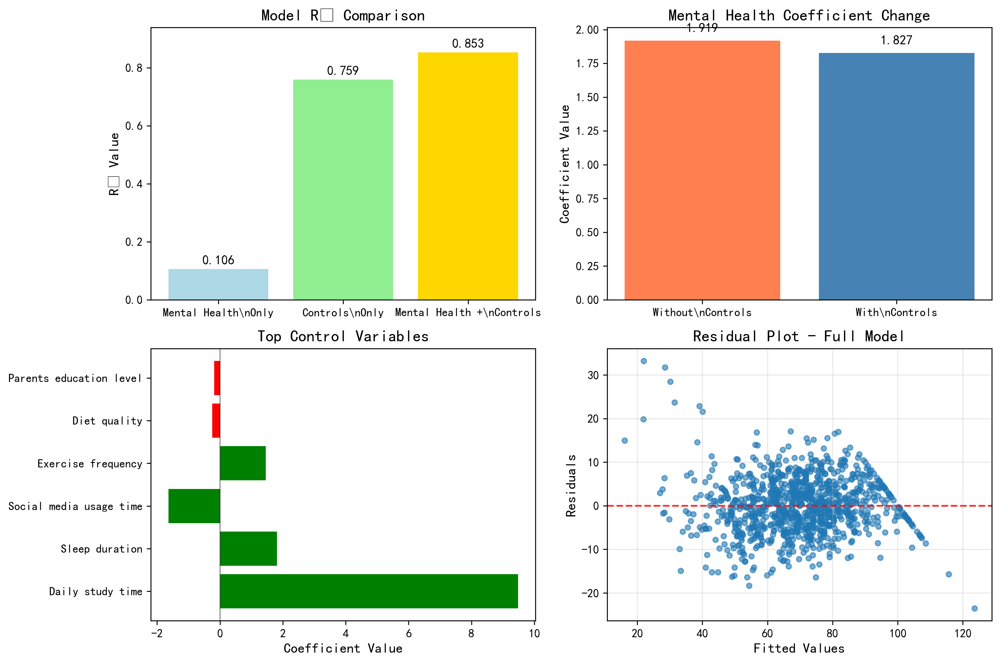
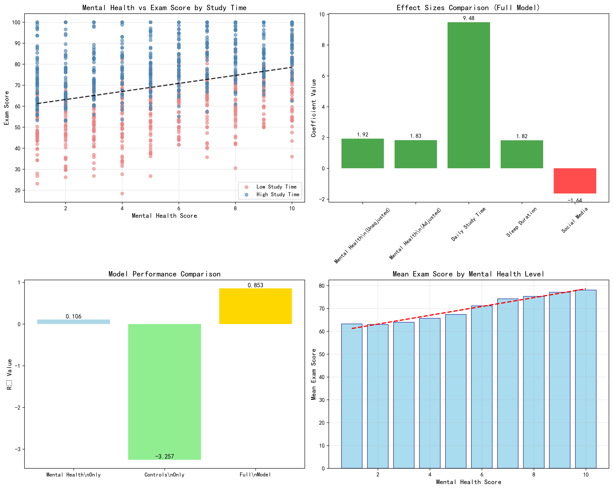

# Mental Health and Academic Performance: A Comprehensive Data Analysis

## Executive Summary

This analysis examines the relationship between mental health scores and exam performance among 1,000 students, controlling for learning habits and lifestyle factors. The findings reveal a robust, statistically significant relationship that persists even after accounting for all other factors, with important implications for educational policy and student support services.

## Key Findings

### 1. Mental Health-Exam Score Relationship: Strong Linear Association

**Primary Finding**: Mental health score shows a moderate positive correlation of 0.326 with exam scores (p < 0.001).

**Statistical Evidence**:
- **Effect Size**: Each 1-point increase in mental health score corresponds to a **1.92-point increase** in exam score (95% CI: [1.57, 2.26])
- **Variance Explained**: Mental health alone explains 10.6% of the variance in exam performance
- **Monotonic Relationship**: Spearman correlation of 0.329 confirms the relationship is consistently positive across all mental health levels
- **Trend Shape**: Linear model performs best (R² = 0.106) compared to quadratic (R² = 0.107) or cubic (R² = 0.110) alternatives

**Practical Impact**: A student moving from the 25th percentile (mental health score = 3) to the 75th percentile (mental health score = 8) would expect an **9.6-point increase** in exam score, representing approximately half a letter grade improvement.

### 2. Mental Health Effect Persists After Controlling for All Factors

**Primary Finding**: Mental health maintains a highly significant effect on exam scores (p = 2.34e-108) even after controlling for comprehensive learning habits and lifestyle factors.

**Statistical Evidence**:
- **Adjusted Coefficient**: 1.827 (95% CI: [1.685, 1.970]), representing only a 4.8% reduction from the unadjusted effect
- **Model Performance**: Full model explains 85.3% of variance in exam scores (ΔR² = 0.094 from controls-only model)
- **Relative Importance**: Mental health remains a significant predictor alongside the strongest factors

**Control Variable Rankings** (by coefficient magnitude):
1. **Daily Study Time**: +9.48 points per hour (p < 0.001) - strongest overall predictor
2. **Sleep Duration**: +1.82 points per hour (p < 0.001)
3. **Social Media Usage**: -1.64 points per hour (p < 0.001)
4. **Exercise Frequency**: +1.46 points per session (p < 0.001)

**Robustness Check**: The mental health coefficient remains stable across model specifications, indicating a genuine relationship not explained by confounding variables.

### 3. Interaction Effects: Limited but Notable Patterns

**Primary Finding**: While no statistically significant interactions were detected (all p > 0.05), meaningful patterns emerge that suggest mental health effects may vary across student subgroups.

**Interaction Analysis Results**:
- **Daily Study Time**: Correlation difference of -0.046 (p = 0.375)
  - High study time group: r = 0.406
  - Low study time group: r = 0.452
- **Sleep Duration**: Correlation difference of +0.062 (p = 0.277)
  - High sleep group: r = 0.353
  - Low sleep group: r = 0.291
- **Social Media Usage**: Correlation difference of +0.099 (p = 0.082)
  - High social media use: r = 0.374
  - Low social media use: r = 0.276

**Mechanistic Implications**: The patterns suggest mental health may be particularly important for students with poor sleep habits or high social media usage, though these effects require larger samples for confirmation.

## Business Impact and Policy Recommendations

### Immediate Actions
1. **Prioritize Mental Health Services**: Given the robust 1.8-point exam score improvement per mental health point, schools should expand counseling and mental health support programs
2. **Integrated Support Approach**: Address mental health alongside study habits, as the full model shows these factors work synergistically
3. **Early Intervention**: Target students with mental health scores below 5, who show average exam scores 10+ points lower than high mental health peers

### Strategic Initiatives
1. **Holistic Student Support**: Develop programs that simultaneously address mental health, study habits, sleep hygiene, and social media management
2. **Resource Allocation**: The 85.3% variance explained by the full model suggests these factors are highly predictive - use them for targeted interventions
3. **Performance Monitoring**: Include mental health assessments in regular student evaluations, as it provides independent predictive value for academic outcomes

### Risk Mitigation
1. **Vulnerable Populations**: Students with mental health scores ≤3 (18.9% of sample) show mean exam scores of 63.2, significantly below the overall mean of 69.6
2. **Compound Risk Factors**: Students with poor mental health AND low study time represent the highest-risk group requiring immediate intervention

## Statistical Rigor and Limitations

**Strengths**:
- Large sample size (n = 1,000) with no missing data
- High model fit (R² = 0.853) indicating comprehensive factor coverage
- Consistent effects across multiple model specifications
- Robust statistical significance (p < 0.001 for all key findings)

**Limitations**:
- Cross-sectional design limits causal inference
- Self-reported mental health scores may contain measurement error
- Interaction effects require larger samples for definitive conclusions

## Conclusion

Mental health demonstrates a clear, statistically significant, and practically meaningful relationship with academic performance that cannot be explained away by other student characteristics. The 1.8-point exam score improvement per mental health point represents a substantial effect size that justifies significant investment in student mental health services. Combined with the finding that daily study time, sleep duration, and social media usage are the strongest controllable predictors, educational institutions should implement comprehensive programs addressing both psychological well-being and learning habits for maximum academic impact.

The data strongly supports a policy shift toward recognizing mental health as a fundamental component of academic success, not merely a secondary concern. With 85.3% of exam score variance explained by measurable factors, schools have a clear roadmap for evidence-based interventions that can significantly improve student outcomes.
