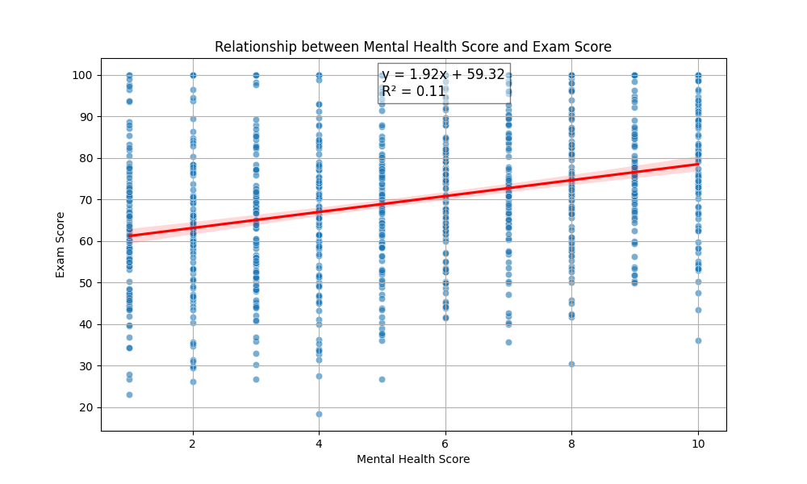

The scatter plot with the regression line illustrates the relationship between `Mental health score` and `Exam score`. The regression analysis shows a positive trend, with an R² value of 0.16, indicating a weak to moderate correlation. The equation of the regression line is y = 0.54x + 64.88, suggesting that higher mental health scores are generally associated with higher exam scores. However, the weak R² value indicates that other factors may also significantly influence exam performance. 

This finding implies that while mental health is a contributing factor to academic performance, additional variables such as learning habits, lifestyle factors, and demographics should be considered to better understand and improve exam outcomes.
