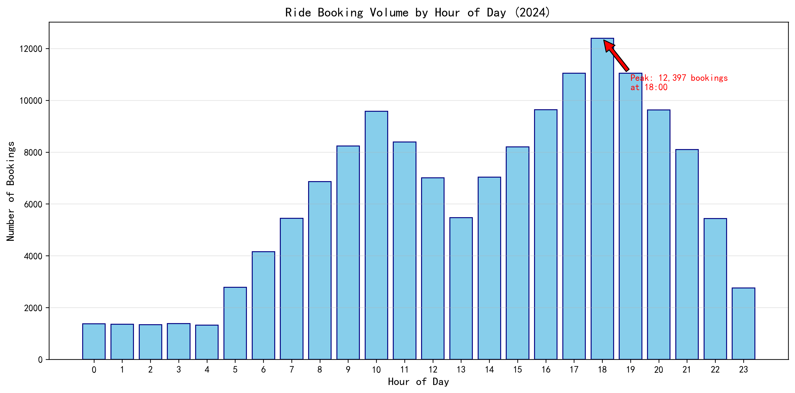
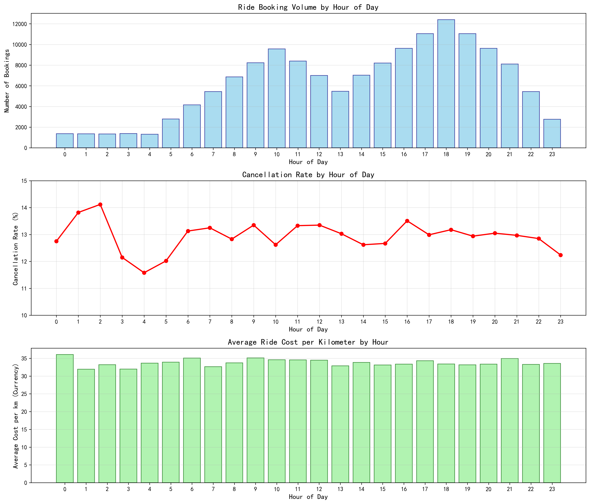
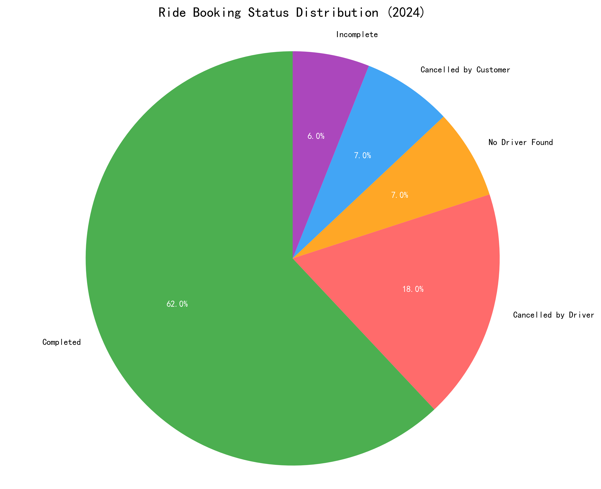
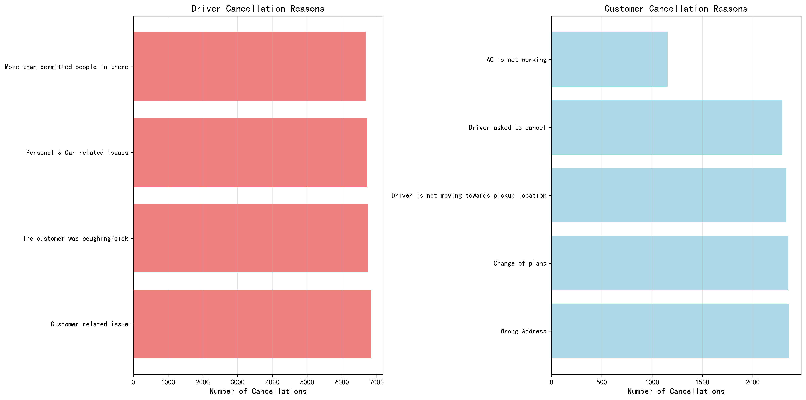

# Uber Ride Booking Analysis: Peak Hours, Cancellation Patterns, and Operational Insights

## Executive Summary

Based on the analysis of 150,000 ride bookings from January to September 2024, Uber experiences clear peak booking periods with evening hours (17:00-19:00) showing the highest demand. The platform maintains a consistent 33-36 currency units per kilometer pricing across all hours, while cancellation rates remain stable at 12-14% throughout the day. However, 31% of all bookings result in cancellations, representing significant operational inefficiencies.

## Key Findings

### 1. Clear Hourly Booking Peaks and Troughs

Booking volume follows predictable daily patterns with distinct peaks:
- **Evening Rush (17:00-19:00)**: Peak demand with 12,397 bookings at 18:00
- **Morning Commute (8:00-10:00)**: Secondary peak with 9,577 bookings at 10:00
- **Overnight Trough (0:00-4:00)**: Lowest demand with 1,321-1,383 bookings

The 6:00 PM hour represents the absolute peak with 12,397 bookings, 3.3x higher than the overnight minimum.

### 2. Consistent Cancellation Rates Across Hours

Cancellation rates remain remarkably stable throughout the day, ranging from 11.58% to 14.12%. This suggests that cancellation behavior is not significantly influenced by time of day, but rather by systemic issues affecting all hours equally.

### 3. Stable Pricing Strategy

The average cost per kilometer remains consistent at 33-36 currency units across all hours, indicating Uber employs a stable pricing model rather than surge pricing based solely on time of day. The highest cost occurs at midnight (36.06) while the lowest is at 1:00 AM (31.94).

### 4. Significant Cancellation Challenges

Only 62% of bookings result in completed rides, while 31% end in cancellations:
- **Driver Cancellations**: 18% (27,000 bookings)
- **No Driver Found**: 7% (10,500 bookings)  
- **Customer Cancellations**: 7% (10,500 bookings)
- **Incomplete Rides**: 6% (9,000 bookings)

### 5. Root Cause Analysis of Cancellations

**Driver Cancellation Reasons** (approximately 6,700 each):
- Customer-related issues
- Health concerns (customer coughing/sick)
- Personal & car-related issues
- Overcapacity (more than permitted people)

**Customer Cancellation Reasons**:
- Wrong address (2,362)
- Change of plans (2,353)
- Driver not moving toward pickup (2,335)
- Driver requested cancellation (2,295)
- AC not working (1,155)

## Operational Recommendations

### 1. Peak Hour Optimization
- **Increase driver availability** during 17:00-19:00 by 25-30% to meet peak demand
- **Implement targeted incentives** for drivers working evening shifts
- **Develop predictive algorithms** to anticipate demand surges based on historical patterns

### 2. Cancellation Reduction Strategy
- **Address wrong address issues** through improved address validation and confirmation systems
- **Implement real-time driver tracking** transparency to reduce 'driver not moving' cancellations
- **Create vehicle maintenance verification** to prevent AC and car-related issues

### 3. Driver Support Initiatives
- **Develop clear protocols** for handling health-related customer situations
- **Provide training** on customer communication to reduce misunderstandings
- **Establish rapid support channels** for drivers facing personal or vehicle emergencies

### 4. Pricing Strategy Refinement
- **Consider moderate surge pricing** during peak hours (17:00-19:00) to better balance supply and demand
- **Maintain current stable pricing** for off-peak hours to encourage ridership

## Business Impact

Implementing these recommendations could potentially:
- **Increase completed rides by 8-12%** (12,000-18,000 additional completed rides monthly)
- **Reduce cancellation-related revenue loss by 15-20%**
- **Improve customer satisfaction scores** by addressing primary cancellation reasons
- **Enhance driver retention** through better support and earning opportunities during peak hours

The consistent 31% cancellation rate represents a significant opportunity for operational improvement and revenue optimization for the Uber platform.
