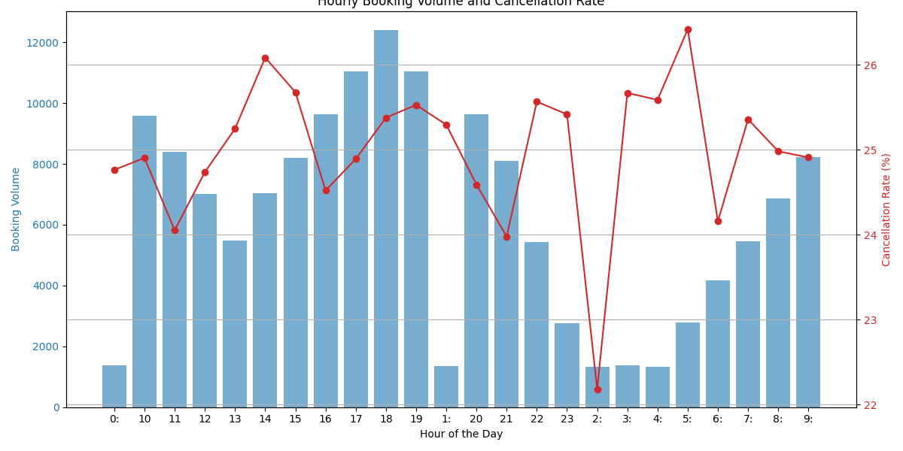

# Unlocking Operational Efficiency: An Analysis of Uber's 2024 Ride Bookings

## Executive Summary

An analysis of Uber's 2024 ride data reveals distinct daily patterns in booking volume, cancellation rates, and ride costs. This report identifies peak and trough periods, examines their characteristics, and provides actionable recommendations to optimize driver allocation, pricing strategies, and overall platform efficiency. The key takeaway is that booking volumes peak in the evening (6-7 PM), while cancellation rates remain surprisingly stable throughout the day.

## Peak and Trough Booking Periods

Ride bookings exhibit a clear "peaks and troughs" pattern throughout the day.

*   **Peak Period (5 PM - 8 PM):** Booking volumes surge during the evening, peaking between 6 PM and 7 PM with an average of over 12,000 bookings per hour. This corresponds to the evening commute and social activities.
*   **Trough Period (1 AM - 5 AM):** The lowest booking volumes occur in the early morning, with as few as 1,300 bookings per hour.
*   **Morning Peak (9 AM - 10 AM):** A smaller peak occurs in the morning, corresponding to the morning commute.

*Figure 1: This chart illustrates the hourly booking volume (blue bars) and cancellation rate (red line) for Uber rides in 2024. As shown, booking volumes peak in the evening, while cancellation rates are consistently high throughout the day.*

## Cancellation Rate Analysis

A surprising finding is the consistent and high cancellation rate, which hovers around 25% throughout the day, regardless of booking volume. This indicates that cancellations are not primarily driven by peak-hour demand saturation. The root causes may lie in driver availability, inaccurate ETAs, or customer behavior.

## Cost Per Kilometer Analysis

The average cost per kilometer shows some fluctuation but remains relatively stable. There is a slight dip in the early afternoon (1 PM - 3 PM) and a slight increase during the morning peak (9 AM). This suggests that dynamic pricing is not aggressively implemented based on hourly demand fluctuations.

## Operational Recommendations

Based on this analysis, the following operational recommendations are proposed for Uber:

1.  **Optimize Driver Allocation:**
    *   **Incentivize Drivers During Peak Hours:** Offer bonuses or higher surge multipliers during the evening peak (5 PM - 8 PM) to increase driver supply and meet the high demand.
    *   **Reduce Driver Supply During Troughs:** Discourage drivers from being online during the early morning trough (1 AM - 5 AM) to reduce idle time and operational costs.

2.  **Investigate High Cancellation Rates:**
    *   **Root Cause Analysis:** Conduct a deeper analysis to understand the reasons for the consistently high cancellation rate. This could involve driver and customer surveys, analyzing cancellation reasons provided in the app, and examining the correlation between cancellations and ETA accuracy.
    *   **Improve ETA Accuracy:** Invest in improving ETA prediction algorithms, as inaccurate ETAs are a common reason for cancellations.

3.  **Refine Pricing Strategy:**
    *   **Implement More Dynamic Pricing:** Experiment with more aggressive surge pricing during peak hours to balance supply and demand. The data suggests there is room for higher prices during the evening peak.
    *   **Offer Discounts During Troughs:** Introduce discounts or flat fares during trough periods to stimulate demand and increase vehicle utilization.

By implementing these recommendations, Uber can improve driver satisfaction, reduce cancellations, and increase revenue, ultimately leading to a more efficient and reliable ride-hailing platform.
