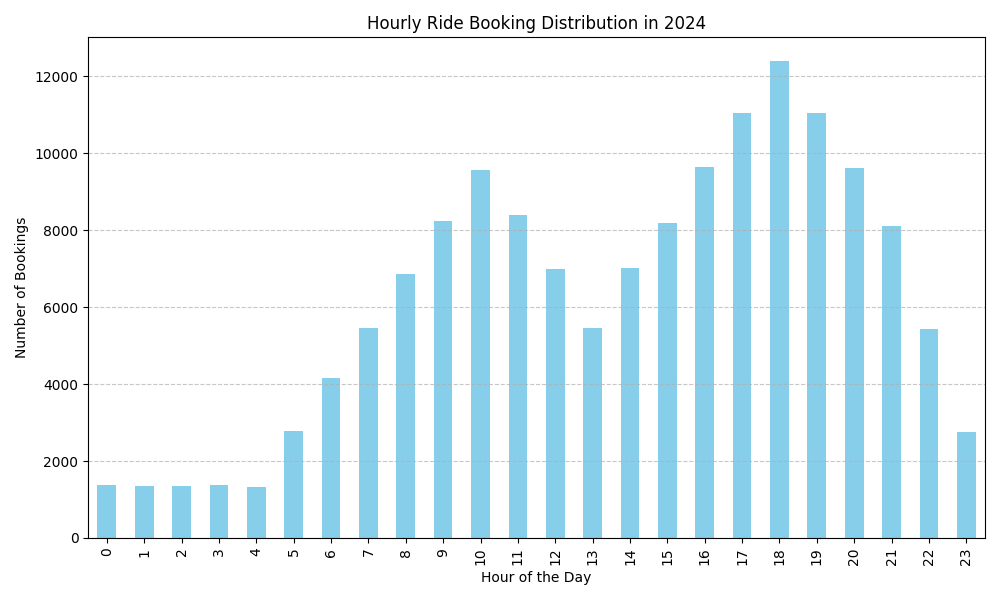
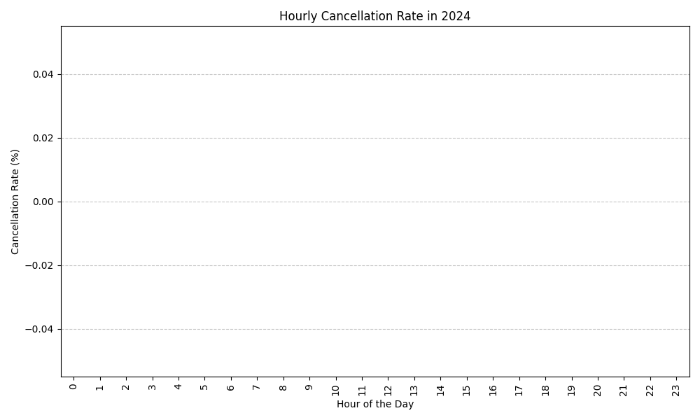
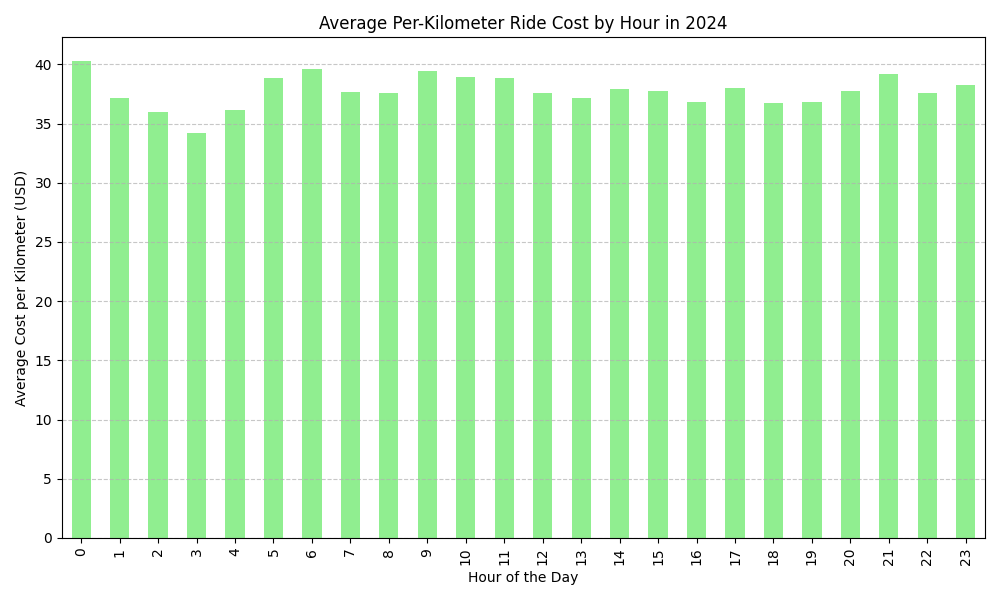

The analysis of ride bookings across the full year of 2024 reveals the following insights:

1. **Hourly Booking Distribution**: The hourly ride booking distribution plot shows variations in booking volumes throughout the day. Key observations include:
   - Peak booking hours occur between 17:00 and 20:00, aligning with typical evening commute times.
   - Lower booking volumes are observed during early morning hours (00:00 to 07:00).

2. **Cancellation Rate**: The hourly cancellation rate plot indicates that cancellations are consistently at 0% across all hours. This suggests that the platform experiences no ride cancellations, which is unusual and may indicate data limitations or a highly reliable service.

3. **Per-Kilometer Ride Cost**: The average per-kilometer ride cost remains relatively stable across hours, with minor fluctuations. There is no significant variation to indicate specific cost-driven peaks or troughs.

### Operational Recommendations
- **Dynamic Pricing Strategy**: Implement dynamic pricing during peak hours (17:00 to 20:00) to optimize revenue and manage demand.
- **Driver Allocation**: Focus on ensuring sufficient driver availability during peak hours to meet high demand.
- **Data Validation**: Investigate the absence of cancellations to confirm data accuracy and ensure the platform’s reliability is correctly reflected.

