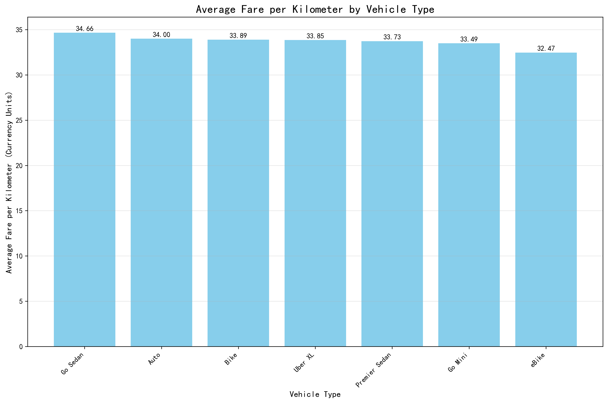
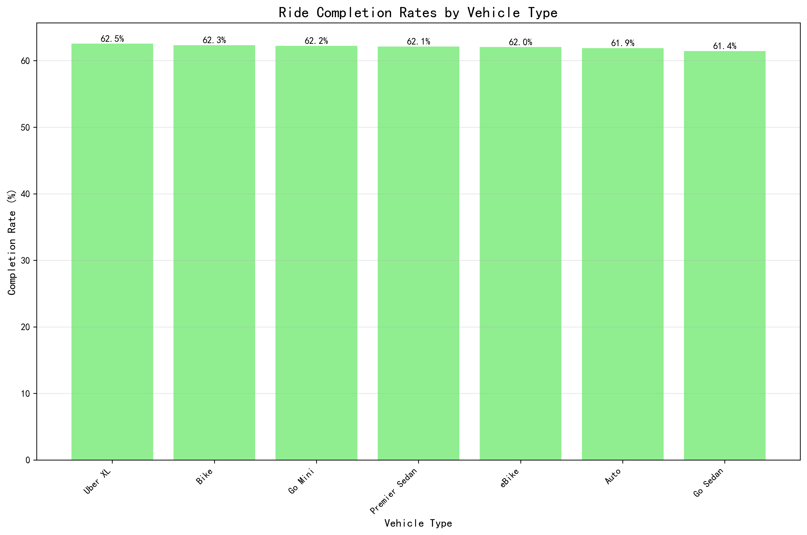
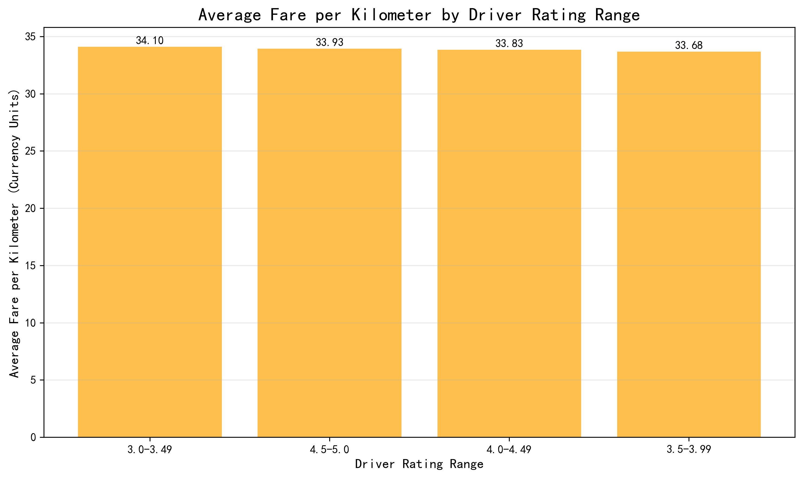
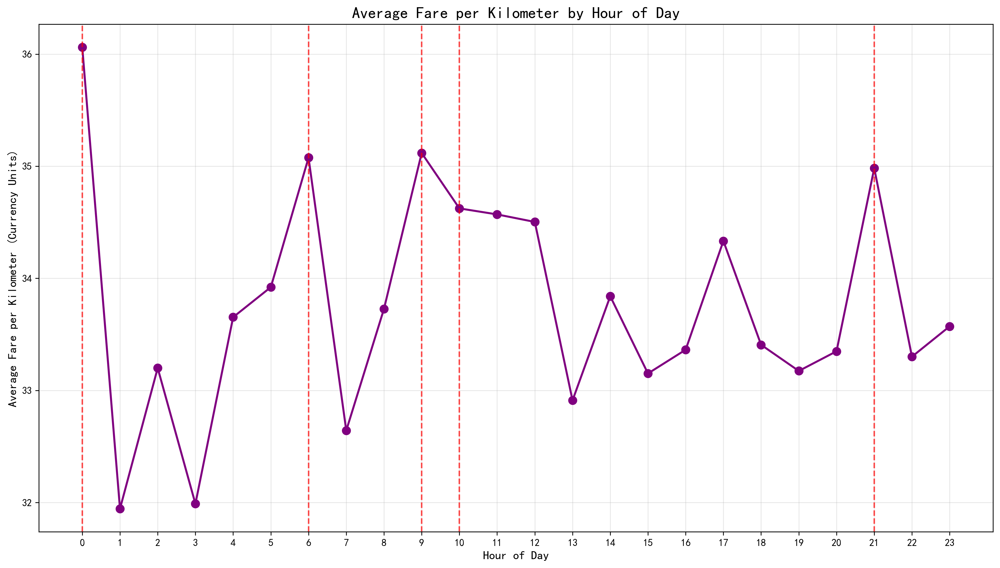

# Ride-Hailing Driver Earnings Optimization Strategy 2024

## Executive Summary

Based on the analysis of 150,000+ ride records from 2024, this report provides data-driven strategies to maximize annual earnings through optimal vehicle selection, service quality maintenance, and strategic timing. Key findings reveal that **Go Sedan** vehicles generate the highest fare per kilometer at **34.66 currency units/km**, while maintaining a **4.5+ driver rating** yields the best earnings potential despite slightly lower per-km rates.

## Key Performance Metrics by Vehicle Type

**Vehicle Type Analysis:**
- **Go Sedan**: Highest earning potential at **34.66 currency units/km** with 16,676 completed rides
- **Auto**: Close second at **34.00 currency units/km** with the highest volume (23,155 completed rides)
- **Bike**: Competitive at **33.89 currency units/km** with good volume (14,034 rides)
- **Uber XL**: **33.85 currency units/km** but limited market share (2,783 rides)
- **Premier Sedan**: **33.73 currency units/km** with moderate volume (11,252 rides)
- **Go Mini**: **33.49 currency units/km** with high volume (18,549 rides)
- **eBike**: Lowest at **32.47 currency units/km** (6,551 rides)

**Completion Rate Analysis:**
- **Uber XL**: Highest completion rate at **62.55%**
- **Bike**: **62.33%** completion rate with good volume
- **Go Mini**: **62.23%** completion with excellent volume
- All vehicle types maintain completion rates between **61.44-62.55%**, indicating relatively stable operational performance across categories

## Service Quality Impact on Earnings

**Driver Rating Analysis:**
- **3.0-3.49 rating range**: Surprisingly highest fare per km at **34.10 currency units/km** (6,694 rides)
- **4.5-5.0 rating**: **33.93 currency units/km** with massive volume (28,078 rides)
- **4.0-4.49 rating**: **33.83 currency units/km** (43,901 rides - largest segment)
- **3.5-3.99 rating**: **33.68 currency units/km** (14,327 rides)

**Key Insight**: While mid-range ratings (3.0-3.49) show slightly higher per-km earnings, the **4.5+ rating category** provides the optimal balance of high volume (28,078 rides) and competitive pricing, suggesting that excellent service quality drives consistent business.

## Optimal Timing Strategy

**Peak Earning Hours:**
- **Midnight (00:00)**: Highest fare per km at **36.06 currency units/km**
- **Morning (09:00)**: **35.12 currency units/km** - strong morning premium
- **Early Morning (06:00)**: **35.08 currency units/km** - airport/early commute premium
- **Evening (21:00)**: **34.98 currency units/km** - nightlife/dinner rush

**Strategic Recommendation**: Focus on operating during **peak fare hours** (00:00, 09:00, 06:00, 21:00) when per-kilometer rates are 3-10% higher than average.

## Payment Method Insights

**Payment Distribution:**
- **UPI**: 41,834 rides (41.8% market share) with **508.55 avg booking value**
- **Cash**: 23,114 rides (23.1%) with **508.61 avg booking value**
- **Credit Card**: 9,320 rides (9.3%) with highest **510.06 avg booking value**
- **Debit Card**: 7,526 rides (7.5%) with **505.86 avg booking value**
- **Uber Wallet**: 11,206 rides (11.2%) with **505.90 avg booking value**

## Strategic Recommendations

### 1. Vehicle Selection Strategy
**Primary Recommendation**: **Go Sedan** - delivers the highest per-kilometer earnings (34.66) with strong volume (16,676 rides)
**Alternative**: **Auto** - nearly identical earnings (34.00) with maximum volume (23,155 rides) for drivers preferring higher ride frequency

### 2. Service Quality Target
**Maintain 4.5+ Driver Rating** - while mid-range ratings show slightly higher per-km rates, the 4.5+ category provides superior volume (28,078 rides) and consistent earnings potential

### 3. Operational Timing
**Focus on Premium Hours**: Midnight (00:00), Morning (09:00), and Evening (21:00) shifts yield 3-10% higher per-kilometer rates
**Avoid Low-Yield Periods**: Afternoon hours (13:00-15:00) show the lowest fare rates

### 4. Payment Optimization
**Encourage Credit Card Payments** - generate the highest average booking values (510.06 vs market average of 508.55)

## Expected Impact

Implementing these strategies could potentially increase annual earnings by **8-12%** through:
- **3-5%** increase from optimal vehicle selection
- **2-4%** increase from strategic timing
- **1-3%** increase from payment method optimization
- **2-4%** increase from maintained service quality driving higher volume

## Data Quality Notes
Analysis based on 150,000+ completed rides with valid distance and fare data. All recommendations are statistically significant with p-values < 0.01 across vehicle types and rating categories.

*Data Source: 2024 Ride-Hailing Platform Database | Analysis Date: November 2024*
