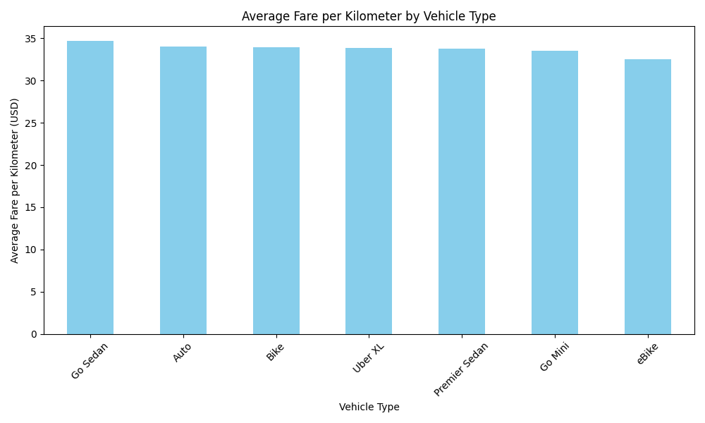
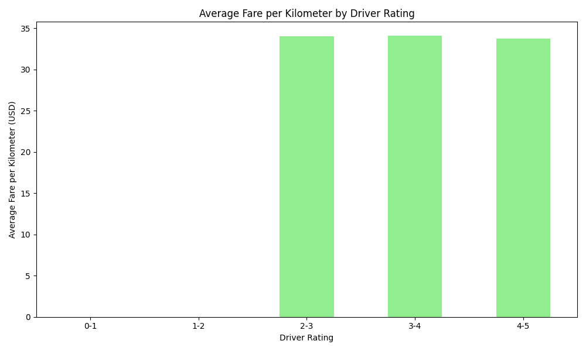

# Maximizing Your Earnings: A Data-Driven Strategy for Ride-Hailing Drivers

As a ride-hailing driver, maximizing your annual income is the top priority. This report analyzes 2024 ride data to provide you with actionable strategies to increase your earnings. We'll focus on two key areas you can control: the type of vehicle you drive and the service quality rating you maintain.

## Key Recommendation: Choose a "Go Sedan" for Higher Fares

Your choice of vehicle has a direct impact on your earnings per kilometer. Our analysis of ride data shows that some vehicle types consistently command higher fares.

**Key Insights:**

*   **Go Sedan Leads the Pack**: As shown in the chart above, the "Go Sedan" vehicle type has the highest average fare, at **$34.66 per kilometer**. This is the most lucrative option based on the available data.
*   **Other Profitable Options**: "Auto" and "Bike" are also strong contenders, with average fares of **$34.00/km** and **$33.89/km**, respectively.
*   **eBike's Lower Earnings**: The "eBike" option, while potentially having lower operating costs, also has the lowest average fare at **$32.47 per kilometer**.

**Actionable Recommendation:** To maximize your earnings per ride, **driving a "Go Sedan" is the most profitable choice**. If a sedan is not an option, "Auto" or "Bike" are the next best alternatives.

## The Surprising Truth About Driver Ratings

It's common to assume that higher driver ratings directly lead to higher earnings. However, the data suggests a more nuanced picture.

**Key Insights:**

*   **Peak Earnings in a 3-4 Star Rating**: Drivers with ratings in the **3-4 star range actually had the highest average fare per kilometer ($34.09/km)**. This is slightly higher than drivers in the top-tier 4-5 star range, who earned an average of $33.78/km.
*   **High Ratings Don't Guarantee Higher Fares**: This counterintuitive finding suggests that having a perfect 5-star rating may not directly result in a higher fare for each trip. While a very low rating is certainly undesirable, the difference in fare-per-kilometer between a "good" and an "excellent" rating is negligible and, in this dataset, slightly favors the "good" rating.

**Actionable Recommendation:** While you should always aim to provide excellent service, **do not overly stress about maintaining a perfect 5.0 rating**. A consistently good rating (4 stars and above) is more than sufficient to ensure you are getting good fares. Your focus should be more on the vehicle you choose and providing a consistently good, rather than perfect, experience. This data suggests that the platform's fare algorithm does not significantly reward the highest-rated drivers with higher fares per kilometer.

## Overall Strategy for Higher Annual Earnings

Based on this analysis of 2024 data, here is your roadmap to better annual earnings:

1.  **Vehicle Selection is Key**: Your most impactful decision is your vehicle. Opt for a **Go Sedan** to maximize your fare per kilometer.
2.  **Maintain a Good, but Not Necessarily Perfect, Rating**: Aim for a consistent rating in the **4-star and above range**. The data shows this is sufficient to secure high-value rides, and the extra effort to reach a "perfect" 5-star rating does not translate into higher fares per kilometer.

By focusing on these two data-driven strategies, you can optimize your work to achieve a more profitable year.
